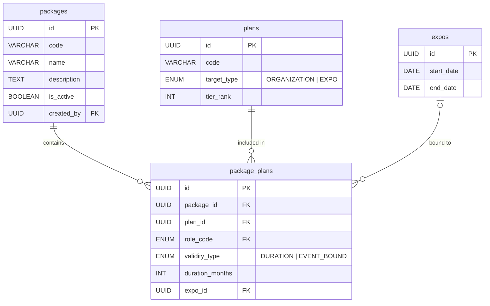

# 1. User Story Statement

**As a** SYS_ADMIN,
**I want** to define Packages — commercial bundles that combine one or more Plans with individual validity configurations,
**so that** users can purchase a single Package and automatically receive the correct plan entitlements across B2B and TradeXpo modules.
# 2. Description & Business Value
A **Package** is the commercial unit that sits above Plans. While Plans define the entitlement rules (limits, features), Packages define what gets sold — which Plans are bundled together, how long each Plan is valid, and whether a Plan is tied to a specific Expo event.  
This story covers the data model and admin management of Package definitions. It does not cover the purchase flow (US-05).  
Key design decisions:

- One Package can contain multiple Plans across different modules.
- Each Plan within a Package has its own validity configuration: **duration-based** (e.g., 12 months) or **event-bound** (e.g., valid for Expo A's duration).
- One Plan can be included in multiple Packages.
- Deactivating a Package stops new purchases but does not affect existing assignments.

# 3. Scope & Technical Constraints

### **3.1. Pre-condition**

- US-01 complete: plans table seeded.
- For EVENT_BOUND package plans: target Expo must already exist in the system.
- Only SYS_ADMIN can create, update, or deactivate Packages.

### **3.2. Input**

**Table packages:**

|Column|Type|Required|Note|
|---|---|---|---|
|id|UUID|YES|Auto-generated PK|
|code|VARCHAR(50)|YES|Unique. Example: pkg_b2b_pro_annual, pkg_expo_a_premium, pkg_all_in_one|
|name|VARCHAR(255)|YES|Display name shown to users/sales|
|description|TEXT|NO|Marketing description|
|is_active|BOOLEAN|YES|Default true. When false, Package is no longer available for purchase. Existing assignments unaffected.|
|created_by|UUID|YES|FK → users.id. SYS_ADMIN who created this package.|
|created_at|TIMESTAMP|YES|Auto|
|updated_at|TIMESTAMP|YES|Auto|

**Table package_plans:**

|Column|Type|Required|Note|
|---|---|---|---|
|id|UUID|YES|Auto-generated PK|
|package_id|UUID|YES|FK → packages.id|
|plan_id|UUID|YES|FK → plans.id|
|role_code|ENUM|YES|Role nhận plan này khi package được activate. FK → roles.role_code|
|validity_type|ENUM|YES|DURATION or EVENT_BOUND|
|duration_months|INT|NO|Required when validity_type = DURATION. Number of months the plan is active from purchase date.|
|expo_id|UUID|NO|Required when validity_type = EVENT_BOUND. FK → expos.id. Plan is active for the Expo's duration.|
|created_at|TIMESTAMP|YES|Auto|

**Constraints:**

- validity_type = DURATION → duration_months NOT NULL, expo_id NULL.
- validity_type = EVENT_BOUND → expo_id NOT NULL, duration_months NULL.
- validity_type = EVENT_BOUND → referenced plan must have target_type = EXPO.
- validity_type = DURATION → referenced plan must have target_type = ORGANIZATION.
- A Package must contain at least one package_plan entry before it can be activated.
- No duplicate (package_id, plan_id, role_code) combinations allowed in package_plans.

### 3.3. Process / Logic
**Creating a Package:**
1. SYS_ADMIN provides package name, code, description.
2. SYS_ADMIN adds one or more Plans to the package:
    - For each Plan: select validity type.
        - DURATION → set duration_months.
        - EVENT_BOUND → select target Expo from active Expo list.
3. System validates all constraints (see above).
4. Package is saved with is_active = true.

**Deactivating a Package:**
1. SYS_ADMIN sets is_active = false.
2. Package no longer appears in purchase flows.
3. All existing package_assignments for this Package remain unaffected — active plans continue until their own expiry.
**Editing a Package:**
- Allowed before any purchase has been made.
- After at least one purchase exists (package_assignments record linked to this Package): editing package_plans is **not permitted** to preserve historical integrity. SYS_ADMIN must create a new Package version instead.
### 3.4. Output
- packages and package_plans tables populated.
- Package available for purchase flow (US-05).
- Admin UI shows full Package composition with plan validity details.

# 4. Diagram

# 5. Design (UX/UI Interaction)
### **User Flow 1: SYS_ADMIN creates a new Package**
**Given:** SYS_ADMIN is in Package Management workspace.
- **Step 1:** Click **"Create Package"**.
- **Step 2:** Fill in package name, code, and optional description.
- **Step 3:** Click **"Add Plan"**. Select plan from dropdown (shows active plans only).
- **Step 4:** Select role that will receive this plan (dropdown from active roles list).
- **Step 5:** Select validity type:
    - If EVENT_BOUND: select target Expo from active Expo list.
- **Step 6:** Repeat Step 3-5 for each additional plan in the bundle.
- **Step 7:** Click **"Save"**. Package is created and marked is_active = true.
### **User Flow 2: SYS_ADMIN deactivates a Package**
**Given:** Package "Business Pro Annual" is currently active.
- **Step 1:** SYS_ADMIN opens Package Management.
- **Step 2:** Selects "Business Pro Annual" → click **"Deactivate"**.
- **Step 3:** System confirms: "Existing subscribers unaffected. Package removed from purchase options."
- **Step 4:** Package is_active = false. No longer shown in purchase flows. 

# 6. Acceptance Criteria (AC)

|#|Given|When|Then|
|---|---|---|---|
|**01**|SYS_ADMIN submits valid Package with b2b_pro (DURATION 12 months, role_code = OWNER) + tx_premium (EVENT_BOUND Expo A, role_code = EXHIBITOR).|Save triggered.|Package created with 2 package_plans entries, each with correct role_code. is_active = true.|
|**02**|Package plan entry sets validity_type = DURATION but expo_id is provided.|Validator runs.|Request rejected — DURATION must not have expo_id.|
|**03**|Package plan entry sets validity_type = EVENT_BOUND but duration_months is provided.|Validator runs.|Request rejected — EVENT_BOUND must not have duration_months.|
|**04**|Package plan uses validity_type = EVENT_BOUND but linked plan has target_type = ORGANIZATION.|Validator runs.|Request rejected — EVENT_BOUND requires EXPO plan.|
|**05**|Package plan uses validity_type = DURATION but linked plan has target_type = EXPO.|Validator runs.|Request rejected — DURATION requires ORGANIZATION plan.|
|**06**|SYS_ADMIN deactivates a Package.|Deactivation confirmed.|is_active = false. Package hidden from purchase flows. Existing package_assignments unaffected.|
|**07**|Package has no package_plans entries.|SYS_ADMIN tries to activate it.|Request rejected — Package must have at least one Plan.|
|**08**|Package has at least one package_assignments record.|SYS_ADMIN tries to edit package_plans.|Request rejected — cannot modify purchased Package.|
|**09**|Two entries attempt (package_id, plan_id, role_code) with same combination.|DB constraint runs.|Duplicate rejected.|
|**10**|Admin queries Package list.|Filter by is_active = true.|Only active packages returned.|
|**11**|Package has an EVENT_BOUND plan tied to Expo A. Expo A is later deactivated.|Admin opens Package detail.|Package still shows the Expo reference. Warning indicator shown: "Linked Expo is no longer active." Package cannot be purchased until Expo reference is updated or removed.|
|**12**|Package has a plan entry referencing b2b_pro. b2b_pro is later deactivated (plans.is_active = false).|User attempts to purchase the Package.|Request rejected — Package contains a deactivated plan. Admin must update or replace the plan entry before Package can be purchased again.|

# 7. Non-Technical Explanation

- A Package is like a product bundle in an online store — it groups several service plans into a single purchasable item.
- For example: "Expo Starter Bundle" might include a B2B Pro plan for 12 months AND a premium booth plan valid for a specific upcoming Expo event.
- SYS_ADMIN or the Sales team defines these bundles. Users see and purchase them.
- Deactivating a Package is like removing it from the shelf — existing customers keep what they bought, but nobody new can buy it.