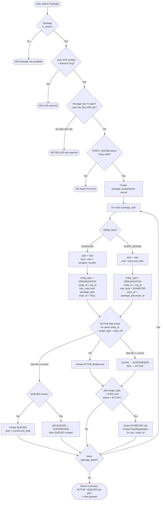

# 1. User Story Statement
**As a** User (KYB-verified, tied to an Organization),
**I want** to purchase a Package,
**so that** my Organization and linked Expos are automatically assigned the correct service plans with the right validity periods.
# 2. Description & Business Value
This story covers the end-to-end flow from a user selecting a Package to the system creating all resulting plan assignments. It connects the commercial layer (Package) to the entitlement layer (Plan Assignment).  
Two purchase channels are supported:
- **Self-service**: User browses and purchases a Package directly on the platform.
- **Sales-assisted**: Sales team configures and assigns a Package on behalf of the user.

Both channels result in the same system behaviour: a package_assignments record is created, and plan_assignments are auto-generated for each Plan in the Package.  
Key rules:

- Purchaser must have completed KYB onboarding and be tied to an Organization.
- Each Plan in the Package is activated independently with its own validity window.
- Conflict resolution (upgrade vs. queue) is applied per Plan at activation time.
- The purchase record is preserved for audit even if plans later expire or are superseded.

Out of scope: payment processing, invoice generation, refunds.

# 3. Scope & Technical Constraints

### **3.1. Pre-condition**

- US-04 complete: packages and package_plans seeded and active.
- Purchaser is authenticated, KYB-verified, and tied to an Organization.
- For TX plans: purchaser must have the SELLER role in B2B Marketplace.

For EVENT_BOUND plans: target Expo is active and within a valid registration window.

### **3.2. Input**

**Table package_assignments:**

|Column|Type|Required|Note|
|---|---|---|---|
|id|UUID|YES|Auto-generated PK|
|package_id|UUID|YES|FK → packages.id|
|organization_id|UUID|YES|FK → Organization the purchaser belongs to|
|purchased_by|UUID|YES|FK → users.id. The user who initiated the purchase.|
|purchased_at|TIMESTAMP|YES|Timestamp of purchase.|
|channel|ENUM|YES|SELF_SERVICE or SALES_ASSISTED|
|created_at|TIMESTAMP|YES|Auto|

> Note: package_assignments always belongs to an Organization. Both B2B and TX plan assignments use entity_type = ORGANIZATION. TX plan assignments additionally carry expo_id to scope the entitlement to a specific Expo.

### **3.3. Process / Logic**

**Full Purchase & Activation Flow:**

1. User selects Package
2. System validates:
   a. Package is active (is_active = true)
   b. User is KYB-verified and linked to Organization
   c. For each TX (EXPO target_type) plan: purchaser has SELLER role in B2B Marketplace
   d. For each EVENT_BOUND plan: target Expo is active and within valid registration window
3. Create package_assignments record
4. For each package_plan in the Package:
   a. Resolve plan validity window:
      - DURATION → start_date = now, end_date = now + duration_months
      - EVENT_BOUND → start_date = now (purchase time), end_date = expo.end_date
   b. Determine target entity and role:
      - ORGANIZATION plan → entity_type = ORGANIZATION, entity_id = organization_id
      - EXPO plan (TX) → entity_type = ORGANIZATION, entity_id = organization_id, expo_id = package_plan.expo_id
      - role_code = package_plan.role_code (copied from package definition)
   c. Apply conflict resolution (US-02 Section C):
      - Check existing ACTIVE plan for same entity + target_type
      - Upgrade (new tier_rank > current) → new plan ACTIVE immediately, current SUPERSEDED
      - Downgrade/Renew (new tier_rank ≤ current) → new plan QUEUED
   d. Create plan_assignments record with package_assignment_id set
   e. If plan.target_type = EXPO and plan_assignment status = ACTIVE: grant role_code (EXHIBITOR) to purchaser for expo_id. Create or update ExpoRegistration linking purchaser's Org to the Expo with EXHIBITOR role.
5. Return success with summary of activated/queued plans 

**Conflict Resolution Summary (per plan in Package):**

|Situation|Result|
|---|---|
|No existing active plan for this module|New plan → **ACTIVE**|
|New plan tier_rank > current (upgrade)|Current → **SUPERSEDED**, new → **ACTIVE**|
|New plan tier_rank ≤ current (downgrade/renew)|New → **QUEUED**|

**Atomicity:**

- The full flow (package_assignments + all plan_assignments) must be atomic. If any plan assignment fails validation, the entire purchase is rolled back.

**Sales-Assisted Channel:**

- SYS_ADMIN or Sales user initiates on behalf of the Organization.
- purchased_by = the admin/sales user ID.
- channel = SALES_ASSISTED.
- Same validation and activation logic applies.

### **3.4. Output**

- package_assignments record created.
- One plan_assignments record per package_plan, status either ACTIVE or QUEUED.
- plan_assignments.package_assignment_id set for traceability.
- Response includes summary: which plans are now ACTIVE, which are QUEUED and when they activate.
- For ACTIVE TX plan assignments: EXHIBITOR role granted and ExpoRegistration created for the purchaser at the target Expo.

# 4. Diagram

# 5. Design (UX/UI Interaction)

### **User Flow 1: Self-service purchase**

**Given:** User is KYB-verified and browsing the Package catalogue.

- **Step 1:** User selects a Package (e.g., "Expo Starter Bundle").
- **Step 2:** System shows Package summary: included plans, validity periods, target Expo (if applicable).
- **Step 3:** User clicks **"Purchase"**.
- **Step 4:** System validates eligibility and processes activation.
- **Step 5:** Confirmation page shows:
    - Plans now **ACTIVE** (with start/end dates).
    - Plans **QUEUED** (with scheduled activation date), if any.

### **User Flow 2: Sales-assisted assignment**

**Given:** Sales team has agreed on a custom Package with a client.

- **Step 1:** SYS_ADMIN opens Organization management.
- **Step 2:** Selects target Organization → **"Assign Package"**.
- **Step 3:** Selects Package from active Package list.
- **Step 4:** Confirms assignment. System runs same activation flow with channel = SALES_ASSISTED.
- **Step 5:** Organization receives active/queued plan assignments. Audit log records sales admin as purchaser.

### **User Flow 3: Purchase with upgrade**

**Given:** Org A has ACTIVE b2b_pro. User purchases Package with b2b_enterprise.

- **Step 1:** User purchases Package.
- **Step 2:** System detects b2b_enterprise (tier_rank=2) > b2b_pro (tier_rank=1) → **upgrade**.
- **Step 3:** b2b_pro → SUPERSEDED. b2b_enterprise → ACTIVE immediately.
- **Step 4:** Confirmation shows: "B2B Enterprise is now active."

### **User Flow 4: Purchase with queue**

**Given:** Org A has ACTIVE b2b_enterprise. User purchases Package with b2b_pro.

- **Step 1:** User purchases Package.
- **Step 2:** System detects b2b_pro (tier_rank=1) < b2b_enterprise (tier_rank=2) → **queue**.
- **Step 3:** b2b_pro → QUEUED with start_date = b2b_enterprise.end_date.
- **Step 4:** Confirmation shows: "B2B Pro is queued. Activates on [date]."

# 6. Acceptance Criteria (AC)

|#|Given|When|Then|
|---|---|---|---|
|**01**|User is KYB-verified with SELLER role. Org A has no active plans. Package has b2b_pro (DURATION 12m) + tx_premium (EVENT_BOUND Expo A).|User purchases Package.|package_assignments created. b2b_pro → ACTIVE (entity = Org A, end = now+12m). tx_premium → ACTIVE (entity = Org A, expo_id = Expo A, end = Expo A end_date). EXHIBITOR role granted for Expo A.|
|**02**|User is not KYB-verified.|User attempts purchase.|Request rejected — KYB verification required.|
|**02b**|User is KYB-verified but does not have SELLER role. Package contains TX plan.|User attempts purchase.|Request rejected — SELLER role required to purchase TX plans.|
|**03**|Package is_active = false.|User attempts purchase.|Request rejected — Package not available.|
|**04**|Org A has ACTIVE b2b_pro (tier_rank=1). Package contains b2b_enterprise (tier_rank=2).|User purchases.|b2b_pro → SUPERSEDED. b2b_enterprise → ACTIVE immediately.|
|**05**|Org A has ACTIVE b2b_enterprise (tier_rank=2). Package contains b2b_pro (tier_rank=1).|User purchases.|b2b_enterprise stays ACTIVE. b2b_pro → QUEUED with start_date = b2b_enterprise.end_date.|
|**06**|Org A already has a QUEUED plan. New Package also generates a QUEUED plan for same module.|User purchases.|Previous QUEUED replaced by new QUEUED.|
|**07**|Package has tx_premium EVENT_BOUND Expo A. Expo A is not yet active.|User purchases.|tx_premium → ACTIVE with start_date = now (purchase time), end_date = Expo A.end_date. Exhibitor has immediate access.|
|**08**|One plan in Package fails validation (e.g., Expo not found).|Purchase attempted.|Entire purchase rolled back. No package_assignments or plan_assignments created.|
|**09**|SYS_ADMIN assigns Package on behalf of Org B.|Assignment confirmed.|channel = SALES_ASSISTED. purchased_by = admin user ID. Same plan activation logic applied.|
|**10**|Package purchase completes with mixed results (one ACTIVE, one QUEUED).|Success response returned.|Response includes per-plan status: plan code, status, start_date, end_date.|
|**11**|Org A has already purchased Package X. Org A purchases Package X again.|Second purchase attempted.|Second purchase processed normally. Each package_plan applies conflict resolution independently — existing plans may be renewed (QUEUED) or upgraded (SUPERSEDED) based on tier_rank.|
|**12**|Two users from the same Org attempt to purchase the same Package simultaneously.|Both requests processed concurrently.|Both package_assignments records created. Conflict resolution in US-02 ensures only one ACTIVE plan per module — second activation results in QUEUED or SUPERSEDED, never duplicate ACTIVE.|

# 7. Non-Technical Explanation

- This is the moment a user "buys" a Package and the system brings it to life.
- Each plan inside the Package activates on its own schedule — a B2B plan might start immediately for 12 months, while a TradeXpo plan activates when the Expo begins and ends when it does.
- If the user already has a plan and buys a better one, the upgrade kicks in right away.
- If they buy a lower or same tier plan, it queues up and activates automatically when the current plan runs out.
- The Sales team can do all of this on behalf of a customer — the end result is identical.