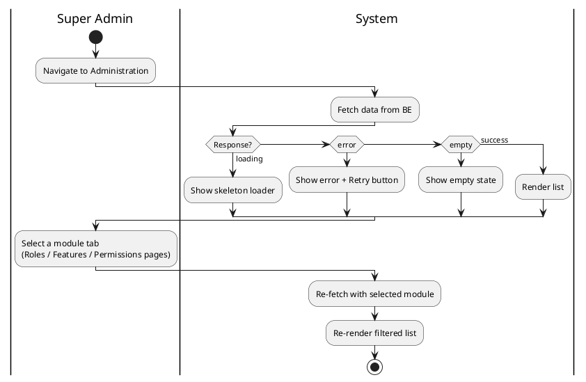

# 1. User Story Statement

**As a** Super Admin,

**I want** to view the platform's Module, Role, Feature, and Permission structure through a dedicated administration UI connected to live data,

**so that** I can verify the current access configuration across all modules accurately.

---

# 2. Description & Business Value

The administration panel manages the platform's four-level access hierarchy: **Module → Role → Feature → Permission**.

The FE has previously built these pages with mocked static data. The BE has now completed the supporting APIs. This ticket covers replacing mock data with live API integration across all four pages.

---

# 3. Scope & Technical Constraints

### 3.1. Pre-condition

- User is authenticated as **Super Admin**.
- User is on the Administration section of the Admin Portal.

### 3.2. Input

The Admin Portal sidebar includes four navigation items: **Modules**, **Roles**, **Features**, **Permissions**. Each item navigates to its respective management page.

**Modules page** — displays all modules registered in the system (e.g., `B2B Marketplace`, `TradeXpo`). No module filter tab on this page.

**Roles page** — displays all roles in the system. Module filter is displayed as **tabs** at the top (one tab per module + an "All" tab).

| Module | Roles |
|--------|-------|
| B2B Marketplace | `BUYER`, `SELLER` |
| TradeXpo | `EXPO_OWNER`, `EXHIBITOR` |

**Features page** — displays all features in the system. Module filter is displayed as **tabs** at the top.

**Permissions page** — displays all permissions in the system. Module filter is displayed as **tabs** at the top. Results are grouped by Role → Feature.

### 3.3. Process / Logic

**Module filter (Tabs):**
- The Roles, Features, and Permissions pages display module filter as **tabs** at the top of the page. Each tab corresponds to one module, plus an **"All"** tab as the default.
- When a module tab is selected, the list updates to show only items belonging to that module.
- The **"All"** tab shows all items across all modules.

**Search:**
- All four pages include a **search bar**. Search is applied against the name/display name of the entity on each page.
- Search and module filter can be applied simultaneously — results reflect both conditions.
- When the search input is cleared, the list resets to the full result (respecting any active module filter).

**Pagination:**
- All four pages are paginated. The default page size is **20 items per page**.
- Pagination resets to page 1 whenever the search keyword or module filter changes.
- The pagination control shows the current page, total pages, and allows navigating to prev/next page.

**API states:**
- All four pages handle three states:
  - **Loading** — show skeleton rows while data is being fetched.
  - **Error** — show an error message with a **Retry** button.
  - **Empty** — show an empty state message if no records exist.

### 3.4. Output

- Each page renders its respective list populated with live data from the BE.
- The module filter, search, and pagination work together to narrow and navigate results.

---

# 4. Diagram

---

# 5. Design (UX/UI Interaction)

### User Flow 1: View Modules

**Given:** Super Admin is on the Administration section.

- **Step 1:** Super Admin clicks **"Modules"** in the sidebar.
- **Step 2:** System fetches and renders the modules list (page 1, 20 items).

---

### User Flow 2: Search on any page

**Given:** Super Admin is on any of the four pages.

- **Step 1:** Super Admin types a keyword into the search bar.
- **Step 2:** System re-fetches with the search keyword; pagination resets to page 1.
- **Step 3:** Matching results are displayed.
- **Step 4:** Super Admin clears the search input → list resets to the full result.

---

### User Flow 3: Filter Roles by module tab

**Given:** Super Admin is on the **Roles** page. The **"All"** tab is active by default.

- **Step 1:** Super Admin clicks the **"B2B Marketplace"** tab.
- **Step 2:** System re-fetches; pagination resets to page 1.
- **Step 3:** Only roles under B2B Marketplace are shown (`BUYER`, `SELLER`).

---

### User Flow 4: Navigate pages

**Given:** Super Admin is on any page with more than 20 records.

- **Step 1:** Super Admin clicks **Next** in the pagination control.
- **Step 2:** System fetches the next page of results and renders them.

---

### User Flow 5: API call fails

**Given:** Super Admin is on any of the four pages.

- **Step 1:** API returns an error.
- **Step 2:** Error message is displayed with a **Retry** button.
- **Step 3:** Super Admin clicks **Retry** → system re-fetches and renders the result.

---

# 6. Acceptance Criteria

| #   | Given                                                         | When                    | Then                                                                                                        |
| --- | ------------------------------------------------------------- | ----------------------- | ----------------------------------------------------------------------------------------------------------- |
| 01  | Super Admin opens the Modules page                            | Page loads              | All modules are displayed, paginated at 20 items per page                                                   |
| 02  | Super Admin opens the Roles page with no filter               | Page loads              | All roles across all modules are displayed                                                                  |
| 03  | Super Admin clicks a module tab on the Roles page             | Tab is selected         | Only roles belonging to that module are shown; pagination resets to page 1                                  |
| 04  | Super Admin clicks a module tab on the Features page          | Tab is selected         | Only features belonging to that module are shown; pagination resets to page 1                               |
| 05  | Super Admin clicks a module tab on the Permissions page       | Tab is selected         | Only permissions belonging to that module are shown, grouped by Role → Feature; pagination resets to page 1 |
| 06  | Super Admin types a keyword in the search bar on any page     | Search is applied       | Results are filtered by the keyword; pagination resets to page 1                                            |
| 07  | Super Admin applies both a module filter and a search keyword | Both are active         | Results reflect both conditions simultaneously                                                              |
| 08  | Super Admin clears the search input                           | Search is cleared       | List resets to the full result respecting any active module filter                                          |
| 09  | A page has more than 20 records                               | Super Admin clicks Next | Next page of results is loaded                                                                              |
| 10  | Data is being fetched on any page                             | Loading state           | Skeleton loader is shown                                                                                    |
| 11  | API call fails on any page                                    | Error state             | Error message and **Retry** button are shown                                                                |
| 12  | API returns no records                                        | Empty state             | Empty state message is shown                                                                                |

---

# 7. Open Items

| # | Item | Status | Decision |
|---|------|--------|----------|
| OI-01 | Does the Permissions page use a flat table or a matrix (Role × Feature) layout? | **Open** | — |
| OI-02 | Should the module filter state persist when navigating between the four pages? | **Open** | — |
