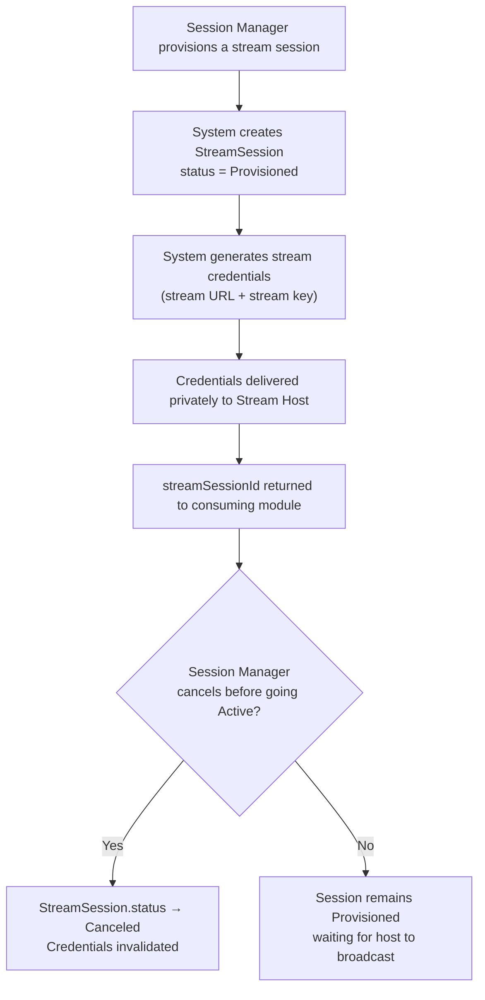

## 1. User Story Statement

**As a** Session Manager,

**I want** to provision a stream session and assign a designated host,

**so that** the host receives private stream credentials and can go live using their broadcasting software.

---

## 2. Description & Business Value

A `StreamSession` is the foundation of any live content event on the platform. Provisioning a session generates a private stream credential set — a stream URL and stream key — that only the designated host can access. The session tracks the full broadcast lifecycle from provisioning through to replay.

This story is module-agnostic. Any product area can provision a `StreamSession` and build its own business context on top. The consuming module links its domain object to the `StreamSession` via `streamSessionId`.

**Business Value:**

- Enables any module on the platform to add live streaming without re-implementing credential management or broadcast detection
- Ensures stream credentials are private, scoped, and invalidated after use

**Dependencies:**

- **[US-02][CORE] Broadcast a Stream Session** — credentials issued here are used by the Stream Host
- **[US-03][CORE] Watch a Stream Session** — sessions provisioned here are watched in US-03

---

## 3. Scope & Technical Constraints

### 3.1. Pre-conditions

- The requesting module has identified a valid user to act as Stream Host
- The Session Manager is authenticated and authorized within the consuming module

### 3.2. Input

| Field | Type | Notes |
|---|---|---|
| **Host User** | User reference | Mandatory. The user who will broadcast this session |
| **Replay Enabled** | Boolean | Optional. Whether the session should be recorded for replay. Defaults to false |

### 3.3. Process / Logic

**Provisioning a session:**

1. System creates a `StreamSession` record with `status = Provisioned`.
2. System generates a unique stream URL and stream key scoped to this session only.
3. Credentials are stored encrypted and delivered privately to the designated host.
4. The consuming module receives the `streamSessionId` to link with its own business object.
5. If `replayEnabled = true`, the session is marked for recording when the broadcast begins.

**Canceling a session (before it goes Active):**

1. Session Manager cancels the session.
2. System transitions `StreamSession.status → Canceled`.
3. Credentials are immediately invalidated.

**Updating replay setting (before session goes Active):**

1. Session Manager updates `replayEnabled`.
2. System updates the flag on the `StreamSession`.

### 3.4. Output

- `StreamSession` record created with `status = Provisioned`
- Stream credentials (stream URL + stream key) available privately to the designated host
- `streamSessionId` available to the consuming module for linking

---

## 4. Diagram

---

## 5. Design (UX/UI Interaction)

> Provisioning is triggered by a module-level action (e.g., creating a GoLIVE Event in TradeXpo). The UI for provisioning is defined by the consuming module. This story defines the platform behavior.

### User Flow 1: Provision a Session

**Given:** Session Manager performs a module-level action that triggers stream provisioning.

* **Step 1:** System creates a `StreamSession` with `status = Provisioned`.
* **Step 2:** System generates and encrypts stream credentials scoped to this session.
* **Step 3:** Credentials become accessible to the designated host in their private Host Dashboard.
* **Step 4:** Consuming module receives `streamSessionId` and links it to its business object.

### User Flow 2: Cancel a Session Before Going Live

**Given:** A `StreamSession` with `status = Provisioned` exists.

* **Step 1:** Session Manager triggers a cancel action via the consuming module.
* **Step 2:** System transitions status to `Canceled` and invalidates credentials immediately.
* **Step 3:** If the host attempts to stream using the now-invalid credentials, the stream is rejected.

---

## 6. Acceptance Criteria

| # | Given | When | Then |
|---|-------|------|------|
| AC-01 | Session Manager provisions a session with a valid host user | Session is provisioned | A `StreamSession` record is created with `status = Provisioned` and the designated host is set |
| AC-02 | Session is provisioned | Credentials are generated | Stream URL and stream key are unique to this session and accessible only to the designated host |
| AC-03 | `replayEnabled = true` at provisioning | Session is provisioned | Session is marked for recording; replay will be available after the session ends |
| AC-04 | `replayEnabled = false` or not set | Session is provisioned | Session is not recorded; no replay is available after it ends |
| AC-05 | Session `status = Provisioned` | Session Manager cancels the session | Status transitions to `Canceled`; credentials are invalidated immediately |
| AC-06 | Session `status = Canceled` | Host attempts to stream using the invalidated credentials | Stream is rejected |

---

## 7. Open Items

| # | Item | Status | Owner |
|---|------|--------|-------|
| OI-01 | Should the Session Manager be able to change the designated host after provisioning? | Open | Product |
| OI-02 | Should `Provisioned` sessions expire if the host never goes live within a set window? | Open | Product |
