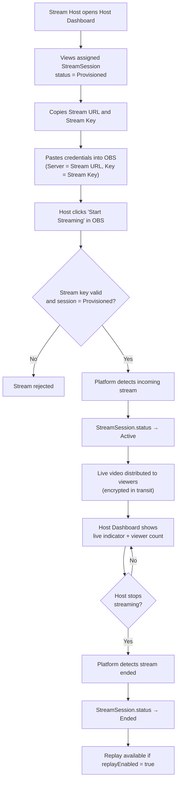

## 1. User Story Statement

**As a** Stream Host,

**I want** to connect my broadcasting software and go live using my stream credentials,

**so that** viewers can watch my live session through the platform.

---

## 2. Description & Business Value

Once a `StreamSession` is provisioned, the designated Stream Host receives a private stream URL and stream key. The host enters these into any RTMP-compatible broadcasting software (such as OBS Studio), then starts streaming. The platform detects the incoming stream, transitions the session to `Active`, and distributes the live video to all viewers.

When the host stops streaming, the platform detects the disconnection and transitions the session to `Ended`. If replay was enabled, a recording becomes available to viewers.

**Business Value:**

- Supports industry-standard RTMP tools (OBS, Streamlabs, vMix) — no proprietary broadcasting software required
- Encrypted stream transport protects content from interception and unauthorized re-distribution

**Dependencies:**

- **[US-01][CORE] Provision a Stream Session** — credentials used here are generated in US-01
- **[US-03][CORE] Watch a Stream Session** — viewers experience the stream published in this flow

---

## 3. Scope & Technical Constraints

### 3.1. Pre-conditions

- A `StreamSession` exists with `status = Provisioned`
- The user is the designated Stream Host for this session
- The host has access to RTMP-compatible broadcasting software

### 3.2. Input

From the **Host Dashboard**, the Stream Host views:

| Field | Description |
|---|---|
| **Stream URL** | The RTMP endpoint to paste into OBS → Settings → Stream → Server |
| **Stream Key** | The private key to paste into OBS → Settings → Stream → Stream Key |

The host copies both values into their broadcasting software, then starts streaming.

### 3.3. Process / Logic

**Starting a broadcast:**

1. Host configures their broadcasting software with the stream URL and stream key.
2. Host starts streaming — this sends the video feed to the platform's ingest endpoint.
3. Platform detects the incoming stream and validates the stream key against the `StreamSession`.
4. System transitions `StreamSession.status → Active`.
5. Live video is distributed to all viewers watching this session.
6. Host Dashboard shows a live indicator and real-time viewer count.

**Ending a broadcast:**

1. Host stops streaming in their broadcasting software.
2. Platform detects the stream has ended.
3. System transitions `StreamSession.status → Ended` immediately.
4. Host Dashboard shows a session summary: duration and peak viewer count.
5. If `replayEnabled = true`, the platform begins processing the recording asynchronously. `StreamSession.replayUrl` remains `null` during processing and is set by the platform once the replay asset is ready. This processing period may take several minutes depending on session length.
6. Viewers who attempt to access replay while processing is in progress see a **"Replay is being prepared"** message. The Watch Replay action becomes available only once `replayUrl` is populated.

### 3.4. Output

- `StreamSession.status = Active` while stream is running
- Live video distributed to viewers watching via [US-03][CORE]
- Host Dashboard shows live indicator and real-time viewer count
- `StreamSession.status = Ended` after the host stops streaming
- Replay available if `replayEnabled = true`

---

## 4. Diagram

---

## 5. Design (UX/UI Interaction)

### User Flow 1: Start a Broadcast

**Given:** Stream Host is logged in and has been assigned to a `StreamSession`.

* **Step 1:** Host navigates to their **Host Dashboard**.
* **Step 2:** They see their assigned session listed with status `Provisioned`.
* **Step 3:** Host clicks **"View Credentials"** — a secure panel reveals the Stream URL and Stream Key with copy-to-clipboard buttons.
* **Step 4:** Host opens OBS Studio → Settings → Stream → Service = Custom → pastes in the URL and key.
* **Step 5:** Host clicks **"Start Streaming"** in OBS.
* **Step 6:** Host Dashboard updates automatically: status badge changes to `Active`, a real-time viewer count appears.

### User Flow 2: End a Broadcast

**Given:** Stream Host is currently live (`status = Active`).

* **Step 1:** Host clicks **"Stop Streaming"** in OBS (or clicks **"End Broadcast"** on the Host Dashboard).
* **Step 2:** Platform detects the stream has ended and transitions the session to `Ended`.
* **Step 3:** Host Dashboard shows a session summary: total duration and peak viewer count.
* **Step 4:** If replay is enabled, viewers see a **"Watch Replay"** option on the session.

---

## 6. Acceptance Criteria

| # | Given | When | Then |
|---|-------|------|------|
| AC-01 | Stream Host has valid credentials and session `status = Provisioned` | Host starts streaming in OBS | Platform detects the stream; session status transitions to `Active` |
| AC-02 | Session transitions to `Active` | Status changes | Live video is distributed to viewers |
| AC-03 | Host uses an invalid or expired stream key | Host starts streaming | Stream is rejected; session status remains unchanged |
| AC-04 | Host is live | Host Dashboard is open | Host sees a live indicator and real-time viewer count |
| AC-05 | Host stops streaming | Stream disconnects | Session status transitions to `Ended` within 30 seconds |
| AC-06 | Session transitions to `Ended` and `replayEnabled = true` | Status changes | `StreamSession.status = Ended` immediately; `replayUrl` is `null` while processing; platform sets `replayUrl` once the replay asset is ready |
| AC-07 | `replayEnabled = true` and `replayUrl` is still `null` (processing in progress) | Viewer attempts to access replay | Viewer sees "Replay is being prepared" message; Watch Replay action is not yet available |
| AC-08 | Session transitions to `Ended` and `replayEnabled = false` | Status changes | No replay is available; `replayUrl` is never set |
| AC-08 | Host clicks "View Credentials" | Panel opens | Stream URL and Stream Key are shown with copy buttons; credentials are not visible to any other user |
| AC-09 | Session `status = Ended` | Host attempts to stream using the same credentials | Stream is rejected; session cannot be restarted |

---

## 7. Open Items

| # | Item | Status | Owner |
|---|------|--------|-------|
| OI-01 | Should the host be able to restart a broadcast after accidentally disconnecting, within a grace period? | Open | Product |
| OI-02 | Should there be a test stream mode so the host can verify their setup before going live? | Open | Product |
| OI-03 | Should duration and peak viewer count be persisted on the `StreamSession` record post-session? | Open | Product |
