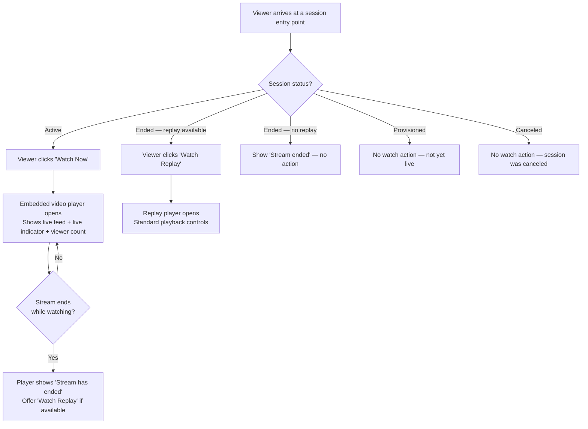

## 1. User Story Statement

**As a** Stream Viewer,

**I want** to watch a live stream or replay through the platform,

**so that** I can follow live content without leaving the platform or installing external software.

---

## 2. Description & Business Value

The Stream Viewer experience covers two states: watching an active live stream and watching a recorded replay after the stream has ended. No account is required to watch — guests and authenticated users can both view content. The consuming module provides the entry point that directs viewers to the player; this story defines the player behavior and viewing rules.

**Business Value:**

- Extends live content reach to remote and guest viewers without requiring account creation
- Replay availability preserves content value beyond the live window, driving re-engagement

**Dependencies:**

- **[US-02][CORE] Broadcast a Stream Session** — the live feed watched here is published in US-02
- The consuming module provides the entry point (e.g., a "Watch Now" button) that opens the player

---

## 3. Scope & Technical Constraints

### 3.1. Pre-conditions

- `StreamSession` exists with `status = Active` (for live) or `status = Ended` and `replayUrl != null` (for replay)
- Viewer has been directed to the session by the consuming module

### 3.2. Input

- Viewer clicks a watch action provided by the consuming module (e.g., "Watch Now" or "Watch Replay")

### 3.3. Process / Logic

**Watching a live stream:**

1. Viewer clicks the watch action.
2. System opens an embedded video player showing the live feed.
3. Player displays: live indicator, session title, and current viewer count.
4. If the stream ends while the viewer is watching, the player transitions to a "Stream has ended" state and offers a replay option if available.

**Watching a replay:**

1. Viewer clicks the replay action.
2. System opens the replay player with the recorded session.
3. Standard playback controls are available: play/pause, seek, volume, fullscreen.

**Auth gating:**

- Watching live streams and replays does not require authentication.

### 3.4. Output

- Viewer watches the live stream or replay within the platform
- Live viewer count is visible to the viewer during an active stream
- Replay remains accessible after the session ends until the consuming module removes it

---

## 4. Diagram

---

## 5. Design (UX/UI Interaction)

### User Flow 1: Watch a Live Stream

**Given:** Viewer has reached the session entry point; `status = Active`.

* **Step 1:** Viewer clicks **"Watch Now"**.
* **Step 2:** An embedded video player opens — inline or in a full-screen overlay (UX decided by consuming module). The player shows a live indicator, session title, and a viewer count.
* **Step 3:** Viewer watches the stream. Controls: volume, fullscreen, and optionally picture-in-picture.
* **Step 4:** If the host ends the stream, the player automatically shows **"Stream has ended"**. If replay is available, a **"Watch Replay"** button appears.

### User Flow 2: Watch a Replay

**Given:** `status = Ended` and `replayUrl` is populated.

* **Step 1:** Viewer clicks **"Watch Replay"**.
* **Step 2:** The replay player opens with standard controls (play/pause, seek bar, volume, fullscreen).
* **Step 3:** Viewer watches at their own pace.

---

## 6. Acceptance Criteria

| # | Given | When | Then |
|---|-------|------|------|
| AC-01 | Session `status = Active` | Viewer clicks "Watch Now" | Embedded video player opens and the live stream plays with a live indicator and viewer count |
| AC-02 | Host ends the stream while a viewer is watching | Stream ends | Player transitions to "Stream has ended" message; "Watch Replay" button appears if replay is available |
| AC-03 | Session `status = Ended` and `replayUrl` is populated | Viewer clicks "Watch Replay" | Replay player opens with standard playback controls |
| AC-04 | Session `status = Ended`, `replayEnabled = true`, and `replayUrl` is still `null` | Viewer views the session | "Replay is being prepared" message is shown; Watch Replay action is not available |
| AC-05 | Session `status = Ended` and `replayEnabled = false` | Viewer views the session | No watch action is available |
| AC-06 | Viewer is a guest (not logged in) | Viewer clicks "Watch Now" | Live stream plays — no authentication required |
| AC-07 | Session `status = Provisioned` or `Canceled` | Viewer views the session | No watch action is available |

---

## 7. Open Items

| # | Item | Status | Owner |
|---|------|--------|-------|
| OI-01 | Should guest viewers need to provide an email to watch (lead capture)? | Open | Product |
| OI-02 | How long are replays retained after the session ends? | Open | Product |
| OI-03 | Should the viewer count be visible to guests, or only to authenticated users? | Open | Product |
