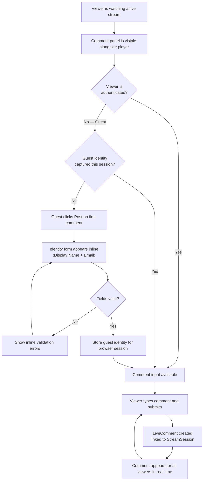

## 1. User Story Statement

**As a** Stream Viewer,

**I want** to post comments while watching a live stream,

**so that** I can engage with the session and interact with other viewers in real time.

---

## 2. Description & Business Value

The Live Comments panel is a real-time public comment thread attached to a `StreamSession`. It is active while the stream is running and becomes read-only after the session ends. Authenticated users can comment immediately. Guests must provide a display name and email before their first comment — this one-time input is remembered for the duration of the browser session.

**Business Value:**

- Increases viewer engagement and dwell time during live sessions
- Enables real-time interaction between viewers and the host
- Captures guest identity (name + email) as a lightweight lead signal — no account creation required

**Dependencies:**

- **[US-03][CORE] Watch a Stream Session** — comments are scoped to an active or ended `StreamSession`

---

## 3. Scope & Technical Constraints

### 3.1. Pre-conditions

- `StreamSession` exists with `status = Active`
- Viewer is on the session watch page

### 3.2. Input

**Authenticated users:**

- Comment text. Mandatory. Max 500 characters.

**Guest users (first comment only):**

| Field | Type | Notes |
|---|---|---|
| **Display Name** | Text | Mandatory. Max 60 characters. Shown next to the comment |
| **Email** | Email | Mandatory. Not displayed publicly |
| **Comment** | Text | Mandatory. Max 500 characters |

After the first comment, the guest's identity is remembered for the browser session. Subsequent comments only require the comment text.

### 3.3. Process / Logic

**Posting a comment (authenticated user):**

1. User types a comment and submits.
2. System creates a `LiveComment` linked to the `StreamSession`, with user identity, timestamp, and comment text.
3. Comment appears in the thread for all viewers immediately.

**Posting a comment (guest — first comment):**

1. Guest clicks **"Post"**.
2. System detects the viewer is not authenticated and has not provided identity this session — shows the identity form (Display Name + Email) inline.
3. Guest fills in the fields and submits.
4. System validates: Display Name (non-empty, max 60 characters) and Email (valid format).
5. System creates a `LiveComment` with guest display name, stored email (private), timestamp, and comment text.
6. Guest identity is stored for the browser session — no further prompts.
7. Comment appears in the thread with the guest's display name.

**Subsequent guest comments (same session):**

1. Guest types and submits directly — no re-entry of identity required.
2. Comment is posted using the identity already captured this session.

**Comment thread display:**

- Chronological order, oldest at top, newest at bottom, with auto-scroll to the latest.
- Each comment shows: avatar/initials, display name, timestamp, and comment text.
- Guest email is never displayed publicly.

**After session ends (`status = Ended`):**

- Comment input is disabled. A label reads: *"This stream has ended. Comments are closed."*
- Existing comments remain visible in read-only mode.

**Comment moderation:**

- The consuming module is responsible for authorizing delete actions. Before requesting a deletion, the consuming module must verify that the requesting user has moderator privileges for this session (e.g., is an Organizer or Broadcaster in TradeXpo).
- Once the consuming module confirms authorization, it instructs Core to delete the comment on behalf of the authorized user. Core executes the deletion and records `deletedByUserId`.
- Core does not enforce role-based authorization independently — it trusts the consuming module's authorization check.
- Deleted comments are removed from view for all viewers immediately.

### 3.4. Output

- Comment appears in the live thread for all current viewers in real time
- Guest identity remembered for the browser session duration
- Comments remain visible (read-only) after the session ends
- Moderators can remove individual comments

---

## 4. Diagram

---

## 5. Design (UX/UI Interaction)

### User Flow 1: Authenticated User Posts a Comment

**Given:** Logged-in viewer is watching a live stream.

* **Step 1:** The comment panel is visible alongside the video player. Existing comments are in a scrollable thread.
* **Step 2:** Viewer types a message in the comment input at the bottom of the panel.
* **Step 3:** Viewer presses **Enter** or clicks **"Post"**.
* **Step 4:** Comment appears immediately at the bottom of the thread with their avatar, display name, and timestamp. Panel auto-scrolls to the latest message.

### User Flow 2: Guest Posts Their First Comment

**Given:** Guest (not logged in) is watching a live stream.

* **Step 1:** Guest sees the comment panel. The input shows a placeholder: *"Join the conversation…"*.
* **Step 2:** Guest types their comment and clicks **"Post"**.
* **Step 3:** An inline identity form expands above the input: **Your name** and **Your email** fields.
* **Step 4:** Guest fills in their name and email, then clicks **"Post Comment"** (a single submit covering both identity and comment).
* **Step 5:** System validates the fields. If valid, the comment is posted with the guest's display name.
* **Step 6:** For the rest of the browser session, the comment input behaves the same as for authenticated users.

### User Flow 3: Guest Posts a Subsequent Comment

**Given:** Guest has already provided identity in this browser session.

* **Step 1:** Guest types a new comment and clicks **"Post"**.
* **Step 2:** Comment is posted immediately using the previously captured identity.

### User Flow 4: Moderator Deletes a Comment

**Given:** Moderator is watching or monitoring the live comment thread.

* **Step 1:** Moderator hovers over (or long-presses on mobile) a comment — a **"Delete"** option appears.
* **Step 2:** Moderator clicks **"Delete"** — no confirmation dialog required.
* **Step 3:** Comment is removed from the thread for all viewers immediately.

### User Flow 5: Stream Ends While Viewer Is in the Comment Panel

**Given:** Viewer is actively watching and the stream ends.

* **Step 1:** Video player transitions to the "Stream has ended" state.
* **Step 2:** Comment input becomes disabled. A label appears below the thread: *"This stream has ended. Comments are closed."*
* **Step 3:** Existing comments remain visible and scrollable.

---

## 6. Acceptance Criteria

| # | Given | When | Then |
|---|-------|------|------|
| AC-01 | `StreamSession.status = Active` | Viewer opens the watch page | Comment panel is displayed alongside the video player |
| AC-02 | Viewer is authenticated | Viewer submits a comment | Comment appears in the thread immediately with their avatar and display name |
| AC-03 | Guest has not provided identity this session | Guest clicks "Post" on first comment | Identity form (name + email) appears inline |
| AC-04 | Guest submits identity form with valid name and email | Form submitted | Comment is posted; identity is remembered for the session; no further prompts appear |
| AC-05 | Guest submits with empty Display Name | Form submitted | Validation error shown next to Name field; comment is not posted |
| AC-06 | Guest submits with invalid email format | Form submitted | Validation error shown next to Email field; comment is not posted |
| AC-07 | Guest has already provided identity this session | Guest submits a subsequent comment | Comment is posted immediately — no identity form appears |
| AC-08 | Any viewer posts a comment | Comment is submitted | All other viewers currently watching see the comment appear without refreshing |
| AC-09 | Guest comment is displayed in the thread | Other viewers see the comment | Guest display name is shown; guest email is not visible to any viewer |
| AC-10 | `StreamSession` transitions to `Ended` | Stream stops | Comment input is disabled; label *"This stream has ended. Comments are closed."* appears |
| AC-11 | Session `status = Ended` | Viewer views the post-stream page | All prior comments remain visible in read-only mode |
| AC-12 | Moderator hovers over or long-presses a comment | User sees comment actions | A "Delete" option is visible |
| AC-13 | Moderator deletes a comment | Delete action triggered | Comment is removed from the thread for all viewers immediately |
| AC-14 | Comment text is empty | Viewer clicks "Post" | Comment is not submitted; submit action remains inactive |
| AC-15 | Comment text exceeds 500 characters | Viewer types past the limit | Input is capped at 500 characters; a character counter shows the remaining count |

---

## 7. Open Items

| # | Item | Status | Owner |
|---|------|--------|-------|
| OI-01 | Should guest email be used to send a follow-up or CTA after the stream ends? | Open | Product |
| OI-02 | Should there be automated comment moderation (e.g., profanity filter)? | Open | Product |
| OI-03 | Should comments be paginated or lazy-loaded for high-traffic streams? | Open | Engineering |
