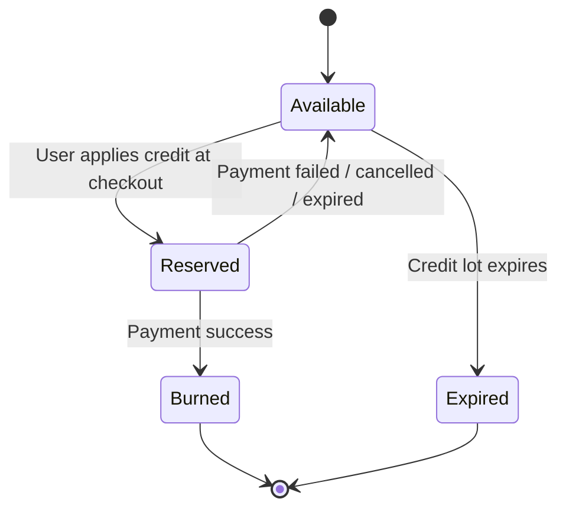

# Epic Overview: TradeCredit

## 1. Business Context

TradeCredit is the cross-product incentive wallet for Arobid. It rewards valuable Buyer, Seller, and Exhibitor behavior with credit points, then lets users burn those credits against eligible Arobid services.

TradeCredit is a **point balance**, not money. Credits do not carry monetary value at earn time. When a user burns credits, the system calculates the discount value using the active credit valuation configured by Arobid Admin at burn time.

This epic supports:

- **B2B Marketplace** - Buyer/Seller engagement, RFQ, quotation, meeting, review, profile, content, and lead-unlock incentives.
- **TradeXpo** - Exhibitor booth setup, expo participation, booth checkout, and Partner/Tenant reporting.
- **Core platform** - Wallet ledger, policy configuration, checkout reservation lifecycle, Notification Center events, and audit.

## 2. Scope

| In Scope | Out of Scope |
| --- | --- |
| TradeCredit wallet and immutable ledger | Cash withdrawal or money transfer |
| Admin configuration for system-defined earn/burn rules | Admin-created custom rule logic |
| Admin credit valuation setting | Min/max guardrail for valuation in V1 |
| Earn processing from approved platform events | Dynamic earn-rate automation |
| Burn reservation lifecycle during checkout | Refund automation beyond releasing reserved credits on failed payment |
| eVoucher + TradeCredit stacking on the same order | Partner/Tenant credit issuance or manual adjustment |
| Notification Center event when burn succeeds | Email notification for burn success |
| Partner/Tenant aggregate reporting only | Partner/Tenant settlement or revenue-share accounting |
| Expiry warning 30 days before credit expiry | Premium Quote Slot |

## 3. Core Product Rules

| Topic | Rule |
| --- | --- |
| Credit nature | Credit is stored as point balance only. It is not cash and cannot be transferred or withdrawn. |
| Default valuation | Default initial valuation is `1 credit = 2,500 VND`. |
| Valuation timing | Monetary discount value is calculated only at burn time using the active Admin-configured valuation. |
| Valuation updates | Changing valuation does not rewrite old earn ledger entries or user credit balances. |
| Earn rules | Earn rules are system-defined. Admin can enable/disable rules and set credit quantity, but cannot create arbitrary trigger logic in V1. |
| Earn cap | Total earn is capped at 900 credits per month per user. When the cap is reached, additional earn events are blocked. |
| Expiry | Credits expire 12 months after earn. Users receive a notification 30 days before expiry. |
| Inactivity | More than 12 months inactive triggers a 30-day warning before reset. |
| Burn cap | Discount burn is capped at 30% of the eligible order value unless a specific burn type is defined as unlock-service burn. |
| Unlock services | Unlock-service burn can consume 100% of the configured credit cost and does not apply the 30% order discount cap. |
| eVoucher stacking | eVoucher and TradeCredit can be used on the same order. No separate combined discount cap is applied beyond each mechanism's own rules. |
| Discount calculation order | `Original price -> eVoucher discount -> TradeCredit burn -> Final payable`. |
| Burn success notification | When credit burn succeeds, TradeCredit emits an in-app Notification Center event showing the number of credits used. Discount value is not shown in the notification. |
| Partner/Tenant scope | Partner and Tenant users do not configure TradeCredit in V1. They can view aggregate reports only for assigned Expo/campaign scope. |
| Discount cost ownership | Arobid absorbs TradeCredit discount cost, including Partner-owned or Tenant-operated Expos. |

## 4. Data Model

### CreditAccount

| Field | Type | Description |
| --- | --- | --- |
| `accountId` | String | Unique wallet account ID |
| `ownerUserId` | FK | User who owns the credit balance |
| `availableBalance` | Number | Credits available to burn |
| `reservedBalance` | Number | Credits currently reserved for checkout/payment |
| `burnedLifetime` | Number | Total burned credits for reporting |
| `expiredLifetime` | Number | Total expired credits for reporting |
| `status` | Enum | `active` / `suspended` |
| `createdAt` | DateTime | |
| `updatedAt` | DateTime | |

### CreditLedgerEntry

| Field | Type | Description |
| --- | --- | --- |
| `ledgerEntryId` | String | Unique ledger entry |
| `accountId` | FK | Related CreditAccount |
| `type` | Enum | `earn` / `reserve` / `burn` / `release` / `expire` / `adjust` / `reverse` |
| `creditAmount` | Number | Positive point quantity affected by this entry |
| `balanceAfter` | Number | Account available balance after entry |
| `sourceModule` | String | Module that emitted the event, e.g. `b2b_marketplace`, `tradexpo`, `payment` |
| `sourceEventType` | String | System event type that caused the ledger entry |
| `referenceId` | String | Related entity such as order, RFQ, meeting, expo, or reservation |
| `reasonCode` | String | Product-readable reason such as `profile_completed`, `booth_discount_burn` |
| `expiresAt` | DateTime, nullable | Required for earn lots; null for burn/release entries |
| `createdAt` | DateTime | |

### CreditRule

| Field | Type | Description |
| --- | --- | --- |
| `ruleId` | String | System-defined rule ID |
| `ruleType` | Enum | `earn` / `burn` |
| `name` | String | Display name shown to Admin |
| `sourceModule` | String | Module that can trigger the rule |
| `triggerEventType` | String | System-defined event that activates the rule |
| `isEnabled` | Boolean | Admin-configurable on/off |
| `creditQuantity` | Number | Admin-configurable earn quantity or fixed burn cost |
| `capType` | Enum | `none` / `one_time` / `monthly` / `per_expo` / `per_order` |
| `capValue` | Number, nullable | Quantity limit for the cap |
| `createdAt` | DateTime | |
| `updatedAt` | DateTime | |

### CreditValuationHistory

| Field | Type | Description |
| --- | --- | --- |
| `valuationId` | String | Unique valuation record |
| `creditValueVnd` | Number | VND value for 1 credit |
| `effectiveAt` | DateTime | When this valuation starts applying |
| `previousValueVnd` | Number, nullable | Previous configured value |
| `adminActorId` | FK | Admin who changed the policy |
| `reasonNote` | String | Required policy change note |
| `createdAt` | DateTime | |

### CreditReservation

| Field | Type | Description |
| --- | --- | --- |
| `reservationId` | String | Unique reservation ID |
| `accountId` | FK | Related CreditAccount |
| `orderId` | FK | Checkout order where credits are reserved |
| `creditAmount` | Number | Reserved credit quantity |
| `valuationId` | FK | Valuation used to calculate burn value at reservation time |
| `status` | Enum | `reserved` / `burned` / `released` |
| `createdAt` | DateTime | |
| `resolvedAt` | DateTime, nullable | Set when burned or released |

## 5. Burn Reservation State Machine



## 6. Checkout Calculation

```text
Original price
  -> apply eVoucher discount
  -> apply TradeCredit burn using active valuation
  -> final payable amount
  -> create payment session
```

TradeCredit burn must be reserved before creating the payment session so the final payable amount is stable during payment. On payment success, the reservation becomes `burned`. On failed, cancelled, or expired payment, the reservation is released back to the wallet.

## 7. Story Map

| # | Story | Actor | Scope |
| --- | --- | --- | --- |
| [US-01] | Admin TradeCredit Policy Configuration | Admin | Rule enable/disable, credit quantities, valuation, audit |
| [US-02] | User TradeCredit Wallet and Ledger History | Buyer / Seller / Exhibitor | Balance, expiring credits, earn/burn/expire history |
| [US-03] | Earn Credit Processing | System | Event-based earn, cap enforcement, ledger write |
| [US-04] | Burn TradeCredit at Checkout | Buyer / Seller / Exhibitor / System | Checkout calculation, reservation, payment resolution |
| [US-05] | Partner and Tenant TradeCredit Reporting | Partner / Tenant | Aggregate report-only visibility |
| [US-06] | TradeCredit Notification Events | System | Burn success and expiry-warning notifications |

## 8. Dependencies

| Dependency | Direction | Note |
| --- | --- | --- |
| B2B Marketplace event sources | Upstream | Emits earn events such as RFQ created, quotation response, meeting completed, review submitted, profile updated |
| TradeXpo event sources | Upstream | Emits earn events such as booth setup completed, expo attended, expo meeting completed |
| eVoucher | Upstream peer | eVoucher discount is calculated before TradeCredit burn when both are present |
| Payment | Downstream peer | Payment session is created after final payable amount is calculated |
| Orders & Transactions | Downstream peer | Order stores final payable amount and payment result; payment result resolves credit reservation |
| Notification Service | Downstream | Delivers in-app Notification Center events emitted by TradeCredit |
| Partner Portal | Downstream | Displays aggregate report-only TradeCredit metrics for assigned Expo/campaign scope |

## 9. Deferred Items

| Item | Reason |
| --- | --- |
| Premium Quote Slot | Not important for V1 standardization |
| Information Show final credit cost | Current `50 credits/lead` remains reference only; not required to block V1 foundation |
| Dynamic earn rate | Advanced anti-inflation mechanism; V1 uses fixed caps, expiry, Admin policy, and audit |
| Partner/Tenant settlement | V1 rule is Arobid absorbs TradeCredit discount cost |
