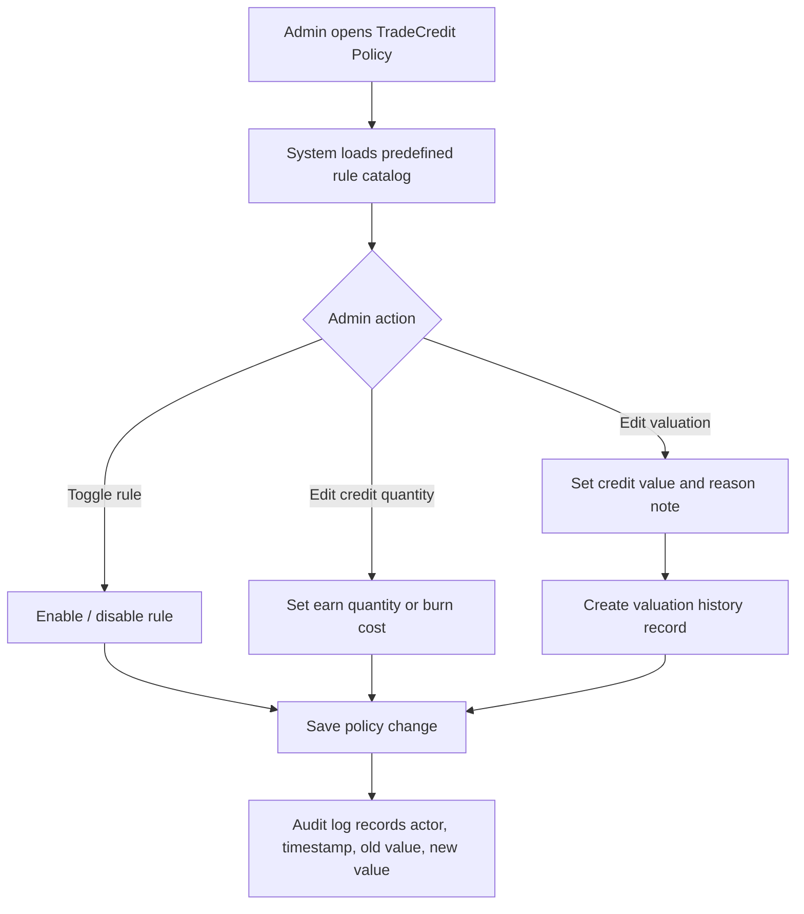

# 1. User Story Statement

**As an** Admin,
**I want** to configure TradeCredit policy using system-defined rules,
**so that** Arobid can control credit earn/burn behavior, credit valuation, and auditability without allowing arbitrary rule creation.

# 2. Description & Business Value

TradeCredit policy controls how users earn and burn credits across Arobid. Admin needs a controlled configuration surface to enable/disable system-defined rules, set credit quantities for earn rules, set the active credit valuation, and review policy-change history.

Admin does not create custom trigger logic in V1. Rule definitions, event triggers, cap types, and anti-gaming hooks are owned by the system so Arobid can keep governance consistent and avoid accidental credit inflation.

# 3. Scope & Technical Constraints

### 3.1. Pre-condition

- User is authenticated as Admin.
- TradeCredit rule catalog exists with system-defined earn and burn rules.
- Default valuation exists: `1 credit = 2,500 VND`.

### 3.2. Input

#### TradeCredit Policy Screen

| Field / Control | Type | Required | Notes |
| --- | --- | --- | --- |
| Rule list | Table | Yes | Shows earn and burn rules from the system-defined catalog |
| Rule status | Toggle | Yes | Admin can turn each rule on/off |
| Credit quantity | Number | Yes for earn rules | Admin sets how many credits user earns when the rule triggers |
| Burn credit cost | Number | Conditional | Used for burn rules with fixed credit cost, such as unlock services |
| Credit valuation | Number VND | Yes | Active VND value for 1 credit at burn time |
| Effective date/time | DateTime | Yes | Defaults to immediate effect |
| Reason / note | Text | Yes when valuation changes | Required for audit |

### 3.3. Process / Logic

**Rule configuration**

1. Admin opens TradeCredit Policy Configuration.
2. System loads all system-defined rules.
3. Admin can enable or disable each rule.
4. Admin can update credit quantity for earn rules.
5. Admin cannot create a new rule, change the event trigger, change cap type, or edit anti-gaming logic.
6. On save, system writes a policy audit entry with Admin actor, timestamp, previous value, and new value.

**Credit valuation**

1. Admin updates the active value of 1 credit.
2. System requires a reason/note.
3. System stores the valuation in `CreditValuationHistory`.
4. New burn calculations use the valuation active at burn/reservation time.
5. Existing wallet balances and historical earn ledger entries are not rewritten.
6. No min/max guardrail is applied in V1.

### 3.4. Output

- Updated rule status and credit quantities are saved.
- Active credit valuation is updated according to effective time.
- Audit history records all policy changes.
- User credit balances remain unchanged after valuation changes.

# 4. Diagram

# 5. Design (UX/UI Interaction)

### User Flow 1: Admin Updates Earn Rule Quantity

**Given:** Admin is on the TradeCredit Policy screen.

- **Step 1:** Admin finds a system-defined earn rule, such as `Create RFQ`.
- **Step 2:** Admin turns the rule on or leaves it enabled.
- **Step 3:** Admin updates the credit quantity.
- **Step 4:** Admin clicks **Save**.
- **Step 5:** System saves the quantity and records the policy audit entry.

### User Flow 2: Admin Updates Credit Valuation

**Given:** Admin is on the TradeCredit Policy screen.

- **Step 1:** Admin opens the Credit Valuation section.
- **Step 2:** Admin enters the new VND value for 1 credit.
- **Step 3:** Admin enters a reason/note.
- **Step 4:** Admin clicks **Save**.
- **Step 5:** System creates a new valuation history record. Future burns use the new active valuation.

# 6. Acceptance Criteria (AC)

| # | Given | When | Then |
| :--- | :--- | :--- | :--- |
| **01** | Admin views TradeCredit Policy | Page loads | System displays system-defined earn and burn rules |
| **02** | Admin toggles an enabled rule off | Clicks Save | Rule is disabled and no future events earn/burn from that rule until re-enabled |
| **03** | Admin updates credit quantity for an earn rule | Clicks Save | New quantity is saved and future earn events use the new quantity |
| **04** | Admin attempts to create a custom rule | Uses the policy screen | No create-custom-rule action is available |
| **05** | Admin changes credit valuation | Provides required reason/note and saves | System creates a valuation history record with previous value, new value, actor, timestamp, and reason |
| **06** | Admin changes credit valuation | Save completes | Existing credit balances and historical earn entries are not rewritten |
| **07** | Admin changes credit valuation without reason/note | Clicks Save | System blocks save and asks for reason/note |
| **08** | A non-Admin user accesses policy configuration | Sends request | System blocks access |

# 7. Open Items

None for V1 baseline.
