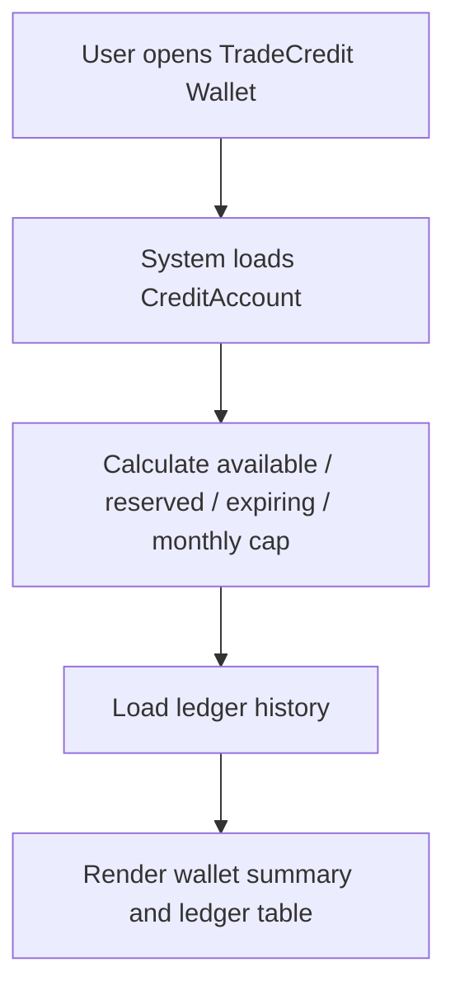

# 1. User Story Statement

**As a** Buyer, Seller, or Exhibitor,
**I want** to view my TradeCredit balance and ledger history,
**so that** I understand how many credits I can use, where they came from, and when they will expire.

# 2. Description & Business Value

The TradeCredit wallet is the user-facing view of credit ownership. It helps users understand available credits, reserved credits, expiring credits, and historical earn/burn/expiry activity.

The wallet displays credits as points only. It does not present credits as cash balance. Monetary value is calculated only when the user burns credits in an eligible checkout or unlock flow.

# 3. Scope & Technical Constraints

### 3.1. Pre-condition

- User is authenticated.
- User has a `CreditAccount`; if none exists, system can initialize an empty active account.

### 3.2. Input

User opens TradeCredit Wallet from their account/workspace area.

Wallet displays:

| Field | Description |
| --- | --- |
| Available credits | Credits that can be used now |
| Reserved credits | Credits currently held for in-progress checkout/payment |
| Expiring soon | Credits expiring within 30 days |
| Monthly earned | Credits earned in the current calendar month |
| Monthly cap usage | Progress against 900 credits/month earn cap |
| Ledger history | Earn, reserve, burn, release, expire, adjust, reverse entries |

Ledger table columns:

| Column | Description |
| --- | --- |
| Date/time | When the ledger entry occurred |
| Type | `Earn`, `Reserved`, `Burned`, `Released`, `Expired`, `Adjusted`, `Reversed` |
| Credits | Credit quantity |
| Source | B2B Marketplace, TradeXpo, Checkout, Admin, System |
| Description | User-readable reason |
| Status | Completed / Reserved |
| Expiry date | Shown for earn lots when applicable |

### 3.3. Process / Logic

1. System loads the current user's CreditAccount.
2. System calculates available, reserved, expiring-soon, and monthly earned values.
3. System displays ledger entries newest first.
4. Credit amounts are displayed as point quantities only.
5. No cash-equivalent value is displayed in the wallet summary.
6. Reserved credits are shown separately and cannot be burned again until released or burned.

### 3.4. Output

- User sees current TradeCredit wallet state.
- User can inspect historical ledger activity.
- User can identify credits expiring soon.

# 4. Diagram

# 5. Design (UX/UI Interaction)

### User Flow 1: User Views Wallet

**Given:** User is authenticated.

- **Step 1:** User opens TradeCredit Wallet.
- **Step 2:** System displays available credits, reserved credits, expiring-soon credits, and monthly cap usage.
- **Step 3:** User scrolls the ledger history.
- **Step 4:** User can see why credits were earned, burned, released, expired, or adjusted.

### User Flow 2: User Has No Credits Yet

**Given:** User has no TradeCredit activity.

- **Step 1:** User opens TradeCredit Wallet.
- **Step 2:** System initializes or loads an empty CreditAccount.
- **Step 3:** Wallet shows `0` available credits and empty ledger state.

# 6. Acceptance Criteria (AC)

| # | Given | When | Then |
| :--- | :--- | :--- | :--- |
| **01** | Authenticated user opens wallet | Page loads | System displays available credits and ledger history |
| **02** | User has reserved credits | Wallet loads | Reserved credits are shown separately from available credits |
| **03** | User has credits expiring within 30 days | Wallet loads | Expiring-soon amount is shown |
| **04** | User has no TradeCredit history | Wallet loads | System shows `0` balance and empty ledger state |
| **05** | Ledger includes earn and burn entries | User views history | Each entry shows type, credits, source, description, and timestamp |
| **06** | User views wallet summary | Page renders | System does not display credits as cash-equivalent wallet money |
| **07** | User reaches monthly earn cap | Wallet loads | Monthly cap usage indicates cap reached |

# 7. Open Items

None for V1 baseline.
