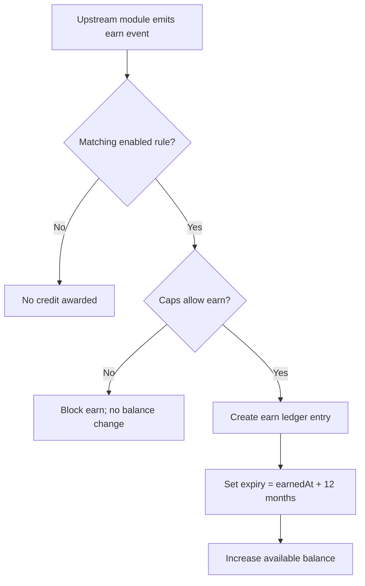

# 1. User Story Statement

**As the** system,
**I want** to process eligible platform events into TradeCredit earn ledger entries,
**so that** users are rewarded consistently for valuable behavior while caps and governance rules are enforced.

# 2. Description & Business Value

Earn processing converts approved events from B2B Marketplace, TradeXpo, and related modules into credit points. The system only processes events for enabled system-defined earn rules. It enforces one-time, monthly, per-expo, and platform-wide caps before writing immutable ledger entries.

# 3. Scope & Technical Constraints

### 3.1. Pre-condition

- User has a CreditAccount or the system can create one.
- A system-defined earn rule exists for the incoming event.
- The rule is enabled by Admin.

### 3.2. Input

TradeCredit receives a normalized earn event from an upstream module.

| Field | Required | Description |
| --- | --- | --- |
| `userId` | Yes | User who should earn credit |
| `sourceModule` | Yes | Module emitting the event |
| `eventType` | Yes | Event type, such as `rfq_created` or `booth_setup_completed` |
| `referenceId` | Yes | ID of related entity |
| `occurredAt` | Yes | Event timestamp |
| `metadata` | No | Extra context for audit/display |

### 3.3. Process / Logic

1. System receives earn event.
2. System finds the matching system-defined earn rule.
3. If no matching rule exists or rule is disabled, no credit is awarded.
4. System checks cap rules:
   - one-time action already earned;
   - per-month action cap;
   - per-expo cap;
   - total 900 credits/month earn cap.
5. If cap blocks the event, system records no earn ledger entry.
6. If eligible, system writes a `CreditLedgerEntry` with type `earn`.
7. Earned credits receive an expiry date 12 months from earn timestamp.
8. Available balance increases by the earned credit quantity.

### 3.4. Output

- Eligible events create earn ledger entries.
- User available balance increases.
- Ineligible, disabled, or capped events do not increase balance.

# 4. Diagram

# 5. Design (UX/UI Interaction)

This story is system-level. User-visible effects appear in TradeCredit Wallet and related notifications.

### Flow 1: Eligible Earn Event

**Given:** User completes an action tied to an enabled earn rule.

- **Step 1:** Upstream module emits the earn event.
- **Step 2:** TradeCredit validates rule and caps.
- **Step 3:** System creates earn ledger entry.
- **Step 4:** User sees increased balance in TradeCredit Wallet.

### Flow 2: Monthly Cap Reached

**Given:** User has already earned 900 credits in the current month.

- **Step 1:** Another earn event is emitted.
- **Step 2:** TradeCredit detects monthly cap reached.
- **Step 3:** No new credits are awarded.

# 6. Acceptance Criteria (AC)

| # | Given | When | Then |
| :--- | :--- | :--- | :--- |
| **01** | Enabled earn rule exists | Matching event is received | System creates an earn ledger entry |
| **02** | Earn ledger entry is created | Processing completes | User available balance increases by configured credit quantity |
| **03** | Rule is disabled | Matching event is received | No credit is awarded |
| **04** | User already earned a one-time rule | Same one-time event is received again | No duplicate credit is awarded |
| **05** | Monthly earn cap has been reached | New eligible event is received | No credit is awarded |
| **06** | Credit is earned | Ledger entry is created | Entry has expiry date 12 months from earn timestamp |
| **07** | Event has no matching system-defined rule | Event is received | System ignores it for TradeCredit earn |

# 7. Open Items

None for V1 baseline.
