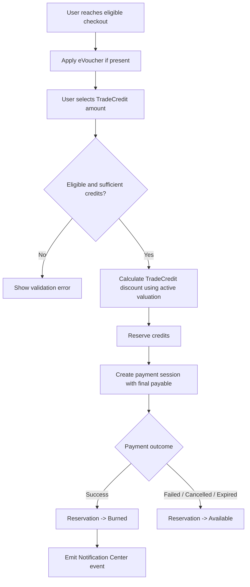

# 1. User Story Statement

**As a** Buyer, Seller, or Exhibitor,
**I want** to burn TradeCredit during eligible checkout or unlock flows,
**so that** I can reduce payable amount or unlock eligible services using my earned credits.

# 2. Description & Business Value

TradeCredit burn lets users convert credit points into eligible benefits at burn time. For checkout discounts, TradeCredit is calculated after eVoucher and before final payment. Credits are reserved during payment and only permanently burned after payment succeeds.

# 3. Scope & Technical Constraints

### 3.1. Pre-condition

- User is authenticated.
- User has available TradeCredit balance.
- Checkout item or service is eligible for TradeCredit burn.
- Burn rule is enabled.
- Active credit valuation exists.

### 3.2. Input

| Field | Type | Required | Notes |
| --- | --- | --- | --- |
| Credit amount to use | Number | Yes | User-selected credit quantity or system-calculated max |
| Order context | Object | Yes | Original price, eligible item/service, eVoucher state if any |
| eVoucher discount | Amount | No | Applied before TradeCredit burn |

### 3.3. Process / Logic

**Checkout calculation order**

```text
Original price -> eVoucher discount -> TradeCredit burn -> Final payable
```

1. System calculates amount after eVoucher discount.
2. System validates TradeCredit burn eligibility.
3. System checks user available credit balance.
4. For discount burn, system applies the 30% order-value burn cap for TradeCredit discount rules.
5. System calculates discount using the active credit valuation.
6. System reserves the selected credits by creating a `CreditReservation`.
7. Reserved credits move from available balance to reserved balance.
8. System creates payment session using final payable amount.
9. On payment success:
   - reservation transitions `reserved -> burned`;
   - credit ledger records burn;
   - Notification Center event is emitted with number of credits used.
10. On payment failed, cancelled, or expired:
   - reservation transitions `reserved -> released`;
   - credits return to available balance.

**Stacking with eVoucher**

- eVoucher and TradeCredit are allowed on the same order.
- No combined discount cap is applied beyond each mechanism's own rules.
- eVoucher percentage/fixed discount is applied before TradeCredit.

### 3.4. Output

- Checkout displays original price, eVoucher discount if any, TradeCredit credits used, and final payable amount.
- Credit reservation is created before payment.
- Reservation resolves based on payment outcome.

# 4. Diagram



# 5. Design (UX/UI Interaction)

### User Flow 1: Burn Credit Successfully

**Given:** User is on eligible checkout and has available credits.

- **Step 1:** User applies eVoucher if they have one.
- **Step 2:** User selects how many TradeCredits to use.
- **Step 3:** System shows final payable amount after eVoucher and TradeCredit.
- **Step 4:** User proceeds to payment.
- **Step 5:** System reserves credits and creates payment session.
- **Step 6:** Payment succeeds.
- **Step 7:** Credits are burned and Notification Center records the number of credits used.

### User Flow 2: Payment Fails

**Given:** User reserved TradeCredit and payment is in progress.

- **Step 1:** Payment fails, is cancelled, or expires.
- **Step 2:** System releases reserved credits.
- **Step 3:** Credits return to available wallet balance.

# 6. Acceptance Criteria (AC)

| # | Given | When | Then |
| :--- | :--- | :--- | :--- |
| **01** | Order has eVoucher and TradeCredit | Checkout calculates total | System applies `Original price -> eVoucher -> TradeCredit -> Final payable` |
| **02** | User has sufficient credits | User applies TradeCredit | System calculates discount using active valuation |
| **03** | User applies TradeCredit at checkout | Before payment session is created | System creates a credit reservation |
| **04** | Payment succeeds | Gateway confirms success | Reservation transitions to `burned` and credits are permanently deducted |
| **05** | Payment fails | Gateway returns failure | Reservation is released and credits return to available balance |
| **06** | Payment is cancelled or expired | Payment session resolves | Reservation is released and credits return to available balance |
| **07** | Burn succeeds | Reservation becomes burned | Notification Center event is emitted with the number of credits used |
| **08** | User has insufficient credits | Attempts to apply more credits than available | System blocks action and shows validation error |
| **09** | Burn rule is disabled | User attempts to use TradeCredit for that item | System does not allow TradeCredit burn for that item |
| **10** | eVoucher and TradeCredit are both used | Checkout validates discount | No combined discount cap is applied beyond each mechanism's own rules |

# 7. Open Items

None for V1 baseline.
