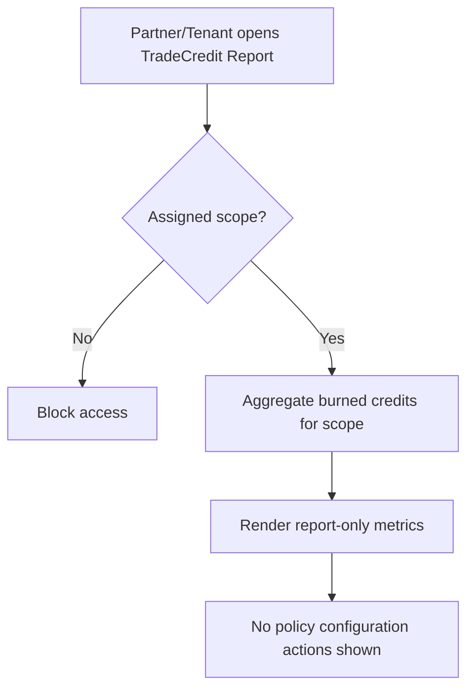

# 1. User Story Statement

**As a** Partner or Tenant,
**I want** to view aggregate TradeCredit usage reports for my assigned Expo or campaign scope,
**so that** I can understand how TradeCredit supports conversion without managing credit rules myself.

# 2. Description & Business Value

Partner and Tenant users do not configure TradeCredit in V1. They contact Arobid to use TradeCredit as part of their collaboration scope. Arobid Admin owns credit valuation, rule configuration, and discount cost.

Partner/Tenant reporting is read-only and aggregate. It helps partners understand TradeCredit impact without exposing user-level wallet balances or granting credit issuance authority.

# 3. Scope & Technical Constraints

### 3.1. Pre-condition

- User is authenticated as Partner / Tenant / Expo Owner with assigned Expo or campaign scope.
- TradeCredit is enabled for the relevant scope by Arobid.

### 3.2. Input

Partner/Tenant opens TradeCredit Reporting in Partner Portal or assigned reporting surface.

Filters:

| Filter | Description |
| --- | --- |
| Expo / campaign | Only assigned scopes are selectable |
| Date range | Reporting period |
| Burn type | Booth discount, unlock service, boost, lead unlock, other eligible category |

Report metrics:

| Metric | Description |
| --- | --- |
| Total credits burned | Aggregate credits used within the assigned scope |
| Number of burn events | Count of successful burn transactions |
| Booth bookings supported by TradeCredit | Count of bookings where TradeCredit was burned |
| Conversion uplift indicator | Aggregate comparison if available |
| Credit-assisted GMV | Aggregate gross order value involving TradeCredit before final payable |

### 3.3. Process / Logic

1. System validates user has access to the requested Expo/campaign scope.
2. System aggregates successful burned TradeCredit entries linked to that scope.
3. System excludes individual wallet balances and unrelated user activity.
4. System displays aggregate metrics only.
5. Partner/Tenant cannot change credit rules, valuation, or issue/adjust credits.
6. Arobid absorbs TradeCredit discount cost in V1; no settlement workflow is exposed.

### 3.4. Output

- Partner/Tenant sees aggregate TradeCredit usage report for assigned scope.
- Unauthorized scope requests are blocked.

# 4. Diagram

# 5. Design (UX/UI Interaction)

### User Flow 1: Partner Views Assigned Expo Report

**Given:** Partner has an assigned Expo.

- **Step 1:** Partner opens TradeCredit Reporting.
- **Step 2:** System lists assigned Expo/campaign scopes only.
- **Step 3:** Partner selects date range and scope.
- **Step 4:** System displays aggregate TradeCredit metrics.

### User Flow 2: Partner Attempts Unauthorized Scope

**Given:** Partner sends a direct request for an unassigned Expo.

- **Step 1:** System validates scope.
- **Step 2:** System blocks the request and returns no report data.

# 6. Acceptance Criteria (AC)

| # | Given | When | Then |
| :--- | :--- | :--- | :--- |
| **01** | Partner has assigned Expo | Opens report | System shows aggregate TradeCredit usage for assigned Expo |
| **02** | Partner selects date range | Applies filter | Metrics update for selected period |
| **03** | Partner requests unassigned Expo | API validates access | System blocks access and returns no report data |
| **04** | Partner views report | Page renders | No user wallet balances are shown |
| **05** | Partner views report | Page renders | No rule configuration, valuation, issue, or adjustment actions are shown |
| **06** | TradeCredit was burned in Partner-owned / Tenant-operated Expo | Report loads | Metrics show aggregate burn activity; discount cost ownership remains Arobid |

# 7. Open Items

None for V1 baseline.
