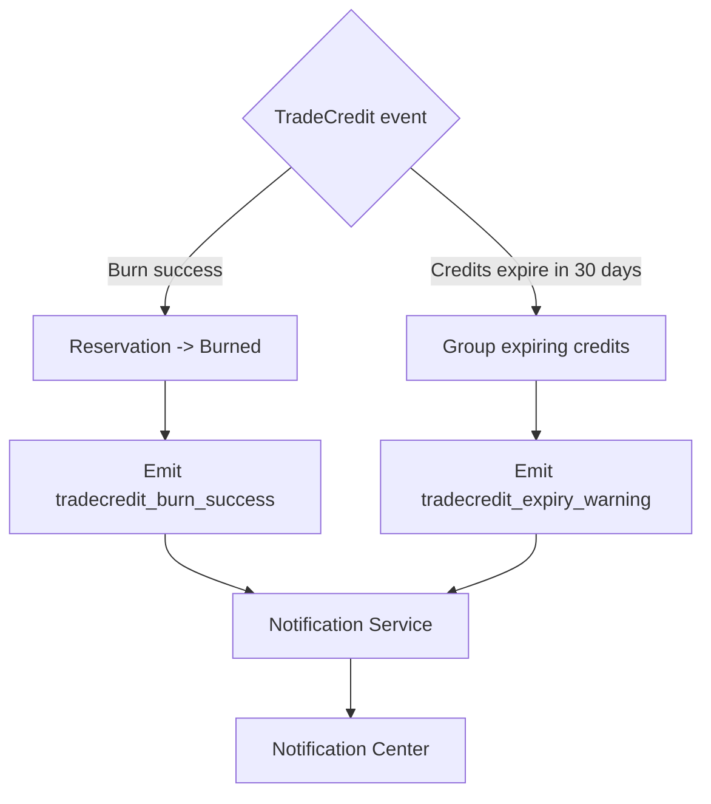

# 1. User Story Statement

**As the** system,
**I want** to emit TradeCredit notification events to the Notification Service,
**so that** users are informed when credits are burned successfully or are close to expiry.

# 2. Description & Business Value

TradeCredit uses the Core Notification Service for user-facing in-app notifications. Notification Service remains module-agnostic; TradeCredit defines the event content, recipient, channels, and deep links.

V1 includes two notification events:

- Burn success: sent when reserved credits become burned after successful payment or service unlock.
- Expiry warning: sent 30 days before credits expire.

# 3. Scope & Technical Constraints

### 3.1. Pre-condition

- Notification Service is available.
- Recipient is an authenticated user with a valid `userId`.
- TradeCredit ledger event has completed.

### 3.2. Input

TradeCredit emits Notification Service payloads.

#### Burn Success

| Field | Value |
| --- | --- |
| `source` | `tradecredit` |
| `type` | `tradecredit_burn_success` |
| `title` | `TradeCredit used successfully` |
| `body` | `You used {creditAmount} credits.` |
| `channels` | `["in_app"]` |
| `deepLinkPath` | TradeCredit wallet or related order detail |
| `referenceId` | CreditReservation or Order ID |
| `referenceType` | `TradeCreditReservation` or `Order` |

The burn success notification must show the number of credits used. It does not show discount value.

#### Expiry Warning

| Field | Value |
| --- | --- |
| `source` | `tradecredit` |
| `type` | `tradecredit_expiry_warning` |
| `title` | `TradeCredits expiring soon` |
| `body` | `{creditAmount} credits will expire in 30 days.` |
| `channels` | `["in_app"]` |
| `deepLinkPath` | TradeCredit wallet |
| `referenceId` | Credit lot or expiry batch ID |
| `referenceType` | `TradeCreditExpiryBatch` |

### 3.3. Process / Logic

**Burn success**

1. Payment or unlock flow resolves successfully.
2. Credit reservation transitions to `burned`.
3. TradeCredit emits notification payload to Notification Service.
4. Notification Service stores and delivers in-app notification to user's Notification Center.

**Expiry warning**

1. System identifies credits expiring in 30 days.
2. System groups relevant expiring credits for the user.
3. TradeCredit emits expiry-warning notification.
4. Notification Service stores and delivers in-app notification.

### 3.4. Output

- User receives in-app Notification Center record for burn success.
- User receives in-app Notification Center record for credits expiring in 30 days.
- No email notification is required for these V1 events.

# 4. Diagram

# 5. Design (UX/UI Interaction)

### User Flow 1: Burn Success Notification

**Given:** User burned TradeCredit successfully.

- **Step 1:** Payment or unlock succeeds.
- **Step 2:** TradeCredit marks credits as burned.
- **Step 3:** Notification Center receives a new in-app notification.
- **Step 4:** User sees how many credits were used.

### User Flow 2: Expiry Warning Notification

**Given:** User has credits expiring in 30 days.

- **Step 1:** Scheduled expiry check runs.
- **Step 2:** TradeCredit emits expiry-warning notification.
- **Step 3:** User sees the warning in Notification Center.

# 6. Acceptance Criteria (AC)

| # | Given | When | Then |
| :--- | :--- | :--- | :--- |
| **01** | Credit reservation becomes burned | Burn completes | System emits `tradecredit_burn_success` notification |
| **02** | Burn success notification is emitted | Notification is displayed | Body shows number of credits used |
| **03** | Burn success notification is displayed | User reads it | Notification does not show discount value |
| **04** | User has credits expiring in 30 days | Expiry check runs | System emits `tradecredit_expiry_warning` notification |
| **05** | Notification event is emitted | Payload is sent | `channels` contains `in_app` only |
| **06** | User opens Notification Center | Notification exists | User can navigate to TradeCredit wallet or related order detail via deep link |

# 7. Open Items

None for V1 baseline.
