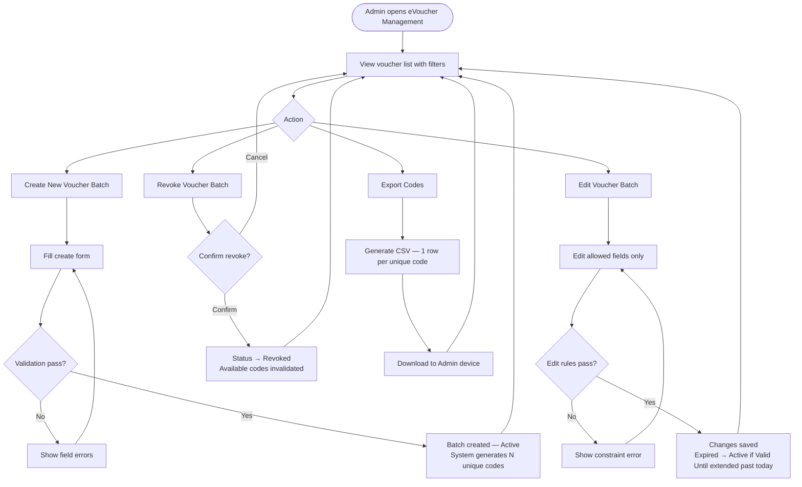

# 1. User Story Statement

**As an** Admin (Arobid),
**I want** to create, view, and manage eVoucher batches,
**so that** I can control the issuance of discount vouchers tied to specific services or expos and distribute individual codes through authorized Partners.

# 2. Description & Business Value

Arobid is the sole authority for issuing eVouchers on the platform. When Admin creates a voucher batch, the system automatically generates N unique individual codes (one per issued quantity unit). Admin can export these codes as a CSV and hand them to a designated Partner for redistribution to businesses.

This screen gives Admin full visibility into all voucher batches, their redemption progress, and which Partner each batch was assigned to.

# 3. Scope & Technical Constraints

### 3.1. Pre-condition

- User is authenticated as Admin.
- At least one active Service or Expo exists on the platform (required for scoping a new voucher batch).

### 3.2. Input

#### 3.2.1 Voucher List Screen

The screen displays all eVoucher batches in a paginated table with the following columns:

| Column | Description |
|--------|-------------|
| Code Prefix | Prefix used to generate all codes in this batch (e.g., `EXPO2025`) |
| Name | Display name |
| Applicable To | Service / Expo + target name |
| Assigned To | Partner name this batch was assigned to |
| Valid Period | Start date – End date |
| Quantity | Issued / Remaining (Remaining = Issued − Locked − Redeemed) |
| Discount | e.g., `10%` or `50,000 VND` |
| Status | `Active` / `Expired` / `Depleted` / `Revoked` |
| Actions | Edit, Export Codes, Revoke |

Filters available: Status, Applicable Type (Service / Expo), Valid Period range, Assigned Partner.

#### 3.2.2 Create / Edit Voucher Form

| Field | Type | Required | Notes |
|-------|------|----------|-------|
| Code Prefix | Text | Yes | Unique prefix used to seed code generation (e.g., `EXPO2025`); Admin may enter manually or leave blank for auto-generation. System appends a unique suffix per code. |
| Name | Text | Yes | Display name shown to users |
| Applicable To | Select: `Service` / `Expo` | Yes | Determines the scoping dimension |
| Target | Reference lookup | Yes | Specific service or expo the voucher applies to |
| Assigned To (Partner) | Reference lookup | Yes | Partner receiving this batch for redistribution |
| Valid From | Date | Yes | Inclusive start of validity window |
| Valid Until | Date | Yes | Inclusive end of validity window; must be after Valid From |
| Issued Quantity | Number (≥ 1) | Yes | Total individual codes to generate for this batch |
| Discount Type | Select: `Percentage` / `Fixed Amount` | Yes | |
| Discount Value | Number (> 0) | Yes | Percentage: 1–100; Fixed: positive integer (VND) |
| Description / Conditions | Text Area | No | Usage conditions shown to the business at checkout |

**Edit rules:**
- `Discount Type` and `Discount Value` cannot be changed once any redemption exists.
- `Valid Until` can only be extended (moved forward), never shortened.
  - If the voucher is `Expired` and Admin extends `Valid Until` to a date after today, the status transitions back to `Active` automatically on save.
- `Issued Quantity` can only be increased, never decreased below the number already redeemed.
  - Increasing quantity causes the system to generate additional codes (the delta) and append them to the existing batch.
- `Code Prefix` and `Target` are immutable after creation.

**Status priority** (when multiple conditions apply simultaneously):
`Revoked > Depleted > Expired > Active`

### 3.3. Process / Logic

**Create:**
1. System validates all required fields.
2. System checks `Code Prefix` is unique across the platform.
3. System checks `Valid Until` > `Valid From`.
4. System checks `Discount Value` is within allowed range for the selected type.
5. If validation passes, system creates the voucher batch with status `Active` and generates `Issued Quantity` unique individual codes (format: `{Code Prefix}-{unique suffix}`).
6. Remaining quantity = Issued Quantity (all codes are `Available`).

**Edit:**
1. System applies edit rules (see 3.2.2).
2. Admin may update: Name, Valid Until (extend only), Issued Quantity (increase only), Assigned To (Partner), Description.
3. If `Valid Until` is extended past today on an `Expired` voucher, status reverts to `Active`.
4. If Issued Quantity is increased, system generates additional codes for the delta.
5. System saves changes; updated values take effect immediately.

**Revoke:**
1. Admin may revoke any non-Revoked voucher.
2. Revoking sets status to `Revoked`; all `Available` codes become immediately invalid.
3. `Locked` codes (mid-transaction) remain locked until the transaction resolves, then enter `Revoked` state (not reusable).

**Export Codes:**
1. Admin clicks **"Export Codes"** on a voucher row.
2. System generates a CSV containing one row per individual code in the batch, with columns: `Code`, `Voucher Name`, `Applicable To`, `Assigned To (Partner)`, `Valid From`, `Valid Until`, `Discount`, `Description`, `Status`.
3. File downloads immediately. Export is available for vouchers in any status.
4. File name format: `evoucher-{code-prefix}-{date}.csv`.

**Automatic status transitions:**
- `Active` → `Expired`: when current date passes `Valid Until`.
- `Active` → `Depleted`: when remaining quantity (Issued − Locked − Redeemed) reaches 0.
- `Expired` → `Active`: when Admin extends `Valid Until` past today on save.
- Status priority when multiple conditions apply: `Revoked > Depleted > Expired > Active`.

### 3.4. Output

- Voucher list reflects the latest state (remaining quantity, status).
- On successful creation: new voucher batch appears at the top of the list with a success confirmation.
- On revoke: voucher row updates status to `Revoked` immediately.
- On export: a CSV file is downloaded to Admin's device. File name format: `evoucher-{code-prefix}-{date}.csv`.

# 4. Diagram

# 5. Design (UX/UI Interaction)

### User Flow 1: Create a New eVoucher Batch

**Given:** Admin is on the eVoucher Management screen.

- **Step 1:** Admin clicks **"Create eVoucher"**.
- **Step 2:** System opens a form (modal or page) with all fields from section 3.2.2.
- **Step 3:** Admin selects **Applicable To** (`Service` or `Expo`); the **Target** field updates to show a searchable list of the selected type.
- **Step 4:** Admin fills in all required fields including discount type, value, validity window, issued quantity, and the Partner to assign the batch to.
- **Step 5:** Admin enters a **Code Prefix** manually (e.g., `EXPO2025`) or leaves blank for auto-generation.
- **Step 6:** Admin clicks **"Save"**.
- **Step 7:** System validates; if errors exist, inline messages are shown next to each invalid field.
- **Step 8:** On success, the form closes, the new batch appears at the top of the list, and the system has generated N individual codes ready for export.

### User Flow 2: Edit an Existing Voucher Batch

**Given:** Admin is viewing an `Active` or `Expired` voucher batch on the list.

- **Step 1:** Admin clicks **"Edit"** on a voucher row.
- **Step 2:** System opens the edit form pre-filled with current values; immutable fields (`Code Prefix`, `Target`, `Discount Type`/`Value` if redemptions exist) are shown as read-only.
- **Step 3:** Admin updates allowed fields (e.g., extends `Valid Until`, increases quantity, updates assigned Partner or description).
- **Step 4:** Admin clicks **"Save"**.
- **Step 5:** System validates edit rules and saves. If an `Expired` voucher's `Valid Until` was extended past today, its status reverts to `Active` and a confirmation note is shown.

### User Flow 3: Export Voucher Codes for Partner Distribution

**Given:** Admin is viewing any voucher batch on the list.

- **Step 1:** Admin clicks **"Export Codes"** on a voucher row.
- **Step 2:** System generates a CSV with one row per individual code in the batch. Columns: `Code`, `Voucher Name`, `Applicable To`, `Assigned To (Partner)`, `Valid From`, `Valid Until`, `Discount`, `Description`, `Status`.
- **Step 3:** File downloads automatically to Admin's device.
- **Step 4:** Admin shares the file with the designated Partner for redistribution to businesses.

### User Flow 4: Revoke a Voucher Batch

**Given:** Admin is viewing any non-Revoked voucher batch on the list.

- **Step 1:** Admin clicks **"Revoke"** on a voucher row.
- **Step 2:** System shows a confirmation dialog: *"Revoking this voucher batch will immediately invalidate all unused codes. This cannot be undone."*
- **Step 3:** Admin confirms.
- **Step 4:** Voucher status changes to `Revoked`; the list row updates immediately.

# 6. Acceptance Criteria (AC)

| # | Given | When | Then |
|:--|:------|:-----|:-----|
| **01** | Admin is on the eVoucher Management screen | Admin creates a batch with all valid fields and Issued Quantity = N | Batch is created with status `Active`; system generates N unique individual codes with format `{Code Prefix}-{suffix}` |
| **02** | Admin fills the create form | Code Prefix already exists on the platform | System blocks creation and shows a duplicate prefix error |
| **03** | Admin fills the create form | `Valid Until` is before or equal to `Valid From` | System shows a date range error and blocks creation |
| **04** | Admin fills the create form with Percentage discount | Discount Value is outside 1–100 | System shows a value range error |
| **05** | A batch has at least one redeemed transaction | Admin attempts to change Discount Type or Discount Value | Fields are read-only; system does not allow the change |
| **06** | Admin edits a batch | Admin attempts to set a new `Valid Until` earlier than the current value | System blocks the change and shows a constraint error |
| **07** | Admin edits a batch | Admin attempts to reduce Issued Quantity below the number already redeemed | System blocks the change |
| **08** | Admin revokes an `Active` batch | Revocation is confirmed | Status changes to `Revoked`; all `Available` codes are invalidated immediately |
| **09** | A batch's `Valid Until` date has passed | System evaluates the batch | Status transitions to `Expired` automatically |
| **10** | All issued codes have been redeemed (Remaining = 0) | System evaluates the batch | Status transitions to `Depleted` automatically |
| **11** | A batch is both `Depleted` and `Expired` | System displays the status | Status shown is `Depleted` (Depleted takes priority over Expired) |
| **12** | Admin extends `Valid Until` of an `Expired` batch to a future date | Admin saves the edit | Status transitions from `Expired` back to `Active` |
| **13** | Admin increases Issued Quantity on an existing batch | Admin saves the edit | System generates additional codes equal to the delta and appends them to the batch |
| **14** | Admin clicks "Export Codes" on a batch | System generates the export | A CSV file is downloaded with one row per individual code; columns include Code, Voucher Name, Applicable To, Assigned To (Partner), Valid From, Valid Until, Discount, Description, Status |
