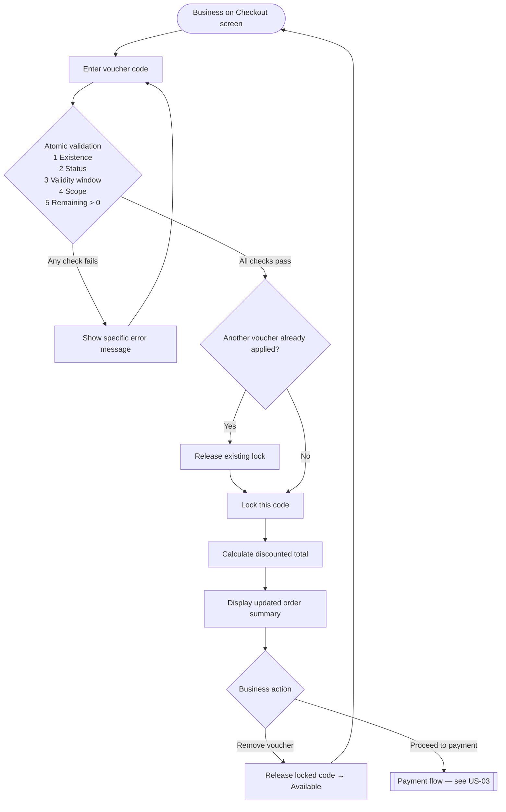

# 1. User Story Statement

**As a** Business (Buyer or Exhibitor),
**I want** to apply an eVoucher code during checkout,
**so that** I can receive a discount on my order before completing payment.

# 2. Description & Business Value

When a business holds a valid eVoucher code (received from a Partner), they can enter it during the payment step to reduce the total payable amount. The discount is applied in real time so the business sees the final price before confirming payment.

This feature supports both B2B Marketplace service purchases and TradeXpo expo booth registrations through a single shared flow.

# 3. Scope & Technical Constraints

### 3.1. Pre-condition

- The business has reached the checkout / payment step for a qualifying order.
- The order is associated with a specific B2B Marketplace service or TradeXpo expo that an eVoucher may be scoped to.
- Only **one voucher code** may be applied per order at a time. Applying a new code while one is already active automatically releases the existing lock and replaces it.

### 3.2. Input

| Field | Type | Required | Notes |
|-------|------|----------|-------|
| Voucher Code | Text | No | Business enters an individual code on the checkout screen. Input is **case-insensitive** — the system normalizes to uppercase before validation. |

### 3.3. Process / Logic

**Validation sequence (in order):**

1. **Existence check** — The normalized code matches a known voucher in the system (either an individual code in a single-use batch, or a multi-use code).
2. **Status check** — The voucher/batch status is `Active` (not `Expired`, `Depleted`, or `Revoked`).
3. **Validity window** — Current date is within `Valid From` – `Valid Until`.
4. **Scope check** — The voucher's target (B2B Marketplace service or TradeXpo expo) matches the item being purchased.
5. **Quantity check** — Remaining quantity > 0, where `Remaining = Issued − Locked − Redeemed`.

All five checks are evaluated as a single **atomic operation** to prevent race conditions (e.g., two businesses applying the last available use simultaneously).

If any check fails, an appropriate error message is shown and the code is not applied. The order total remains unchanged.

**Per-business reuse:**
- **Single-use batch**: each individual code is a one-time use. A business cannot reuse a code they have already redeemed.
- **Multi-use code**: no per-business restriction. A business may apply the same multi-use code to multiple separate orders, as long as remaining quantity > 0 each time.

**On successful validation:**
- If another voucher code was already applied to this order, its lock is **released first**.
- One unit of remaining quantity is **locked** (reserved for this transaction).
- The discount is calculated and applied to the order total:
  - `Percentage`: `Order Total × (1 − Discount% / 100)`
  - `Fixed Amount`: `max(0, Order Total − Discount Value)`
- The checkout screen displays the discounted total and a breakdown showing the applied voucher.

**Removing an applied voucher:**
- The business may remove the voucher code before confirming payment.
- On removal, the locked code is immediately released back to `Available`.

### 3.4. Output

- Checkout screen updates to show:
  - Original amount
  - Voucher discount line (code + discount value)
  - Final payable amount
- A clear error message is shown for each failed validation case (e.g., "Voucher has expired", "Voucher is not applicable to this item").

# 4. Diagram

# 5. Design (UX/UI Interaction)

### User Flow 1: Apply a Voucher Code Successfully

**Given:** Business is on the checkout / payment confirmation screen.

- **Step 1:** Business types the voucher code into the voucher input field on the checkout screen (case-insensitive).
- **Step 2:** Business clicks **"Apply"**.
- **Step 3:** System normalizes the input to uppercase and validates atomically against all conditions.
- **Step 4:** On success, the order summary updates to show the discount breakdown and new total. The input field shows the applied code with a remove (×) option.

### User Flow 2: Voucher Code Fails Validation

**Given:** Business enters a code on the checkout screen.

- **Step 1:** Business types the voucher code and clicks **"Apply"**.
- **Step 2:** System validates and finds a failure (expired, wrong scope, depleted, etc.).
- **Step 3:** An inline error message is shown below the input field (e.g., *"This voucher has expired"* or *"This voucher cannot be used for this item"*).
- **Step 4:** Order total remains unchanged. Business may try a different code.

### User Flow 3: Replace an Already-Applied Voucher

**Given:** A voucher code is already applied on the checkout screen.

- **Step 1:** Business clears the current code field and enters a different code, then clicks **"Apply"**.
- **Step 2:** System validates the new code.
- **Step 3:** On success, the existing lock is released and the new code is locked. Order summary updates to reflect the new discount.
- **Step 4:** On failure, the existing lock is kept and the previous code remains applied. An error message is shown for the new code.

### User Flow 4: Remove an Applied Voucher

**Given:** A voucher has been successfully applied on the checkout screen.

- **Step 1:** Business clicks the remove (×) button next to the applied code.
- **Step 2:** System releases the locked code back to `Available` and reverts the order total to its original amount.
- **Step 3:** The voucher input field becomes empty again.

# 6. Acceptance Criteria (AC)

| # | Given | When | Then |
|:--|:------|:-----|:-----|
| **01** | Business is at checkout for a qualifying order | Business enters a valid, active, in-scope code with remaining > 0 | Discount is applied; order summary shows original amount, discount line, and final total |
| **02** | Business enters a voucher code | Code does not exist | Error shown: code not recognized; total unchanged |
| **03** | Business enters a voucher code | Parent batch status is `Expired` | Error shown: voucher has expired; total unchanged |
| **04** | Business enters a voucher code | Parent batch status is `Revoked` | Error shown: voucher is no longer valid; total unchanged |
| **05** | Business enters a voucher code | Remaining quantity = 0 (`Depleted`) | Error shown: voucher has been fully used; total unchanged |
| **06** | Business enters a voucher code | Voucher is valid but its Module (`B2B Marketplace` / `TradeXpo`) does not match the current order | Error shown: voucher not applicable to this item; total unchanged |
| **07** | Business enters a valid code | Validation passes atomically | Code transitions to `Locked`; it is not available to other transactions until this one resolves |
| **08** | A voucher is applied at checkout | Business removes the applied code before paying | Locked code is released back to `Available`; order total reverts to original |
| **09** | A voucher code is already applied | Business applies a different valid code | Existing lock is released first; new code is locked; order summary updates |
| **10** | Business enters a code in lowercase | Code matches an existing code when normalized to uppercase | Code is accepted; no error shown |
| **11** | Business has previously redeemed a **single-use** code on another order | Business enters the same code again | Error shown: code has already been used; total unchanged |
| **12** | Business has previously redeemed a **multi-use** code on another order | Business enters the same code again on a new order (remaining > 0) | Code is accepted; discount applied normally |
| **13** | Percentage voucher is applied | Discount is 15% on a 2,000,000 VND order | Final total shown as 1,700,000 VND |
| **14** | Fixed amount voucher is applied | Discount is 500,000 VND on a 300,000 VND order | Final total shown as 0 VND (not negative) |

---

*Related: [[US-03][CORE] Voucher Redemption Lock and Release]]*
