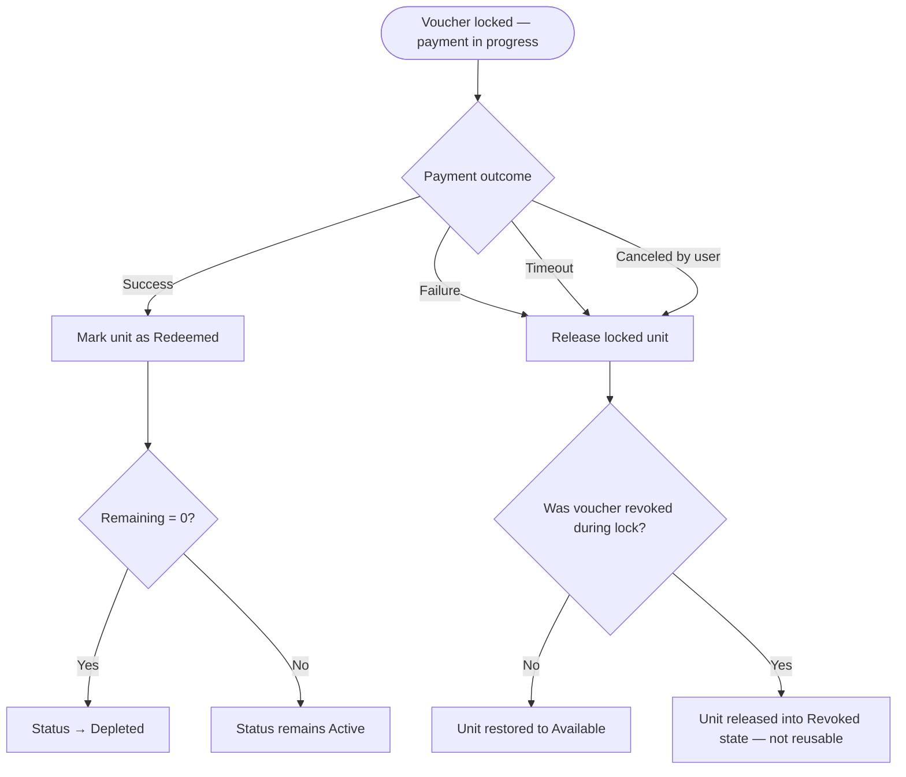

# 1. User Story Statement

**As the** system,
**I want** to manage the lock and release of a voucher's reserved quantity throughout a payment transaction,
**so that** a voucher is consumed exactly once on a successful payment and remains available for reuse if the transaction does not complete.

# 2. Description & Business Value

When a business applies an eVoucher at checkout, one unit of quantity must be temporarily reserved to prevent double-use. However, since payment can fail, time out, or be canceled, the system must reliably release the reservation in those scenarios. This guarantees that vouchers are neither wasted on failed transactions nor double-redeemed on a single code.

# 3. Scope & Technical Constraints

### 3.1. Pre-condition

- A voucher has been applied at checkout (one unit is in `Locked` state for the current transaction).
- The business has proceeded to the payment step.

### 3.2. Input

The system observes the outcome of the payment transaction. No additional user input is required.

| Payment Outcome | Description |
|-----------------|-------------|
| **Success** | Payment gateway confirms the transaction was collected |
| **Failure** | Payment gateway returns a failure or error response |
| **Timeout** | No response received within the gateway's session window |
| **Canceled** | Business explicitly cancels before payment is collected |

### 3.3. Process / Logic

**On payment success:**
1. System marks the locked code as permanently **Redeemed**.
2. The code transitions from `Locked` → `Redeemed`. Remaining quantity (Issued − Locked − Redeemed) decreases by 1.
3. The code cannot be reused for any future transaction.
4. If remaining quantity reaches 0, voucher batch status transitions to `Depleted`.

**On payment failure, timeout, or cancellation:**
1. System **releases** the locked code back to `Available`.
2. The code transitions from `Locked` → `Available`. Remaining quantity is restored.
3. The code can be applied again in a new transaction, provided:
   - Parent batch status is still `Active`.
   - `Valid Until` has not passed.
   - The batch has not been `Revoked` in the interim.

**On voucher revoked during an active lock:**
- The locked unit remains held until the current transaction resolves.
- On resolution: if success → marked Redeemed (deducted). If failure/timeout/cancel → released, but the released unit is placed back into `Revoked` state (not reusable).

**Timeout boundary:**
- A locked code that has not resolved within the payment session window is treated as a timeout and released automatically.
- The timeout window is determined by the active payment gateway. When the gateway signals timeout or the system detects the session has expired without a success callback, the voucher lock is released.

### 3.4. Output

| Outcome | Voucher Remaining Quantity | Voucher Status |
|---------|---------------------------|----------------|
| Payment success | Decremented by 1 (permanent) | `Active` or `Depleted` |
| Failure / Timeout / Cancel | Restored (lock undone) | Unchanged (`Active` or `Revoked`) |

# 4. Diagram

# 5. Design (UX/UI Interaction)

This user story describes system-level behavior with no direct UI interaction. The outcomes are surfaced to the user as follows:

### Outcome Flow 1: Payment Succeeds

- Payment confirmation screen acknowledges the applied discount.
- Voucher code cannot be re-entered in any future transaction.

### Outcome Flow 2: Payment Fails or Times Out

- Business is returned to the checkout screen or a payment retry screen.
- The previously applied voucher code remains in the input field (re-applied automatically, or business may re-enter).
- The voucher is immediately available again and the discount is recalculated on the new attempt.

### Outcome Flow 3: Business Cancels Before Payment

- Business is returned to checkout (per cancellation flow in [[US-05][CORE] QR Bank Transfer Payment]] or equivalent).
- Applied voucher lock is released.
- Business may choose to proceed again with or without the voucher.

# 6. Acceptance Criteria (AC)

| # | Given | When | Then |
|:--|:------|:-----|:-----|
| **01** | A voucher is locked for a transaction | Payment gateway confirms success | Locked unit transitions to Redeemed; remaining quantity is permanently decremented |
| **02** | A voucher is locked for a transaction | Payment gateway returns a failure | Locked unit is released; remaining quantity is restored |
| **03** | A voucher is locked for a transaction | Payment session times out | Locked unit is released; remaining quantity is restored |
| **04** | A voucher is locked for a transaction | Business cancels before payment is collected | Locked unit is released; remaining quantity is restored |
| **05** | Remaining quantity reaches 0 after a successful redemption | System evaluates the voucher | Status transitions to `Depleted` |
| **06** | A voucher is locked and Admin revokes it during the lock | Payment subsequently fails | Released unit enters `Revoked` state; voucher is not reusable |
| **07** | A voucher is locked and Admin revokes it during the lock | Payment subsequently succeeds | Locked unit is marked Redeemed normally |
| **08** | A voucher is released after failure | Voucher is still `Active` and within validity window | Business can apply the same code again in a new transaction |

---

*Related: [[US-02][CORE] Apply eVoucher at Checkout]] · [[US-05][CORE] QR Bank Transfer Payment]]*
