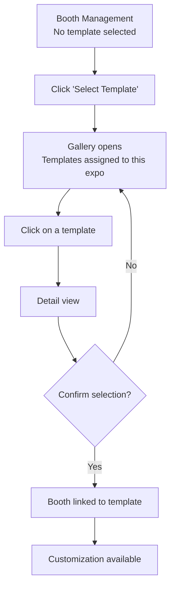

# 1. User Story Statement

**As an** Exhibitor,
**I want** to select a Booth template for my assigned booth,
**so that** my booth has a design layout that represents my brand.

# 2. Description & Business Value

Booth templates are pre-configured by the platform admin and assigned to each expo based on the expo's category. Template selection empowers exhibitors to self-serve their booth design — reducing admin support burden and increasing exhibitor engagement. Once a template is selected, the exhibitor can proceed to customize the template's properties (colors, logo, images, products).

# 3. Scope & Technical Constraints

### 3.1. Pre-condition

- Exhibitor has an approved ExpoRegistration with an assigned booth
- Admin has assigned at least one Booth template to this expo
- Expo is in `Upcoming` or `Live` status

### 3.2. Input

- Selected Booth template

### 3.3. Process / Logic

- Only Booth templates assigned to this expo are shown in the gallery
- Each booth can have exactly one template at a time
- Exhibitor must confirm selection before it is saved
- Template determines which properties are available for customization (e.g., number of colors, max linked products)

### 3.4. Output

- Booth is linked to the selected template
- Customization step (US-03) becomes available

# 4. Diagram

# 5. Design (UX/UI Interaction)

### User Flow: Select Booth Template

**Given:** Exhibitor is in Booth Management; no template selected.

- **Step 1:** System shows "Select Booth Template" section with a "Select Template" button.
- **Step 2:** Exhibitor clicks "Select Template".
- **Step 3:** Gallery opens showing only templates assigned to this expo.
- **Step 4:** Exhibitor browses templates (e.g., "Modern Booth", "Classic Booth", "Minimalist Booth").
- **Step 5:** Exhibitor clicks a template to view its detail (name, preview image, customizable properties).
- **Step 6:** Exhibitor can click "Preview 3D" to inspect the booth layout (see US-04).
- **Step 7:** Exhibitor clicks "Select".
- **Step 8:** Confirmation dialog appears.
- **Step 9:** Exhibitor confirms → template is saved; customization step appears.

# 6. Acceptance Criteria (AC)

| #      | Given                                     | When                             | Then                                                                    |
| :----- | :---------------------------------------- | :------------------------------- | :---------------------------------------------------------------------- |
| **01** | No template selected                      | Exhibitor views Booth Management | "Select Booth Template" section is visible with "Select Template" button |
| **02** | Exhibitor clicks "Select Template"        | Button clicked                   | Gallery opens showing only templates assigned to this expo              |
| **03** | Exhibitor clicks on a template            | Template clicked                 | Detail view opens with name, preview image, and customizable properties |
| **04** | Exhibitor clicks "Select"                 | Button clicked                   | Confirmation dialog appears                                             |
| **05** | Exhibitor confirms                        | Dialog confirmed                 | Booth is linked to the selected template; customization step appears    |
| **06** | Expo is in `Archive` status               | Exhibitor views Booth Management | "Select Template" button is disabled                                    |

# 7. Open Items
