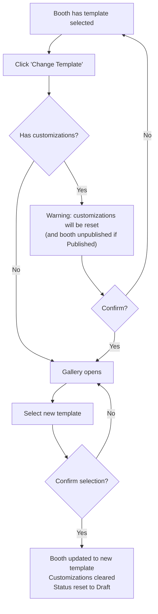

# 1. User Story Statement

**As an** Exhibitor,
**I want** to change my selected Booth template,
**so that** I can try different designs before finalizing my booth setup.

# 2. Description & Business Value

Template change flexibility lets exhibitors experiment confidently. They can compare options and make a deliberate final choice without being locked into their first selection. If the booth was already published, changing the template resets it to Draft — requiring a re-publish after re-customizing.

# 3. Scope & Technical Constraints

### 3.1. Pre-condition

- Booth has a template selected
- Expo is in `Upcoming` or `Live` status

### 3.2. Input

- New Booth template selection

### 3.3. Process / Logic

- If no customizations have been made, the gallery opens directly with no warning
- If customizations exist (colors, logo, images, linked products), a warning is shown before proceeding — changing template will reset all customizations
- If the booth was in `Published` state, changing the template reverts the booth to `Draft`
- Exhibitor must confirm before the change and reset occur

### 3.4. Output

- Booth is updated to the new template
- All prior customizations are cleared
- Booth publish status is reset to `Draft` if it was previously `Published`

# 4. Diagram

# 5. Design (UX/UI Interaction)

### User Flow 1: Change Template (No Customizations)

**Given:** Booth has a template selected; no customizations have been made.

- **Step 1:** Exhibitor clicks "Change Template".
- **Step 2:** Gallery opens directly (no warning).
- **Step 3:** Exhibitor selects a new template and clicks "Select".
- **Step 4:** Confirmation dialog appears.
- **Step 5:** Exhibitor confirms → booth updated to new template.

### User Flow 2: Change Template (Customizations Exist)

**Given:** Booth has been customized (and optionally published).

- **Step 1:** Exhibitor clicks "Change Template".
- **Step 2:** Warning dialog: *"Your customizations (colors, logo, images, products) will be reset. If your booth is published, it will be unpublished. Continue?"*
- **Step 3:** Exhibitor clicks "Continue".
- **Step 4:** Gallery opens; exhibitor selects a new template.
- **Step 5:** Confirmation dialog appears.
- **Step 6:** Exhibitor confirms → booth updated; customizations cleared; status reset to Draft.

# 6. Acceptance Criteria (AC)

| #      | Given                                          | When                         | Then                                                              |
| :----- | :--------------------------------------------- | :--------------------------- | :---------------------------------------------------------------- |
| **01** | Booth has template; no customizations          | Click "Change Template"      | Gallery opens without warning                                     |
| **02** | Booth has customizations                       | Click "Change Template"      | Warning dialog shown                                              |
| **03** | Warning shown                                  | Exhibitor confirms           | Gallery opens for new template selection                          |
| **04** | New template selected                          | Exhibitor confirms           | Booth updated to new template; all customizations cleared         |
| **05** | Booth was in `Published` state                 | Template change confirmed    | Booth status reverts to `Draft`                                   |
| **06** | Expo is in `Archive` status                    | Exhibitor views Booth Management | "Change Template" button is disabled                          |

# 7. Open Items
