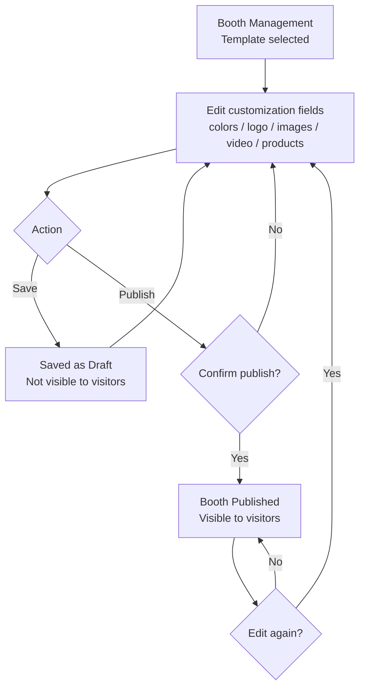

# 1. User Story Statement

**As an** Exhibitor,
**I want** to customize my booth's visual properties, add a video, and link my products,
**so that** my booth reflects my brand identity and showcases my offerings to expo visitors.

# 2. Description & Business Value

After selecting a template, exhibitors can personalize their booth within the boundaries defined by the template. Customization includes visual properties (colors, logo, images), a video (uploaded file or YouTube link), and product linking from the B2B Marketplace. Changes are saved as a Draft and require a separate Publish action to become visible to visitors — giving exhibitors control over when their booth goes live.

# 3. Scope & Technical Constraints

### 3.1. Pre-condition

- Booth has a template selected
- Expo is in `Upcoming` or `Live` status
- Only the main Exhibitor account can access booth customization

### 3.2. Input

Customization fields are defined by the selected template. Possible fields include:

| Field | Type | Constraint |
| :---- | :--- | :--------- |
| Colors | Color picker | Number of color slots defined by template (e.g., 2 or 3) |
| Logo | Image upload | Single image |
| Images | Image upload | Number of image slots defined by template |
| Video | Upload or YouTube link | Mutually exclusive: exhibitor chooses either a video file upload or a YouTube URL — not both; availability defined by template |
| Featured Products | Product selector | Max number of products defined by template (e.g., 3 or 5); selected from exhibitor's B2B Marketplace catalog |

### 3.3. Process / Logic

- Available fields and their limits are determined by the selected template's configuration
- Changes are not auto-saved; exhibitor must click "Save" manually
- Saving stores the customization as `Draft` — not visible to visitors
- Partial save is allowed; all fields are optional at save time
- "Publish" is a separate action that makes the booth visible to visitors
- After publishing, if exhibitor edits and saves again, the status reverts to `Draft` until re-published
- Products shown in the selector are limited to the exhibitor's own products from the B2B Marketplace
- Exhibitor cannot select more products than the template's product slot limit
- For the video field: exhibitor picks either "Upload video" or "YouTube link" — selecting one clears the other
- YouTube link must be a valid youtube.com URL

### 3.4. Output

- **Draft:** Customization saved; booth not visible to visitors
- **Published:** Booth visible to visitors on the expo map and booth detail page

# 4. Diagram

# 5. Design (UX/UI Interaction)

### User Flow 1: Customize and Save as Draft

**Given:** Exhibitor is in Booth Management with a template selected.

- **Step 1:** Customization panel shows fields defined by the template (colors, logo, images, video, products).
- **Step 2:** Exhibitor picks colors using color pickers.
- **Step 3:** Exhibitor uploads logo and images.
- **Step 4:** Exhibitor adds a video — clicks either "Upload Video" or "YouTube Link"; selecting one disables the other.
- **Step 5:** Exhibitor clicks "Add Products" → product selector opens showing exhibitor's B2B Marketplace catalog.
- **Step 6:** Exhibitor selects products up to the template's limit → confirms selection.
- **Step 7:** Exhibitor clicks "Save".
- **Step 8:** System saves as Draft; success notification shown; status badge shows "Draft".

### User Flow 2: Publish Booth

**Given:** Exhibitor has saved customizations (status: Draft).

- **Step 1:** Exhibitor clicks "Publish".
- **Step 2:** Confirmation dialog appears.
- **Step 3:** Exhibitor confirms.
- **Step 4:** Booth status changes to "Published"; booth becomes visible to visitors.

### User Flow 3: Edit After Publishing

**Given:** Booth is in "Published" state.

- **Step 1:** Exhibitor edits a customization field.
- **Step 2:** Exhibitor clicks "Save".
- **Step 3:** Status reverts to "Draft"; booth is no longer visible to visitors until re-published.
- **Step 4:** Exhibitor clicks "Publish" → booth is visible again with updated content.

# 6. Acceptance Criteria (AC)

| #      | Given                                               | When                              | Then                                                                     |
| :----- | :-------------------------------------------------- | :-------------------------------- | :----------------------------------------------------------------------- |
| **01** | Template selected                                   | Exhibitor views customization panel | Fields shown match the template's configuration (color slots, image slots, product limit) |
| **02** | Product selector is open                            | Exhibitor views product list      | Only the exhibitor's own B2B Marketplace products are shown              |
| **03** | Product limit reached (per template)                | Exhibitor tries to select more    | Selection blocked; message shows the template's product limit            |
| **04** | Video field is available (per template)             | Exhibitor selects "Upload Video"  | YouTube link input is disabled; only video upload is active              |
| **05** | Video field is available (per template)             | Exhibitor selects "YouTube Link"  | Video upload is disabled; exhibitor enters a YouTube URL                 |
| **06** | Exhibitor enters an invalid YouTube URL             | Save clicked                      | Validation error shown; customization not saved                          |
| **07** | Exhibitor clicks "Save" with incomplete fields      | Save clicked                      | Customization saved as Draft; no validation error shown                  |
| **08** | Exhibitor clicks "Save"                             | Save clicked                      | Status badge shows "Draft"; changes not visible to visitors              |
| **09** | Exhibitor clicks "Publish"                          | Publish clicked                   | Confirmation dialog appears                                              |
| **10** | Exhibitor confirms Publish                          | Dialog confirmed                  | Booth status changes to "Published"; booth visible to visitors           |
| **11** | Booth is "Published"; exhibitor edits and saves     | Save clicked                      | Status reverts to "Draft"; booth no longer visible to visitors           |
| **12** | Expo is in `Archive` status                         | Exhibitor views Booth Management  | Save and Publish actions are disabled                                    |

# 7. Open Items
