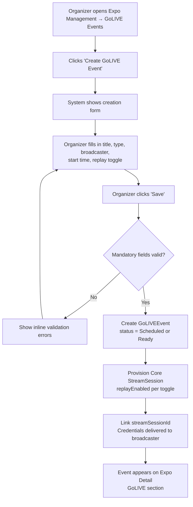

## 1. User Story Statement

**As an** Expo Organizer,

**I want** to create, schedule, and manage GoLIVE Events within an Expo,

**so that** I can build a live content agenda for attendees and control the broadcast schedule across the Expo.

---

## 2. Description & Business Value

A GoLIVE Event is a live session in the Expo agenda — representing workshops, keynotes, panel discussions, product demos, or other live formats. Organizers create these sessions in advance (with a scheduled start time) or as on-demand sessions (no scheduled time), and assign a designated broadcaster.

Creating a GoLIVE Event provisions a **Core StreamSession**, which generates private stream credentials for the designated broadcaster. The GoLIVE Event wraps this session with TradeXpo-specific context: title, session type, thumbnail, and its place in the Expo schedule.

**Business Value:**

- Gives Organizers full control over live programming without technical expertise
- Enables a structured, scheduled agenda that visitors can discover and plan around
- Drives visitor dwell time and return visits by surfacing compelling live content within the Expo

**Dependencies:**

- **Core: Streaming Service** — each GoLIVE Event provisions a StreamSession; stream credentials and broadcast lifecycle are managed there
- **[US-02][TX] GoLIVE Session on Expo Detail Page** — sessions created here appear as watchable entries for visitors
- Expo must be in `Upcoming` or `Live` status

---

## 3. Scope & Technical Constraints

### 3.1. Pre-conditions

- User is authenticated and has the **Expo Organizer** role for this Expo
- Expo is in `Upcoming` or `Live` status

### 3.2. Input

Organizer accesses the GoLIVE management section from the Expo Management panel and clicks **"Create GoLIVE Event"**.

| Field | Type | Notes |
|---|---|---|
| **Title** | Text | Mandatory. Max 100 characters |
| **Session Type** | Select | Mandatory. Options: Workshop, Talkshow, Keynote, Panel, Product Demo, Other |
| **Description** | Text Area | Optional. Visible to visitors on the Expo Detail page |
| **Thumbnail** | Image upload | Optional. Cover image shown before the stream starts |
| **Scheduled Start** | Date + Time | Optional. If left blank, session is on-demand (`Ready`) |
| **Designated Broadcaster** | User selector | Mandatory. Must be a member of the Expo (Organizer or Exhibitor) |
| **Enable Replay** | Toggle | Optional. Defaults to off. If enabled, the session is recorded and available for replay after it ends |

### 3.3. Process / Logic

**Creating a GoLIVE Event:**

1. System validates mandatory fields (Title, Session Type, Designated Broadcaster).
2. System creates a `GoLIVEEvent` record:
   - `status = Scheduled` if Scheduled Start is provided
   - `status = Ready` if no Scheduled Start is provided
   - Linked to the Expo
   - Linked to the designated broadcaster
3. System provisions a **Core StreamSession** with:
   - `replayEnabled` matching the Enable Replay toggle
   - `hostUserId` set to the designated broadcaster
4. System links `GoLIVEEvent.streamSessionId → StreamSession.streamSessionId`.
5. Stream credentials are delivered privately to the broadcaster via their Host Dashboard (Core).
6. GoLIVE Event appears on the Expo Detail page GoLIVE section.

**Editing a GoLIVE Event (before going live):**

1. Organizer opens the event form with current values pre-filled and makes changes.
2. If Designated Broadcaster is changed, Core invalidates the previous credentials and issues new ones to the new broadcaster.
3. Changes to Enable Replay are updated on the linked StreamSession.
4. Editing is only available when `status = Scheduled` or `Ready`.

**Canceling a GoLIVE Event:**

1. Organizer selects **"Cancel Event"** on a session with `status = Scheduled` or `Ready` and confirms.
2. System transitions `GoLIVEEvent.status → Canceled` and cancels the linked StreamSession.
3. Credentials are immediately invalidated.
4. The canceled session is retained in the Expo schedule with a `Canceled` badge — it is not removed.

**Deleting a GoLIVE Event:**

1. Organizer selects **"Delete"** on a session with `status = Scheduled` or `Ready` and confirms.
2. System removes the `GoLIVEEvent` record entirely and cancels the linked StreamSession.
3. The event no longer appears anywhere in the Expo.

### 3.4. Output

- `GoLIVEEvent` record created, linked to the Expo and to a Core StreamSession
- Broadcaster receives private stream credentials via Core
- Event is visible on the Expo Detail GoLIVE section
- Organizer sees the event in their Expo Management panel

---

## 4. Diagram

---

## 5. Design (UX/UI Interaction)

### User Flow 1: Create a GoLIVE Event

**Given:** Organizer is in the Expo Management Panel, GoLIVE Events tab.

* **Step 1:** Organizer clicks **"Create GoLIVE Event"**.
* **Step 2:** A creation form appears. Fields: Title, Session Type, Description, Thumbnail, Scheduled Start, Designated Broadcaster, Enable Replay.
* **Step 3:** Organizer fills in the details. For Designated Broadcaster, a user-picker lets them search and select an Expo member.
* **Step 4:** Organizer clicks **"Save"**.
* **Step 5:** System creates the event and provisions a Core StreamSession. Success toast: *"GoLIVE Event created."*
* **Step 6:** Organizer is returned to the GoLIVE Events list. The new event appears with its status badge and scheduled time (if set).
* **Step 7:** Designated broadcaster sees a new entry in their **Host Dashboard** with the session name and private stream credentials.

### User Flow 2: Edit a GoLIVE Event

**Given:** Organizer is viewing a GoLIVE Event with `status = Scheduled` or `Ready`.

* **Step 1:** Organizer clicks **"Edit"** on the event.
* **Step 2:** Form re-opens with current values pre-filled.
* **Step 3:** Organizer updates fields and clicks **"Save"**.
* **Step 4:** If Designated Broadcaster is changed, new credentials are issued to the new broadcaster and the previous credentials are invalidated.

### User Flow 3: Cancel a GoLIVE Event

**Given:** Organizer is viewing a GoLIVE Event with `status = Scheduled` or `Ready`.

* **Step 1:** Organizer clicks **"Cancel Event"** and confirms: *"This will cancel the session. The event will remain visible in the schedule as canceled."*
* **Step 2:** System marks the event as `Canceled`. Credentials are invalidated.
* **Step 3:** Event remains in the Expo schedule with a `Canceled` badge and is no longer watchable.

### User Flow 4: Delete a GoLIVE Event

**Given:** Organizer is viewing a GoLIVE Event with `status = Scheduled` or `Ready`.

* **Step 1:** Organizer clicks **"Delete"** and confirms: *"This will permanently remove the event."*
* **Step 2:** System removes the event entirely. It no longer appears anywhere in the Expo.

---

## 6. Acceptance Criteria

| # | Given | When | Then |
|---|-------|------|------|
| AC-01 | Organizer submits a valid creation form | Form is saved | A `GoLIVEEvent` is created with correct title, session type, broadcaster, and a linked Core StreamSession |
| AC-02 | Scheduled Start is provided | Event is created | `GoLIVEEvent.status = Scheduled`; start time is shown on the Expo Detail schedule |
| AC-03 | No Scheduled Start is provided | Event is created | `GoLIVEEvent.status = Ready`; no start time is shown |
| AC-04 | Enable Replay is on | Event is created | Linked StreamSession has `replayEnabled = true`; replay will be available after the session ends |
| AC-05 | Enable Replay is off | Event is created | Linked StreamSession has `replayEnabled = false`; no replay after the session ends |
| AC-06 | Event is created | Credentials generated | Designated broadcaster sees the session and stream credentials in their private Host Dashboard |
| AC-07 | Broadcaster is changed via Edit | Form is saved | New credentials issued to the new broadcaster; previous credentials invalidated |
| AC-08 | Title is missing | Form is submitted | Validation error shown next to Title field; event is not created |
| AC-09 | No Designated Broadcaster selected | Form is submitted | Validation error shown; event is not created |
| AC-10 | Session Type is not selected | Form is submitted | Validation error shown; event is not created |
| AC-11 | Organizer cancels a `Scheduled` or `Ready` event and confirms | Cancel confirmed | `GoLIVEEvent.status = Canceled`; credentials invalidated; event remains in schedule with `Canceled` badge |
| AC-12 | Organizer deletes a `Scheduled` or `Ready` event and confirms | Delete confirmed | Event is removed from schedule and Expo Management panel; credentials invalidated |
| AC-13 | Event `status = Live` | Organizer attempts Edit, Cancel, or Delete | All management actions are disabled; tooltip: *"Cannot modify an active live session"* |

---

## 7. Open Items

| # | Item | Status | Owner |
|---|------|--------|-------|
| OI-01 | Should Organizers be able to toggle `replayEnabled` after a session has ended (to remove or restore replay)? | Open | Product |
| OI-02 | Should there be a maximum number of GoLIVE Events per Expo? | Open | Product |
| OI-03 | Should the system send a reminder to visitors before a scheduled GoLIVE starts? | Open | Product |
