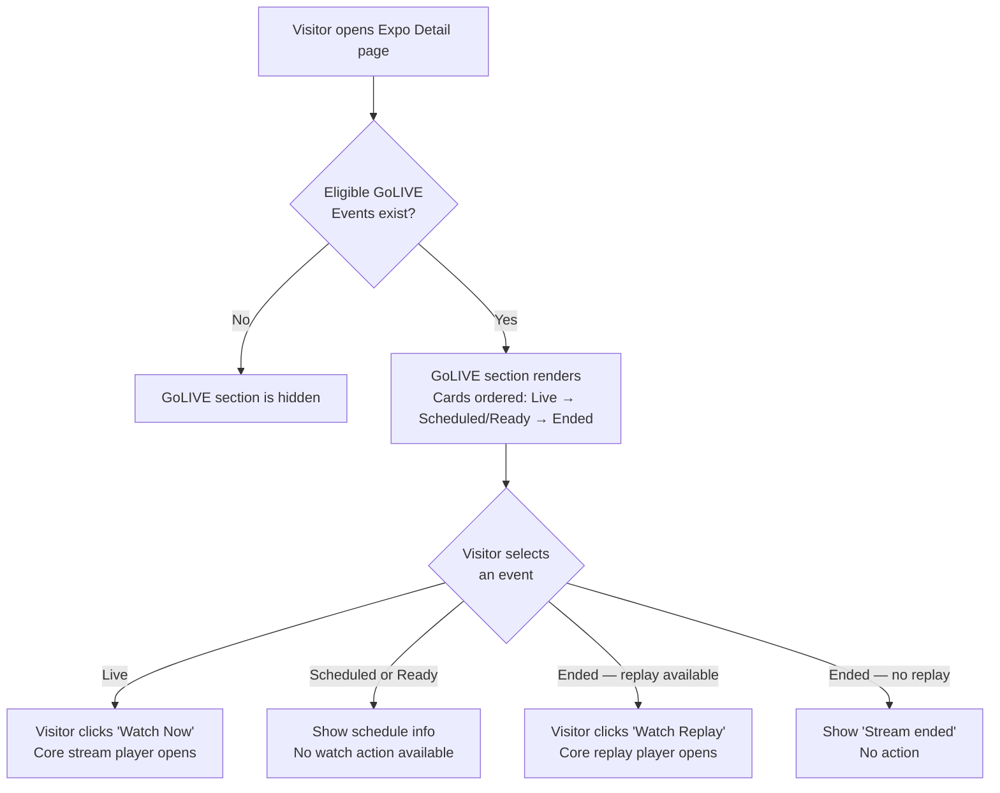

## 1. User Story Statement

**As a** Visitor,

**I want** to see and access GoLIVE sessions on the Expo Detail page,

**so that** I can discover the live programming schedule, watch sessions live, and catch up on content via replay.

---

## 2. Description & Business Value

The GoLIVE section on the Expo Detail page is the visitor-facing surface for all live content at an Expo. Visitors browse the session schedule, see which sessions are currently live, and enter the Core stream player to watch. Replay entries remain accessible after sessions end.

Visitors do not interact with the streaming layer directly — they discover sessions here and are handed off to Core: Streaming Service for playback and live comments.

**Business Value:**

- Increases visitor dwell time by surfacing compelling live content within the Expo
- Extends reach to remote attendees who cannot attend in person
- Replay availability drives re-engagement after the live window closes

**Dependencies:**

- **[US-01][TX] Create and Manage a GoLIVE Event** — sessions displayed here are created in US-01
- **Core: Streaming Service ([US-02][CORE], [US-03][CORE], [US-04][CORE])** — broadcast mechanics, video player, and live comments are handled there
- Expo Detail Page ([US-01][TX] Exhibitor Detail Page) — GoLIVE is a section on this page

---

## 3. Scope & Technical Constraints

### 3.1. Pre-conditions

- At least one `GoLIVEEvent` linked to the Expo exists
- Expo is in `Upcoming`, `Live`, or `Archive` status

### 3.2. Input

- Visitor navigates to the Expo Detail page — GoLIVE section is visible automatically if eligible sessions exist
- Visitor clicks a watch action on an event card

### 3.3. Process / Logic

**GoLIVE section visibility by Expo status:**

| Expo Status | Sessions shown |
|---|---|
| `Upcoming` | `Scheduled` and `Ready` sessions — as upcoming agenda items |
| `Live` | All non-canceled sessions. `Live` sessions are watchable |
| `Archive` | `Ended` sessions only if the linked StreamSession has `replayEnabled = true` |

**Event card behavior by GoLIVEEvent status:**

| GoLIVEEvent Status | Card Content | Action |
|---|---|---|
| `Scheduled` | Title, session type, thumbnail, start date/time, countdown if within 24h | None — agenda display only |
| `Ready` | Title, session type, thumbnail, "On demand" label | None — watch action appears when session goes `Live` |
| `Live` | Title, session type, thumbnail, `LIVE` badge, viewer count | **"Watch Now"** → opens Core stream player |
| `Ended` — replay available | Title, session type, thumbnail, `Ended` badge | **"Watch Replay"** → opens Core replay player |
| `Ended` — no replay | Title, session type, thumbnail, `Ended` badge | None |
| `Canceled` | Not shown | — |

**Card ordering within the GoLIVE section:** `Live` first, then `Scheduled`/`Ready`, then `Ended`.

**Watch entry (live):**

1. Visitor clicks **"Watch Now"** on a `Live` session.
2. System opens the Core stream player (embedded or full-screen overlay).
3. Live comments panel (Core) is accessible alongside the player.

**Replay entry:**

1. Visitor clicks **"Watch Replay"** on an `Ended` session with replay available.
2. System opens the Core replay player.

### 3.4. Output

- Visitor sees the GoLIVE section with appropriately filtered and ordered event cards
- Visitor can enter the Core stream player for live sessions or replay sessions

---

## 4. Diagram

---

## 5. Design (UX/UI Interaction)

### User Flow 1: Browse the GoLIVE Schedule

**Given:** Visitor is on the Expo Detail page; GoLIVE Events exist.

* **Step 1:** Visitor scrolls to the **GoLIVE** section. Event cards are visible, ordered: `Live` first, then `Scheduled`/`Ready`, then `Ended`.
* **Step 2:** Each card shows: thumbnail, title, session type badge, status indicator, and relevant time info or viewer count.
* **Step 3:** `Canceled` sessions are not shown.

### User Flow 2: Watch a Live Session

**Given:** A GoLIVE Event has `status = Live`.

* **Step 1:** Visitor sees the event card with a red **`LIVE`** badge, viewer count, and a **"Watch Now"** button.
* **Step 2:** Visitor clicks **"Watch Now"**.
* **Step 3:** The Core stream player opens (inline or full-screen overlay). Live comments panel is visible alongside.

### User Flow 3: Watch a Replay

**Given:** A GoLIVE Event has `status = Ended` and replay is available.

* **Step 1:** Visitor sees the event card with an **`Ended`** badge and a **"Watch Replay"** button.
* **Step 2:** Visitor clicks **"Watch Replay"**.
* **Step 3:** The Core replay player opens with standard playback controls.

### User Flow 4: View a Scheduled or Ready Session

**Given:** A GoLIVE Event has `status = Scheduled` or `Ready`.

* **Step 1:** Visitor sees the event card with a `Scheduled` badge and start date/time — or an "On demand" label for `Ready` sessions.
* **Step 2:** Sessions starting within 24 hours show a countdown: *"Starting in 2h 30m"*.
* **Step 3:** No watch action is available until the session goes live.

---

## 6. Acceptance Criteria

| # | Given | When | Then |
|---|-------|------|------|
| AC-01 | No eligible GoLIVE Events exist for the Expo | Visitor views Expo Detail | GoLIVE section is not displayed |
| AC-02 | Eligible GoLIVE Events exist | Visitor views Expo Detail | GoLIVE section is visible; cards ordered `Live` first, then `Scheduled`/`Ready`, then `Ended` |
| AC-03 | A GoLIVE Event has `status = Live` | Visitor views the section | Card shows a red `LIVE` badge, viewer count, and a **"Watch Now"** button |
| AC-04 | Visitor clicks "Watch Now" on a Live event | Click action | Core stream player opens with the live feed |
| AC-05 | A GoLIVE Event has `status = Ended` and replay available | Visitor views the section | Card shows an `Ended` badge and a **"Watch Replay"** button |
| AC-06 | Visitor clicks "Watch Replay" | Click action | Core replay player opens with standard playback controls |
| AC-07 | A GoLIVE Event has `status = Ended` and no replay | Visitor views the section | Card shows `Ended` with no watch action |
| AC-08 | A GoLIVE Event has `status = Scheduled` | Visitor views the section | Card shows start date/time; no watch action available |
| AC-09 | A GoLIVE Event has `status = Ready` | Visitor views the section | Card shows "On demand" label; no watch action available |
| AC-10 | A GoLIVE Event has `status = Canceled` | Visitor views the section | Card is not shown |
| AC-11 | Expo `status = Upcoming` | Visitor views Expo Detail | GoLIVE section shows only `Scheduled` and `Ready` sessions |
| AC-12 | Expo `status = Archive` | Visitor views Expo Detail | GoLIVE section shows only `Ended` sessions with replay available |
| AC-13 | Visitor is a guest (not logged in) | Visitor clicks "Watch Now" | Core stream player opens — no authentication required |

---

## 7. Open Items

| # | Item | Status | Owner |
|---|------|--------|-------|
| OI-01 | Should visitors be able to add a session to their calendar from the GoLIVE schedule? | Open | Product |
| OI-02 | Should the GoLIVE section support filtering by session type? | Open | Product |
