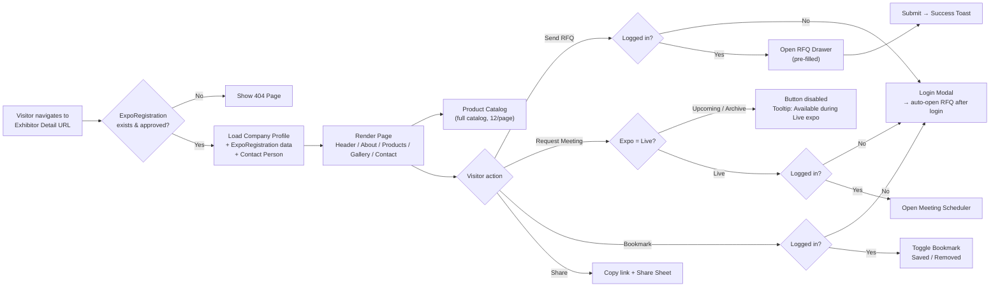

## 1. User Story Statement

**As a** Visitor, **I want to** view a detailed profile of an Exhibitor within an Expo **so that** I can evaluate their products and company, then take action to connect with them directly.
## 2. Description & Business Value

The Exhibitor Detail page is the endpoint of the Visitor's discovery journey within an Expo — the moment where a passive browser decides whether to convert into a lead. The page displays a comprehensive view of a company in the context of a specific Expo: booth information, the full company product catalog with pagination, the contact person assigned to the Expo, media assets, and four CTAs for Visitor action.

The page is accessible across all three Expo statuses (`Upcoming` / `Live` / `Archive`). However, the **Request Meeting** CTA is only enabled when the Expo is `Live`, ensuring meeting requests are only submitted during the active event period.

**Business Value:**

- Converts Visitor discovery intent into concrete lead actions (RFQ, Meeting)
- Increases Exhibitor visibility and product exposure within the Expo context
- Supports multiple connection modes (async RFQ + real-time meeting during Live)
- Extends Exhibitor value beyond the event window — accessible post-Expo via Archive
## 3. Scope & Technical Constraints

### 3.1. Pre-conditions

- Exhibitor has registered and been approved for the Expo (`ExpoRegistration.status = approved`)
- Expo exists in one of three statuses: `Upcoming`, `Live`, or `Archive`
- Exhibitor's company data (profile, products) is synced from the **B2B Marketplace** — no manual input required from the Exhibitor on the TradeXpo side
- `ExpoRegistration` contains a valid `contactPerson` record (name, title, email, phone)
### 3.2. Inputs

- URL params: `expo_slug` + `exhibitor_slug`
- Visitor auth state: guest or authenticated
### 3.3. Process Logic
**Page resolution:**

- System resolves `expo_slug` + `exhibitor_slug` → loads `Company` entity + `ExpoRegistration` entity
- If `ExpoRegistration` does not exist or `status ≠ approved` → return 404
**Products section:**
- Displays the full `CompanyProduct` catalog synced from the B2B Marketplace (read-only, not expo-specific)
- Paginated at **12 products per page**
- Clicking a product card opens a **Product Detail Modal** (not a separate page) — modal displays product name, images, description, specifications, and price range
- Modal can be closed via the ✕ button or clicking outside; page state and scroll position are preserved
**Contact section:**
- Displays the contact person from `ExpoRegistration.contactPerson` (not the company's general contact)
- Fields: full name, job title, email, phone number
**CTA availability by Expo status:**

| CTA | Upcoming | Live | Archive |
| --- | --- | --- | --- |
| Send RFQ | ✅ Enabled | ✅ Enabled | ✅ Enabled |
| Request Meeting | ❌ Disabled + tooltip | ✅ Enabled | ❌ Disabled + tooltip |
| Bookmark | ✅ Enabled | ✅ Enabled | ✅ Enabled |
| Share | ✅ Enabled | ✅ Enabled | ✅ Enabled |

**Auth gating:**

- Send RFQ, Request Meeting, and Bookmark all require login
- Guest clicks any auth-required CTA → Login modal appears → after successful login, the system redirects back to this page and auto-triggers the original action
- Share does not require login

**Error handling:**

- 404: when URL params resolve to a non-existent or unapproved registration
- Empty products: display empty state — *"No products available"*
- Contact person not found: hide contact section gracefully (do not show empty fields)

### 3.4. Outputs

- Full rendered page: Header, About, **3D Booth section**, Product Catalog (paginated, 12/page), Media Gallery, Contact Person, 4 CTA buttons
- RFQ record created and linked to Exhibitor + Expo context (handled by RFQ module)
- Meeting request sent (handled by Meeting module)
- Exhibitor added to or removed from Visitor's bookmark list
- Expo page URL copied to clipboard

---

## 4. Flow / Process Diagram

---

## 5. UX / UI Interaction Flow

1. Visitor arrives from the Expo Map, Expo Business List, or a shared link.
2. **Breadcrumb** at the top of the page: `[Expo Name] > Exhibitors > [Company Name]`.
3. **Page Header** renders: company logo (left) · company name + industry tag + country flag (center) · tier badge + booth number (right).
4. **Sticky action bar** sits immediately below the header and remains visible on scroll. It contains four controls: **Send Inquiry** · **Request Meeting** · **🔖 Bookmark** · **Share**.
    - "Request Meeting" renders as muted and disabled when the Expo is `Upcoming` or `Archive`; hover or tap reveals a tooltip: *"Available during Live expo"*.
5. Visitor scrolls through sections in order: **About** (company description, founding year, export markets) → **3D Booth** (booth preview with "View 3D Booth" CTA) → **Products** (full catalog grid, paginated at 12 per page) → **Media Gallery** (images, videos, brochures) → **Contact** (assigned contact person: name, title, email, phone).
    - In the 3D Booth section, a visual preview of the booth (thumbnail or cover image) is displayed alongside a **"View 3D Booth"** button — **only when Expo is `Live`**. When the Expo is `Upcoming` or `Archive`, this section is hidden entirely. No login is required to click "View 3D Booth".
    - In the Products section, each product card is clickable. Clicking a card opens the **Product Detail Modal** overlaying the current page. The modal shows: product name, image gallery, description, specifications, and price range. Visitor closes the modal via ✕ or clicking the backdrop; the page returns to the same scroll position.
6. **Send Inquiry:**
    - Guest → Login modal appears → after login, RFQ drawer opens automatically.
    - Logged in → RFQ drawer opens immediately with pre-filled Exhibitor name and Expo context.
    - On successful submit: toast *"Inquiry sent successfully"* appears, drawer closes, scroll position is preserved.
7. **Request Meeting** (only when Expo is `Live`):
    - Guest → Login modal → after login, Meeting Scheduler opens automatically.
    - Logged in → Meeting Scheduler modal opens directly.
8. **Bookmark:**
    - Guest → Login modal → after login, exhibitor is automatically bookmarked.
    - Logged in → toggles immediately; short toast shows *"Saved"* or *"Removed"*.
9. **Share:** copies the page URL to the clipboard and shows toast *"Link copied!"*; on mobile, triggers the native OS share sheet.
10. **Pagination:** Visitor clicks Next / Prev or selects a page number; the next batch of products loads without a full page reload.

---

## 6. Acceptance Criteria

| # | Given | When | Then |
| --- | --- | --- | --- |
| AC-01 | Valid URL, ExpoRegistration is approved, Expo is in any status | Visitor navigates to the page | Page renders fully: header, about, 3D booth section, products, contact person |
| AC-02 | `exhibitor_slug` does not exist or `ExpoRegistration.status ≠ approved` | Visitor navigates to the URL | System returns a 404 page with a link back to the Expo Exhibitor list |
| AC-03 | Expo is `Live` | Visitor views the page | All 4 CTAs are enabled and clickable |
| AC-04 | Expo is `Upcoming` or `Archive` | Visitor views the page | "Request Meeting" is disabled; tooltip *"Available during Live expo"* is shown on hover or tap; the other 3 CTAs remain enabled |
| AC-05 | Visitor is not logged in, clicks Send RFQ | Click action | Login modal appears; after successful login, RFQ drawer opens automatically |
| AC-06 | Visitor is not logged in, clicks Request Meeting (Expo is `Live`) | Click action | Login modal appears; after successful login, Meeting Scheduler opens automatically |
| AC-07 | Visitor is not logged in, clicks Bookmark | Click action | Login modal appears; after successful login, exhibitor is automatically saved to bookmarks |
| AC-08 | Visitor is logged in, clicks Send RFQ | Click action | RFQ drawer opens immediately with pre-filled Exhibitor name and Expo context |
| AC-09 | Visitor submits the RFQ form successfully | Form submission | Toast *"Inquiry sent successfully"* appears; drawer closes; scroll position is preserved |
| AC-10 | Exhibitor has products in their catalog | Visitor views Products section | Full catalog renders as a grid, paginated at 12 products per page |
| AC-11 | Exhibitor has no products in their catalog | Visitor views Products section | Empty state displays: *"No products available"* |
| AC-12 | Catalog has more than one page | Visitor clicks Next page | Next set of products loads without a full page reload |
| AC-13 | Visitor is logged in, clicks Bookmark for the first time | Click action | Exhibitor is saved to bookmarks; icon switches to filled state; toast *"Saved"* appears |
| AC-14 | Visitor is logged in, clicks Bookmark on an already-bookmarked exhibitor | Click action | Exhibitor is removed from bookmarks; icon switches to outline state; toast *"Removed"* appears |
| AC-15 | Visitor clicks Share on desktop | Click action | Page URL is copied to clipboard; toast *"Link copied!"* appears for 3 seconds |
| AC-16 | Visitor clicks Share on mobile | Click action | Native OS share sheet appears |
| AC-17 | ExpoRegistration has a `contactPerson` record | Visitor views Contact section | Assigned contact person is displayed: full name, job title, email, and phone number |
| AC-18 | Exhibitor has a Tier badge | Visitor views page header | Tier badge (Premium / Pro / Standard) renders with the correct label and color |
| AC-19 | Visitor is on the Exhibitor Detail page, Expo is `Live` | Visitor clicks "View 3D Booth" | System navigates Visitor to the Exhibitor's booth location within the Expo's 3D space; no login is required |
| AC-20 | Expo is `Upcoming` or `Archive` | Visitor views the Exhibitor Detail page | 3D Booth section is hidden entirely — no preview and no "View 3D Booth" button are shown |

---

## 7. Story Points & Open Items

**Estimated Story Points:** 8 SP

**Dependencies:** RFQ module (US-RFQ-xx) · Meeting Scheduler module (US-MTG-xx) · Bookmark module (US-BKM-xx) · B2B Marketplace data sync (company profile + product catalog)

**Related TradeXpo stories:** [[[US-02][TX] Send Inquiry (RFQ)]] (RFQ trigger hosted on this page) · [[[US-03][TX] Exhibitor Trust Signals]] (Trust Signals section rendered on this page) · [[[US-01][TX] Expo Map — Interactive Exhibition Floor]] ("View Booth" on the map navigates to this page)

| # | Item | Owner |
| --- | --- | --- |
| OI-01 | SEO: confirm `<title>` format and Open Graph meta tag strategy for this page | Product / Engineering |