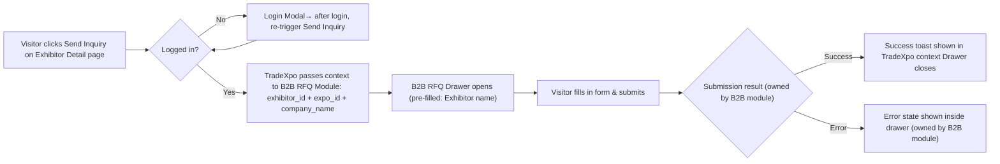

# 1. User Story Statement
**As a** Visitor, **I want to** send an inquiry to an Exhibitor directly from the Exhibitor Detail page **so that** I can express my business interest and initiate a sourcing conversation without leaving the Expo context.
# 2. Description & Business Value
The Send Inquiry (RFQ) action on the Exhibitor Detail page is a direct reuse of the **existing B2B Marketplace RFQ module**. TradeXpo's responsibility is limited to: (1) triggering the module at the correct touchpoint, and (2) passing the right context so the form is pre-filled and the inquiry is correctly attributed. All form rendering, field validation, submission logic, and notification handling remain owned by the B2B module.

This integration converts Visitor discovery intent into a concrete, trackable lead action without duplicating any existing infrastructure.

**Business Value:**

- Zero development overhead for the RFQ flow itself — full reuse of existing module
- Ensures all inquiries from TradeXpo are captured in the same B2B pipeline as direct marketplace inquiries
- Pre-filled context reduces friction and increases conversion from page view to inquiry submitted

---

## 3. Scope & Technical Constraints

### 3.1. Pre-conditions

- Visitor is on the Exhibitor Detail page (`/event/{expo_slug}/business/{exhibitor_slug}`)
- Exhibitor's registration is approved (`ExpoRegistration.status = approved`)
- Expo is in any status (`Upcoming`, `Live`, or `Archive`) — Send Inquiry is available in all statuses
- B2B Marketplace RFQ module is available and integrated

### 3.2. Inputs

| Field | Source | Note |
| --- | --- | --- |
| `exhibitor_id` | System — from `ExpoRegistration` | Passed by TradeXpo to the RFQ module as context |
| `expo_id` | System — from current Expo context | Passed by TradeXpo to the RFQ module for attribution |
| `company_name` | System — from `Company` entity | Used to pre-fill the recipient field in the RFQ drawer |
| Form fields (message, quantity, etc.) | Visitor input | Defined and validated by the B2B RFQ module — not in TradeXpo scope |

### 3.3. Process Logic

**TradeXpo responsibilities (in scope):**

- Render the **Send Inquiry** button in the sticky action bar on the Exhibitor Detail page
- On click: check Visitor auth state
    - Not logged in → show Login Modal → after successful login, auto-re-trigger Send Inquiry
    - Logged in → call B2B RFQ module, passing `exhibitor_id`, `expo_id`, and `company_name`
- B2B RFQ Drawer opens inside the TradeXpo UI (overlay / drawer component)
- On submission success (signal received from B2B module): show success toast *"Inquiry sent successfully"* within the TradeXpo page; close the drawer; preserve scroll position
- On submission error: error state is rendered inside the drawer by the B2B module — TradeXpo does not handle this independently

**B2B Marketplace RFQ module responsibilities (out of TradeXpo scope):**

- RFQ form fields, labels, and validation rules
- Form submission and persistence logic
- Notification/email to Exhibitor upon new inquiry
- RFQ thread management and reply flow
- Error and retry handling within the form

### 3.4. Outputs

- RFQ record created in the B2B system, attributed to the correct `exhibitor_id` and `expo_id`
- Success toast *"Inquiry sent successfully"* displayed in TradeXpo context
- Drawer closes; Visitor remains on the Exhibitor Detail page at the same scroll position

---

## 4. Flow / Process Diagram

---

## 5. UX / UI Interaction Flow

1. Visitor is on the Exhibitor Detail page and sees the sticky action bar below the header.
2. Visitor clicks **Send Inquiry**.
3. **If not logged in:** Login modal appears. After successful login, the system automatically opens the RFQ drawer without requiring the Visitor to click again.
4. **If logged in:** The B2B RFQ drawer slides in (drawer on mobile, modal on desktop), with the **Exhibitor's company name pre-filled** as the recipient. The `expo_id` is passed silently as attribution context.
5. Visitor completes the inquiry form fields (defined by the B2B module) and clicks **Submit**.
6. **On success:** Drawer closes; a toast notification *"Inquiry sent successfully"* appears at the top of the Exhibitor Detail page for 3 seconds; scroll position is preserved.
7. **On error:** The B2B module renders the error state inside the drawer (e.g., validation errors, network failure). Visitor can correct and retry without re-opening.
8. Visitor can also dismiss the drawer at any time by clicking ✕ or tapping outside (mobile); no inquiry is submitted.
## 6. Acceptance Criteria`

| # | Given | When | Then |
| --- | --- | --- | --- |
| AC-01 | Visitor is logged in, on Exhibitor Detail page | Visitor clicks "Send Inquiry" | B2B RFQ drawer opens with the Exhibitor's company name pre-filled as recipient |
| AC-02 | Visitor is not logged in | Visitor clicks "Send Inquiry" | Login modal appears; after successful login, RFQ drawer opens automatically without requiring another click |
| AC-03 | RFQ drawer is open | Visitor submits the inquiry form successfully | Toast *"Inquiry sent successfully"* appears in TradeXpo; drawer closes; scroll position is preserved |
| AC-04 | RFQ drawer is open | Visitor clicks ✕ or taps outside the drawer | Drawer closes; no inquiry is submitted; page state is unchanged |
| AC-05 | RFQ drawer is open and form has a validation error | Visitor attempts to submit | Error state is shown inside the drawer (handled by B2B module); drawer remains open |
| AC-06 | Inquiry is submitted successfully | System processes submission | RFQ record is created in B2B system with correct `exhibitor_id` and `expo_id` attribution |
| AC-07 | Expo is `Upcoming`, `Live`, or `Archive` | Visitor views Exhibitor Detail | "Send Inquiry" button is visible and enabled in all three statuses |

---

## 7. Story Points & Open Items

**Estimated Story Points:** 3 SP *(integration only — no new form logic)*

**Dependencies:** B2B Marketplace RFQ module (existing) · [[[US-01][TX] Exhibitor Detail Page]] (primary trigger surface) · [[[US-01][TX] Expo Map — Interactive Exhibition Floor]] (secondary trigger surface — "Create RFQ" from map)

| # | Item | Owner |
| --- | --- | --- |
| OI-01 | ~~Confirm the exact integration interface of the B2B RFQ module: is it a shared component, an iframe, or an API-triggered drawer?~~ ✅ Resolved: Developer decides the integration approach. TradeXpo must pass `exhibitor_id`, `expo_id`, and `company_name` as context regardless of method. | Confirmed |
| OI-02 | Confirm what signal the B2B module emits on success/error so TradeXpo can react (e.g., a callback, an event, or a redirect) | Engineering |