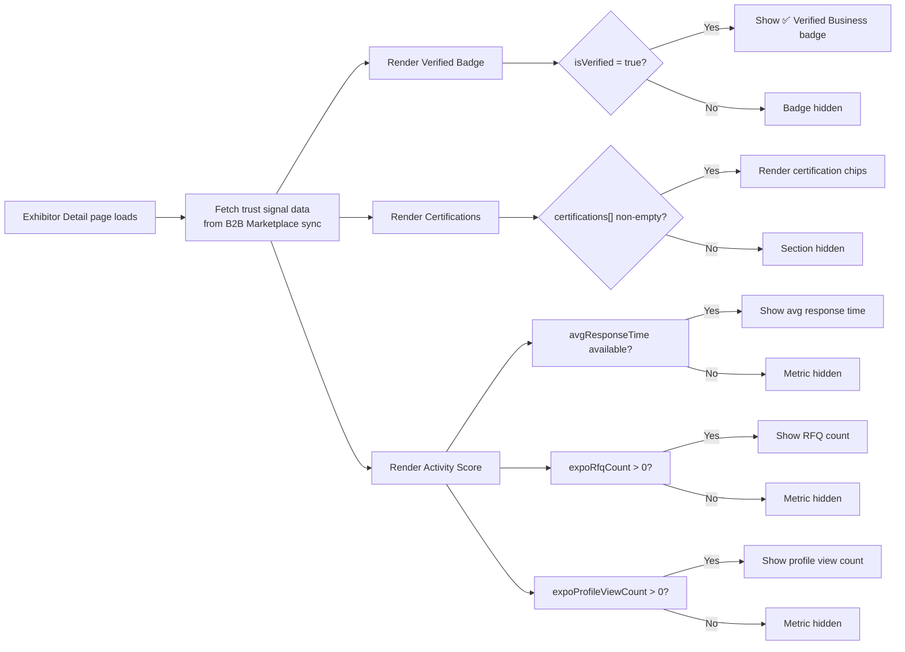

## 1. User Story Statement

**As a** Visitor, **I want to** see trust signals on an Exhibitor's profile — including verification status, certifications, and activity metrics — **so that** I can quickly assess the credibility and responsiveness of the Exhibitor before deciding to reach out.

---

## 2. Description & Business Value

Trust Signals is a read-only display feature on the Exhibitor Detail page. All data is synced from the **B2B Marketplace** and computed from existing system data — no new input is required from the Exhibitor. The section surfaces three categories of trust indicators: a verified business badge, a list of industry certifications, and live activity metrics scoped to the current Expo. Together these signals reduce Visitor hesitation and increase the likelihood of conversion to an RFQ or meeting request.

**Business Value:**

- Reduces Visitor friction at the decision point — credibility is visible without leaving the page
- Differentiates high-quality Exhibitors from unverified ones, incentivizing Exhibitors to complete KYB on B2B Marketplace
- Activity metrics create social proof and a sense of engagement at the Expo

---

## 3. Scope & Technical Constraints

### 3.1. Pre-conditions

- Exhibitor Detail page has loaded successfully (US-ED-01 pre-conditions apply)
- Trust signal data is available via B2B Marketplace sync

### 3.2. Inputs

All inputs are **system-provided** (no Visitor or Exhibitor input required):

| Signal | Source | Scope |
| --- | --- | --- |
| `isVerified` | `Company.isVerified` — B2B Marketplace KYB status | Global (company-level) |
| `certifications[]` | `Company.certifications` — B2B Marketplace | Global (company-level) |
| `avgResponseTime` | Calculated from B2B RFQ response history | Global (company-level) |
| `expoRfqCount` | Count of RFQs received by this Exhibitor at this Expo | Expo-scoped |
| `expoProfileViewCount` | Count of profile views for this Exhibitor at this Expo | Expo-scoped |

### 3.3. Process Logic

**Verified Badge:**

- If `Company.isVerified = true` → display ✅ **"Verified Business"** badge on the Exhibitor header
- If `Company.isVerified = false` or field is absent → badge is not shown; no placeholder or empty state

**Certifications:**

- If `Company.certifications[]` is non-empty → display each certification as a labeled chip/tag (e.g. ISO 9001, HACCP, Organic, Export License)
- If array is empty or absent → Certifications section is hidden entirely; no empty state shown

**Activity Score — 3 metrics displayed as inline stats:**

- `avgResponseTime`: *"Avg. response time: X hours"* — calculated from B2B RFQ module response history `[TBD: calculation window — last 30 days? all-time?]`
- `expoRfqCount`: *"X inquiries received at this Expo"*
- `expoProfileViewCount`: *"X profile views at this Expo"*
- If a metric has no data yet (e.g. zero RFQs, no response history) → that individual metric is hidden; other metrics still display
- If all 3 metrics are absent → entire Activity Score section is hidden

**Layout:**

- Trust Signals render as a compact band **below the page header and above the About section**
- Verified Badge is displayed inline with the company name in the header (or immediately below it)
- Certifications and Activity Score appear as two sub-rows within the Trust Signals band

### 3.4. Outputs

- Trust Signals band rendered on the Exhibitor Detail page with available data
- Sections with no data are hidden gracefully — no broken states or empty placeholders shown to Visitor

---

## 4. Flow / Process Diagram

---

## 5. UX / UI Interaction Flow

1. Visitor lands on the Exhibitor Detail page. The page header renders with the company name and, if `isVerified = true`, a **✅ Verified Business** badge displayed inline next to the company name.
2. Immediately below the header, the **Trust Signals band** renders (if any signal data is available):
    - **Row 1 — Certifications:** A horizontal list of labeled chips, one per certification (e.g. `ISO 9001` · `HACCP` · `Organic`). If no certifications, this row is not rendered.
    - **Row 2 — Activity Score:** Up to 3 inline stat pills showing available metrics:
        - 🕐 *"Avg. response time: 2 hours"*
        - 📨 *"47 inquiries received at this Expo"*
        - 👁 *"1,230 profile views at this Expo"*
        - Only metrics with data are shown. If none available, the row is not rendered.
3. Trust Signals are **display-only** — no click interaction, no tooltip expansion required.
4. If no trust signal data exists at all (no verification, no certifications, no activity data), the Trust Signals band is not rendered and the page layout flows directly from Header to About section.

---

## 6. Acceptance Criteria

| # | Given | When | Then |
| --- | --- | --- | --- |
| AC-01 | `Company.isVerified = true` | Visitor views Exhibitor Detail | ✅ "Verified Business" badge is displayed inline with the company name in the header |
| AC-02 | `Company.isVerified = false` or field is absent | Visitor views Exhibitor Detail | No badge is shown; no placeholder or empty state |
| AC-03 | `Company.certifications[]` contains one or more entries | Visitor views Trust Signals band | Each certification is rendered as a labeled chip (e.g. "ISO 9001", "HACCP") |
| AC-04 | `Company.certifications[]` is empty or absent | Visitor views page | Certifications row is hidden entirely; no empty state is shown |
| AC-05 | `avgResponseTime` data is available | Visitor views Activity Score | Stat pill displays: *"Avg. response time: X hours"* |
| AC-06 | `expoRfqCount` is greater than 0 | Visitor views Activity Score | Stat pill displays: *"X inquiries received at this Expo"* |
| AC-07 | `expoProfileViewCount` is greater than 0 | Visitor views Activity Score | Stat pill displays: *"X profile views at this Expo"* |
| AC-08 | One or more Activity Score metrics have no data | Visitor views Activity Score | Only metrics with data are shown; missing metrics are hidden individually |
| AC-09 | All 3 Activity Score metrics have no data | Visitor views page | Activity Score row is hidden entirely |
| AC-10 | No trust signal data exists (no badge, no certs, no activity) | Visitor views page | Trust Signals band is not rendered; layout flows directly from Header to About section |
| AC-11 | Any trust signal data is present | Visitor views page | Trust Signals band renders between the header and the About section |

---

## 7. Story Points & Open Items

**Estimated Story Points:** 3 SP *(display-only — no user input, no write logic)*

**Dependencies:** [[[US-01][TX] Exhibitor Detail Page]] (rendered as a section within this page) · B2B Marketplace data sync (company profile + certifications + RFQ history) · Expo analytics pipeline (profile view count per Expo)

| # | Item | Owner |
| --- | --- | --- |
| OI-01 | `avgResponseTime` calculation window: last 30 days, last 90 days, or all-time? Affects how the metric is labeled and whether it resets per Expo | Product |
| OI-02 | `expoProfileViewCount`: confirm the analytics pipeline tracks per-Expo profile views and that this data is accessible at render time | Engineering |
| OI-03 | Certification chip labels: confirm the exact display names and whether there is a fixed taxonomy or free-text from B2B Marketplace | Product |