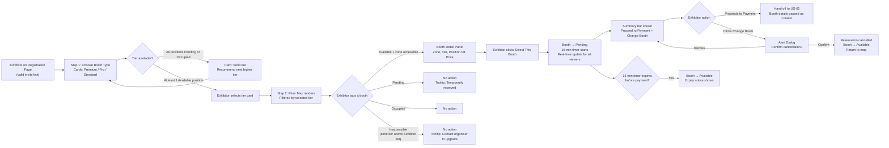

## 1. User Story Statement

**As an** Exhibitor,

**I want** to first choose a booth type (tier), then select a specific booth position on the floor map,

**so that** my preferred location is temporarily reserved and I can proceed to payment.

---

## 2. Description & Business Value

The booth selection flow is split into two sequential sub-steps on the Expo Registration page:

1. **Choose Booth Type** — Exhibitor selects a tier (Premium / Pro / Standard) from a card-based UI showing features, uniform pricing per tier, and availability. If all positions in a tier are taken, the card is marked Sold Out with a recommendation to upgrade.
2. **Choose Booth Position** — After selecting a tier, the interactive floor map renders with zone access rules applied. Exhibitor picks a specific position; the system immediately sets it to **Pending** (15-minute reservation) and notifies all concurrent viewers in real time.

This story ends when the Exhibitor confirms their selection and proceeds to [US-02][TX] Booth Payment.

**Business Value:**

- Two-step progressive disclosure reduces decision fatigue — Exhibitors commit to a budget tier before browsing positions
- Sold-out messaging with upward recommendations preserves conversion opportunities
- Real-time slot locking prevents double-booking
- Reinforces premium value of higher tiers through visible zone differentiation

**Dependencies:**

- **Upstream — Expo Owner: Select Layout Template**: Floor layout must exist before booth positions are available
- **Upstream — [[[US-12][TX] Smart Invitation Link Dynamic Routing]]**: Seller is routed to the Exhibitor Registration flow which begins this story
- **Downstream — [[[US-02][TX] Booth Payment]]**: This story hands off the reserved booth to the payment flow

---

## 3. Scope & Technical Constraints

### 3.1. Pre-condition

- Expo is in `Active` or `Upcoming` status (accepting registrations)
- Expo Owner has locked a Layout Template — booth positions exist in the system
- Exhibitor has accessed the Expo Registration page via a valid invitation link

### 3.2. Input

| Field | Type | Note |
| --- | --- | --- |
| Booth Type | Card selection | Premium / Pro / Standard |
| Booth Position | Map tap / click | Specific booth slot on the floor map |

### 3.3. Process / Logic

**Booth Status — Database (3 statuses only):**

| Status | Description |
| --- | --- |
| `Available` | Unoccupied, not currently reserved |
| `Pending` | Temporarily reserved during an active payment session (max 15 min) |
| `Occupied` | Permanently assigned — payment completed |

**Zone Access Rule — Frontend Display Only (NOT a DB status):**

When rendering the map, the frontend compares each booth's zone tier against the Exhibitor's selected tier. If a booth's zone tier is **higher** than the Exhibitor's tier, that booth is rendered as **Inaccessible** (dimmed + lock icon) regardless of its actual DB status. No extra status is stored in the database.

- **Premium tier** → all zones accessible; all `Available` booths selectable
- **Pro tier** → Premium zone booths inaccessible; Pro and Standard zone booths selectable if `Available`
- **Standard tier** → Premium and Pro zone booths inaccessible; Standard zone booths selectable if `Available`

> Tier upgrades are **not self-service**. Exhibitor must contact the Expo Organiser or Customer Support.
> 

---

**Step 1 — Choose Booth Type:**

- System renders booth type cards for each tier: **Premium**, **Pro**, **Standard**
- Each card shows: tier name, key features/perks, uniform price per tier, availability status
- System checks the number of `Available` positions in each tier's accessible zones:
    - If at least 1 position is available → card is **selectable**
    - If all positions in the tier's zones are `Pending` or `Occupied` → card shows **"Sold Out"** badge + disabled; a recommendation banner suggests the next available higher-tier option (e.g. *"Standard is sold out — consider upgrading to Pro"*)
    - Recommendation direction: **upward only** (Standard sold out → recommend Pro or Premium; Pro sold out → recommend Premium). No downgrade recommendation.
- Exhibitor clicks a selectable booth type card → tier is confirmed; system proceeds to Step 2

**Step 2 — Choose Booth Position:**

- System renders the interactive Expo Map filtered by the Exhibitor's selected tier
- Each booth position displays one of the following visual states:

| Visual State | DB Status | Condition | Selectable? |
| --- | --- | --- | --- |
| Available (green) | `Available` | Zone tier ≤ Exhibitor's tier | ✅ Yes |
| Pending (grey + clock icon) | `Pending` | Any | ❌ No |
| Occupied (grey) | `Occupied` | Any | ❌ No |
| Inaccessible (dimmed + lock icon) | `Available` | Zone tier > Exhibitor's tier — frontend rule only | ❌ No |
- Exhibitor taps an **Available** booth → **Booth Detail Panel** appears: zone name, tier, position reference (e.g. `Hall A - Zone 2 - Booth 04`), price
- Exhibitor clicks **"Select This Booth"**:
    - Booth DB status → **Pending** immediately
    - 15-minute reservation timer starts
    - All concurrent viewers see this booth update to Pending in real time
    - Summary bar appears: *"Hall A · Zone 2 · Booth 04 · Pro · $[Price]"* + **"Proceed to Payment"** + **"Change Booth"** buttons

**Step 2b — Change Selection (before payment):**

- Exhibitor may tap **"Change Booth"** to pick a different position
- System shows **Alert Dialog**: *"Changing your booth will cancel your current reservation for [Booth Ref]. Do you want to continue?"*
    - **Confirm** → reservation cancelled immediately; booth → `Available` in real time; Exhibitor returns to map to re-select
    - **Dismiss** → dialog closes; current reservation unchanged

**Step 3 — Proceed to Payment:**

- Exhibitor clicks **"Proceed to Payment"** → system passes booth details to [US-02][TX] Booth Payment
- If the 15-minute timer expires before payment → booth released to `Available`; notice: *"Your booth reservation has expired. Please select a booth again."*

### 3.4. Output

- Booth status → **Pending** (real-time, visible to all viewers on the map)
- 15-minute reservation timer started
- Booth type, position reference, tier, and price passed as context to [US-02][TX]
- On payment success (US-02): booth → **Occupied**
- On payment failure / cancel / timeout (US-02) or Change Booth confirm: booth → **Available**

---

## 4. Flow / Process Diagram

---

## 5. UX / UI Interaction Flow

**Given:** Exhibitor has clicked a valid invitation link and is on the Expo Registration page.

**Sub-step 1 — Choose Booth Type:**

1. Exhibitor sees a card layout displaying the available booth types: **Standard**, **Pro**, **Premium**
    - Each card shows: tier name, feature highlights, uniform price for this tier, and availability
    - **Sold Out** card: greyed out with "Sold Out" badge, "Select" button disabled; recommendation banner suggests next available higher tier
2. Exhibitor clicks a selectable tier card → tier is confirmed; page transitions to the booth position map

**Sub-step 2 — Choose Booth Position:**

1. The interactive Expo Map renders with all booth positions and visual states:
    - **Green** = Available and zone-accessible for Exhibitor's tier
    - **Grey + clock icon** = Pending — temporarily reserved; tooltip: *"This booth is temporarily reserved"*
    - **Grey** = Occupied — already purchased
    - **Dimmed + lock icon** = Inaccessible — zone tier above Exhibitor's tier (frontend rule only); tooltip: *"Upgrade to [Tier] to access this zone — please contact the organiser"*
2. Exhibitor pans and zooms to explore positions
3. Exhibitor taps an **Available** booth → **Booth Detail Panel** slides in (right panel desktop / bottom sheet mobile): Hall name, Zone name, Booth reference, Tier badge, Price
4. Exhibitor clicks **"Select This Booth"**:
    - Booth → **Pending** immediately; all concurrent viewers see the update in real time
    - 15-minute countdown appears in the summary bar
    - Summary bar: *"Hall A · Zone 2 · Booth 04 · Pro · $[Price]"* + **"Proceed to Payment"** + **"Change Booth"**
5. *(Optional)* Exhibitor clicks **"Change Booth"**:
    - Alert Dialog: *"Changing your booth will cancel your current reservation for Hall A - Zone 2 - Booth 04. Do you want to continue?"*
    - **Confirm** → reservation cancelled immediately; booth → Available; Exhibitor returns to map
    - **Dismiss** → dialog closes; reservation unchanged
6. Exhibitor clicks **"Proceed to Payment"** → navigates to [US-02][TX] Booth Payment
7. If **15-minute timer expires**: booth released to Available; notice: *"Your booth reservation has expired. Please select a booth again."*

---

## 6. Acceptance Criteria

| # | Given | When | Then |
| --- | --- | --- | --- |
| AC-01 | Exhibitor is on the Registration page | Booth type cards render | Each card displays: tier name, feature highlights, uniform price, and availability; cards with all positions taken show a "Sold Out" badge and a disabled "Select" button |
| AC-02 | A booth tier has all its zone positions in Pending or Occupied status | System renders the tier card | The card is marked "Sold Out"; a recommendation banner suggests the next available higher tier (e.g. Standard sold out → recommend Pro) |
| AC-03 | Exhibitor clicks a selectable booth type card | Tier is confirmed | Page transitions to the floor map filtered by the selected tier |
| AC-04 | Exhibitor has selected a booth tier | The floor map renders | All booths display correct visual states: Available (green), Pending (grey + clock), Occupied (grey), or Inaccessible (dimmed + lock) based on DB status and zone access rule |
| AC-05 | Exhibitor has selected Pro tier | Map renders | Premium zone booths are rendered as Inaccessible (dimmed + lock, tooltip: "Upgrade to Premium to access this zone — please contact the organiser") |
| AC-06 | Exhibitor has selected Premium tier | Map renders | All booths with DB status `Available` across all zones show as Available (green) and selectable |
| AC-07 | The map is displayed | Exhibitor taps a Pending booth | No selection occurs; tooltip: "This booth is temporarily reserved" |
| AC-08 | The map is displayed | Exhibitor taps an Occupied booth | No selection occurs; booth is non-interactive |
| AC-09 | The map is displayed | Exhibitor taps an Inaccessible booth | No selection occurs; tooltip: "Upgrade to [Tier] to access this zone — please contact the organiser" |
| AC-10 | Exhibitor taps an Available booth | Booth Detail Panel renders | Panel shows: Hall name, Zone name, Booth reference, Tier badge, and Price |
| AC-11 | Booth Detail Panel is open | Exhibitor clicks "Select This Booth" | Booth DB status is set to Pending immediately; booth renders as grey + clock icon for all concurrent viewers; 15-minute countdown appears in the summary bar; "Proceed to Payment" and "Change Booth" buttons appear |
| AC-12 | Exhibitor A has just reserved a booth (Pending) | Exhibitor B views the same map concurrently | Exhibitor B sees the booth as Pending (grey + clock, non-selectable) in real time |
| AC-13 | Summary bar is visible with a Pending booth | Exhibitor clicks "Change Booth" | Alert Dialog appears: "Changing your booth will cancel your current reservation for [Booth Ref]. Do you want to continue?" with Confirm and Dismiss options |
| AC-14 | Alert Dialog is open | Exhibitor clicks "Confirm" | Reservation cancelled immediately; booth → Available in real time; Exhibitor returned to map to re-select |
| AC-15 | Alert Dialog is open | Exhibitor clicks "Dismiss" | Dialog closes; reservation remains active; countdown continues |
| AC-16 | Exhibitor has a Pending booth | Exhibitor clicks "Proceed to Payment" | System navigates to [US-02][TX] Booth Payment with booth reference, tier, and price passed as context |
| AC-17 | Exhibitor has a Pending booth | 15-minute timer expires before payment completes | Booth → Available in real time; notice shown: "Your booth reservation has expired. Please select a booth again." |

---

## 7. Story Points & Open Items

**Estimated Story Points:** `[TBD]`

| # | Item | Owner |
| --- | --- | --- |
| OI-01 | ~~Reservation timeout duration?~~ ✅ Resolved: 15 minutes, aligned with VNPay session timeout in [US-02][TX] | Confirmed |
| OI-02 | ~~Can Exhibitor re-select a different booth before payment?~~ ✅ Resolved: Yes — "Change Booth" shows Alert Dialog; confirm → reservation cancelled immediately; booth → Available | Confirmed |
| OI-03 | ~~Tier upgrade self-service?~~ ✅ Resolved: Not allowed — must contact Expo Organiser or Customer Support | Confirmed |
| OI-04 | ~~Per-position pricing or uniform per tier?~~ ✅ Resolved: Uniform price per tier — no individual booth pricing | Confirmed |
| OI-05 | ~~Maximum booths per company?~~ ✅ Resolved: No limit | Confirmed |
| OI-06 | ~~Real-time map updates?~~ ✅ Resolved: Required — Engineering must implement real-time status updates (Available → Pending → Occupied) for all concurrent viewers | Engineering (required) |