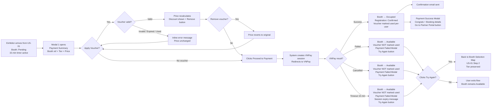

## 1. User Story Statement

**As an** Exhibitor,

**I want** to optionally apply a voucher code and complete payment via VNPay for my reserved booth,

**so that** my booth registration is confirmed automatically and I receive a confirmation email with a link to the Partner Portal to start setting up my booth.
## 2. Description & Business Value

This story covers the payment step that follows booth position selection ([US-01][TX] Select Booth Position). The Exhibitor arrives with a booth already reserved (Pending status). They review the order summary, optionally apply a percentage-based discount voucher, and are redirected to VNPay's hosted payment page. Upon successful payment, the system confirms the registration, updates the booth to Occupied, and sends a welcome email. Failed or cancelled payments release the booth reservation back to Available.

**Business Value:**

- Auto-confirms registration immediately on payment success — no manual Admin reconciliation needed
- Voucher support drives booth sales through promotional campaigns
- Graceful failure handling (VNPay fail / cancel / timeout) ensures a smooth retry experience without losing the user

**Dependencies:**

- **Upstream — [[[US-01][TX] Select Booth Type and Position]]**: Booth must be in Pending status before this flow begins
- **Downstream — Partner Portal onboarding**: Confirmation email delivers Portal access link
## 3. Scope & Technical Constraints

### 3.1. Pre-condition

- Exhibitor is authenticated (logged in)
- Exhibitor has a booth in **Pending** status from [US-01][TX] — booth reference, tier, and price are passed as context
- The 15-minute reservation window from [US-01][TX] is still active
- Exhibitor does **not** already have a confirmed registration (`Occupied` booth) for this Expo — duplicate registration is not allowed
- VNPay integration is already configured in the system
- Voucher codes are pre-configured by Admin `[TBD: Voucher management — separate Epic]`
### 3.2. Input

| Field | Type | Note |
| --- | --- | --- |
| Voucher Code | Text input (optional) | Entered in Payment Summary Modal |
| VNPay Payment | External action | Completed on VNPay's hosted page |

### 3.3. Process / Logic

**Modal 1 — Payment Summary:**

1. System displays order summary using context passed from US-01: expo name, booth reference (e.g. `Hall A - Zone 2 - Booth 04`), tier, original price
2. User optionally enters a Voucher Code and clicks **"Apply"**
    - If valid: system recalculates price and displays the breakdown (original price, discount percentage, discount amount, final price); a **"Remove"** button appears next to the applied voucher
    - If invalid / expired / already used by this user for this Expo: an inline error message appears below the voucher input field; price does not change
    - If user clicks **"Remove"**: voucher is cleared, price reverts to original; user may enter a different voucher code
3. User clicks **"Proceed to Payment"** (enabled by default — voucher is optional) → button immediately disables and enters loading state to prevent duplicate submissions → system creates a VNPay payment session and redirects user to VNPay's hosted payment page
4. **Timer expiry on Modal 1:** If the 15-minute reservation timer reaches 0 while the Exhibitor is still on Modal 1 (before redirecting to VNPay):
    - "Proceed to Payment" button is disabled immediately
    - Modal shows inline message: *"Your booth reservation has expired. Please select a booth again."*
    - Booth → `Available` in real time

**VNPay Payment Page (external):**

1. User completes payment on VNPay's hosted page
2. VNPay returns a callback to the system:
    - **Success:** System updates booth status to **Occupied**; creates a confirmed registration record with status *Confirmed*; marks voucher (if used) as used per-user for this Expo; attempts to send confirmation email (email failure does NOT block registration — booth remains Occupied and registration remains Confirmed regardless); redirects user to Expo page and opens **Payment Success Modal** displaying: congratulations message, booking confirmation details (expo name, booth reference, tier, final amount paid), a note that a confirmation email has been sent, and a **"Go to Partner Portal"** button (primary CTA) + **"Back to Expo"** button (secondary CTA)
    - **Failed:** System releases booth reservation back to **Available**; does NOT create a registration record; voucher is NOT marked as used; redirects user to Expo page and opens **Payment Failed Modal** with error message and a **"Try Again"** button — clicking it closes the modal and redirects Exhibitor back to the **Booth Selection Map** ([US-01] Step 2) with their tier selection preserved so they can re-select a booth
    - **Cancelled:** User cancels on VNPay; system releases booth reservation back to **Available**; voucher is NOT marked as used; redirects user to Expo page and opens **Payment Failed Modal** with cancellation message and a **"Try Again"** button — clicking it redirects Exhibitor back to the **Booth Selection Map** with their tier selection preserved
    - **Timeout (15 min):** VNPay session expires; system releases booth reservation back to **Available**; voucher is NOT marked as used; redirects user to Expo page and opens **Payment Failed Modal** indicating session expiry with a **"Try Again"** button — clicking it redirects Exhibitor back to the **Booth Selection Map** with their tier selection preserved

> ⚠️ **Note:** Booth reservation timer (15 min) is shared between [US-01] and this story. If the timer expires during payment, both the [US-01] reservation and this payment session are invalidated simultaneously.

> ⚠️ **Note (Browser Back Button):** If the Exhibitor navigates back from VNPay using the browser's back button, no cancel callback is triggered. The booth remains in `Pending` status until the 15-minute timer expires naturally, at which point it is released to `Available`. No immediate user-facing notification is possible in this case — the expiry notice from [US-01] handles this scenario.
> 

**Email content (on success):**

- Personalized greeting (full name, company name)
- Expo information (expo name, event date)
- Booth details (booth reference, tier, final amount paid)
- Partner Portal link (fixed URL + query params: `expoId`, `boothDetail`)

> ⚠️ **Note (Out of Scope — Refund):** Manual refund by Admin if Exhibitor cancels post-payment. Automated gateway refund is out of scope and will be addressed in a separate US.
> 

> ⚠️ **Note (Out of Scope — IPN):** VNPay IPN (server-to-server webhook) handling is flagged as a separate engineering concern (OI-04) and not yet confirmed in scope for this story.
> 

### 3.4. Output

- **Payment Success Modal:** Congratulations message + booking confirmation details (expo name, booth reference, tier, final amount paid) + *"A confirmation email has been sent to [email]"* + **"Go to Partner Portal"** button (primary) + **"Back to Expo"** button (secondary)
- **Payment Failed Modal:** Error / cancellation / expiry message (context-specific) + **"Try Again"** button — redirects Exhibitor back to the Booth Selection Map ([US-01] Step 2) with tier preserved so they can re-select a booth
- Booth status → **Occupied** on success; → **Available** on fail / cancel / timeout
- Confirmation email sent automatically upon payment success

---

## 4. Flow / Process Diagram

---

## 5. UX / UI Interaction Flow

**Given:** Exhibitor has selected a booth in [US-01][TX] and clicked "Proceed to Payment". Booth is in Pending status. 15-minute timer is active.

1. **Modal 1 — Payment Summary** opens:
    - Booth summary: expo name, booth reference (e.g. `Hall A - Zone 2 - Booth 04`), tier, original price
    - Remaining reservation time displayed as a countdown (e.g. *"14:32 remaining"*)
    - Voucher Code input field + **"Apply"** button
    - **"Proceed to Payment"** button (enabled by default)
2. *(Optional)* Exhibitor enters a voucher code → clicks **"Apply"**:
    - **Valid code:** Price breakdown appears (original price, voucher discount %, discount amount, final price); a **"Remove"** button appears next to the applied voucher code
    - **Invalid / expired / used code:** Inline error message shown below the input field; price remains unchanged
    - **Remove voucher:** Exhibitor clicks "Remove" → voucher cleared, price reverts to original; may enter a different code
3. Exhibitor reviews the final amount → clicks **"Proceed to Payment"**
4. System creates a VNPay payment session and redirects the Exhibitor to **VNPay's hosted payment page**
5. Exhibitor completes payment on VNPay:
    - **Success:** VNPay redirects back to Expo page; booth → Occupied; **Payment Success Modal** opens displaying:
        - Congratulations message: *"🎉 Booking Confirmed!"*
        - Booking details: Expo name, Booth reference (e.g. `Hall A - Zone 2 - Booth 04`), Tier, Final amount paid
        - *"A confirmation email has been sent to [email]"*
        - **"Go to Partner Portal"** button (primary CTA — navigates to Partner Portal with `expoId` and `boothDetail` params)
        - **"Back to Expo"** button (secondary CTA — dismisses modal)
    - **Failed:** VNPay redirects back to Expo page; booth → Available; **Payment Failed Modal** opens: *"Payment was not completed. Please try again or contact support."* + **"Try Again"** button — clicking it closes the modal and redirects Exhibitor to the **Booth Selection Map** (US-01 Step 2) with tier preserved
    - **Cancelled:** Exhibitor cancels on VNPay; booth → Available; **Payment Failed Modal** opens: *"Your payment was cancelled."* + **"Try Again"** button — clicking it closes the modal and redirects Exhibitor to the **Booth Selection Map** with tier preserved
    - **Timeout (15 min):** Session expires; booth → Available; **Payment Failed Modal** opens: *"Your session has expired. Please select a booth and try again."* + **"Try Again"** button — clicking it closes the modal and redirects Exhibitor to the **Booth Selection Map** with tier preserved

---

## 6. Acceptance Criteria

| # | Given | When | Then |
| --- | --- | --- | --- |
| AC-01 | Exhibitor arrives from US-01 with a booth in Pending status | Modal 1 opens | Modal 1 displays: expo name, booth reference, tier, original price, a reservation countdown timer, a Voucher Code input field, and an enabled "Proceed to Payment" button |
| AC-02 | Modal 1 is open and the Voucher field is empty | Exhibitor clicks "Proceed to Payment" | System creates a VNPay payment session and redirects the Exhibitor to VNPay's hosted payment page with the original (full) price |
| AC-03 | Modal 1 is open | Exhibitor enters a valid, active voucher code and clicks "Apply" | Price breakdown is shown: original price, discount percentage (e.g. 20%), discount amount, and final price; a "Remove" button appears next to the applied voucher |
| AC-04 | Modal 1 is open | Exhibitor enters an invalid voucher code and clicks "Apply" | An inline error message appears below the voucher field; price does not change; Modal 1 remains open |
| AC-05 | Modal 1 is open | Exhibitor enters an expired voucher code and clicks "Apply" | An inline error message indicates the voucher has expired; price does not change |
| AC-06 | Modal 1 is open | Exhibitor enters a voucher code already used by this user for this Expo | An inline error message indicates the voucher has already been used; price does not change |
| AC-07 | Exhibitor has applied a valid voucher in Modal 1 | Exhibitor clicks "Remove" next to the applied voucher | Voucher is cleared; price reverts to original full price; discount breakdown disappears; voucher input field is empty and editable |
| AC-08 | Exhibitor clicks "Proceed to Payment" | System initiates the VNPay session | Exhibitor is redirected to VNPay's hosted payment page; the payment amount matches the final amount from Modal 1 (post-voucher if applicable) |
| AC-09 | Exhibitor completes payment successfully on VNPay | VNPay returns a success callback | Booth status is updated to Occupied; a confirmed registration record is created; voucher (if applied) is marked as used per-user for this Expo; confirmation email is sent; Exhibitor is redirected to the Expo page and the Payment Success Modal opens displaying: congratulations message, booking details (expo name, booth reference, tier, final amount paid), confirmation email notice, "Go to Partner Portal" button (primary), and "Back to Expo" button (secondary) |
| AC-10 | Payment Success Modal is open | System finishes processing | Modal displays: (1) Congratulations message "🎉 Booking Confirmed!", (2) Booking details: expo name, booth reference, tier, final amount paid, (3) "A confirmation email has been sent to [email]", (4) "Go to Partner Portal" button — navigates to Partner Portal with correct expoId and boothDetail params, (5) "Back to Expo" button — dismisses the modal |
| AC-11 | Confirmation email is sent after payment success | Exhibitor opens the email | Email correctly displays: full name, company name, expo name, event date, booth reference, tier, final amount paid, and a working Partner Portal link |
| AC-12 | Exhibitor clicks the Partner Portal link in the email | Browser opens the link | Exhibitor is directed to the Partner Portal with the correct `expoId` and `boothDetail` query params |
| AC-13 | VNPay returns a failed payment callback | System receives the failure result | Booth status is released back to Available; no registration record is created; voucher is NOT marked as used; Exhibitor is redirected to the Expo page and the Payment Failed Modal opens with "Try Again" button |
| AC-14 | Payment Failed Modal is open (from failed payment or timeout) | Exhibitor clicks "Try Again" | Payment Failed Modal closes; Exhibitor is redirected to the Booth Selection Map (US-01 Step 2) with their tier selection preserved; booth is Available for any Exhibitor to select |
| AC-15 | Exhibitor cancels payment on VNPay's hosted page | VNPay redirects back to TradeXpo | Booth status is released back to Available; no registration record is created; voucher is NOT marked as used; Exhibitor is redirected to the Expo page and the Payment Failed Modal opens with cancellation message: "Your payment was cancelled." and a "Try Again" button — clicking it redirects Exhibitor to the Booth Selection Map (US-01 Step 2) with tier preserved |
| AC-16 | The VNPay session reaches 15 minutes without a callback | System detects the timeout | Booth status is released back to Available; no registration record is created; voucher is NOT marked as used; Payment Failed Modal opens with session expiry message and "Try Again" button |
| AC-17 | Exhibitor is not logged in | Exhibitor attempts to access the payment page directly | System redirects the Exhibitor to the login page |
| AC-18 | Exhibitor already has a confirmed registration (Occupied booth) for this Expo | Exhibitor attempts to enter the payment flow | System blocks the flow and shows a message indicating they have already registered for this Expo; no new Pending booth or payment session is created |
| AC-19 | Modal 1 is open and the reservation countdown reaches 0 | Timer expires before Exhibitor clicks "Proceed to Payment" | "Proceed to Payment" button is disabled immediately; inline message appears: "Your booth reservation has expired. Please select a booth again."; booth is released to Available |
| AC-20 | Modal 1 is open | Exhibitor clicks "Proceed to Payment" | Button immediately enters a disabled/loading state; system proceeds to create a single VNPay session; a second click has no effect |
| AC-21 | Payment succeeds but the confirmation email service fails | System completes payment processing | Booth status is updated to Occupied; registration record is created as Confirmed; Payment Success Modal opens as normal; email failure does not block or revert the registration |