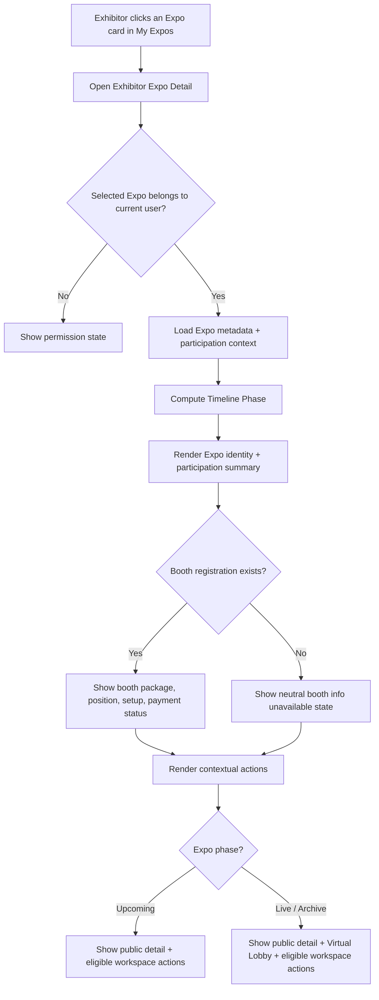

# 1. User Story Statement

**As an** Exhibitor,
**I want** to open the detail page for an Expo I have joined from My Expos,
**so that** I can review my participation context, booth registration, payment status, and next available actions for that specific Expo.

---

# 2. Description & Business Value

The **Exhibitor Expo Detail** page is the workspace-level detail view for a Seller/Exhibitor who has at least one Expo shown in **My Expos**.

Unlike the public Expo Detail page, this page is scoped to the selected Expo participation for the logged-in Exhibitor. It gives the Exhibitor a single place to understand what they joined, which booth package/position they have, whether payment or booth setup still needs action, and how to jump into the relevant Expo experience.

Business value:
- Gives Exhibitors a clear operational landing page after selecting an Expo from **My Expos**.
- Reduces confusion between public Expo discovery content and the Exhibitor's own participation status.
- Creates a workspace entry point for follow-up actions such as payment review, booth configuration, public Expo preview, and 3D hall entry where allowed.

---

# 3. Scope & Technical Constraints

### 3.1. Pre-conditions

- User is logged in with a **Seller/Exhibitor** role.
- User has at least one Expo shown in **My Expos**.
- User opens the page by clicking an Expo card from **My Expos**.
- The selected Expo is authorized for the current user in User Workspace.
- Linked Expo metadata is available.
- Booth registration / order data is available if the Exhibitor has selected and paid for a booth package.

### 3.2. Input

| Label | Type | Required | Note |
|---|---|---|---|
| Expo ID | Route parameter | YES | Identifies the selected Expo. |
| Current User | Auth context | YES | Used to validate that the Expo belongs to the logged-in Exhibitor. |
| Selected Expo | Workspace context | YES | Expo selected by the Exhibitor from My Expos. |
| Detail Data | System data | YES | Workspace-scoped data for the selected Expo, including participation, booth, and payment summary. |
| Expo Metadata | System data | YES | Expo name, timeline, cover/thumbnail, organizer, industry, description summary. |
| Booth Registration | System data | NO | Booth tier, booth number/position, booth setup status. Empty if booth has not been assigned yet. |
| Payment / Order Status | System data | NO | Payment state for booth order if available. |

### 3.3. Process / Logic

- System uses **My Expos** as the source list of Expos the current user has joined.
- When the user opens a selected Expo, the system validates that the selected `expo_id` belongs to the current user in User Workspace.
- If validation fails, system returns a permission state instead of exposing the page.
- This story does not require the UI to reference internal registration models directly.
- System computes **Timeline Phase** dynamically per Expo:
  - `Upcoming` - Expo start date > today
  - `Live` - Expo start date <= today <= Expo end date
  - `Archived` - Expo end date < today
- System displays Expo identity and participation summary using the selected Expo and workspace detail data.
- System displays booth participation summary when booth registration exists:
  - booth tier/package
  - booth number or position
  - booth setup status
  - payment/order status
- If booth registration data is not available, system shows a neutral state explaining that booth assignment or payment information is not available yet.
- Action availability is driven by current Expo phase and related module rules:
  - **View Public Expo Detail** is always available for the selected Expo.
  - **Virtual Lobby** is available when Expo status is `Live` or `Archive`, following Expo Detail US-09.
  - **Configure Booth** is available only when the Exhibitor has an approved booth registration for the selected Expo.
  - **Complete Payment / View Payment** links to the relevant booth order/payment flow when payment/order data exists.
- This story does not define booth customization behavior, payment processing, public Expo Detail content, or 3D hall interaction behavior. It only defines the workspace-level detail surface and navigation entry points.

### 3.4. Output

Exhibitor sees a detail page for the selected Expo with:
- Expo identity summary: name, cover/thumbnail, timeline phase, date range, organizer.
- Participation summary: participation status and registered contact person if available.
- Booth participation summary: package/tier, booth number/position, setup status, payment/order status when available.
- Contextual actions:
  - View Public Expo Detail
  - Virtual Lobby when `Live` or `Archive`
  - Configure Booth when eligible
  - Complete Payment / View Payment when payment/order data exists
- Permission or empty state if the selected Expo does not belong to the current Exhibitor.

---

# 4. Diagram

---

# 5. Design (UX/UI Interaction)

### User Flow 1: Open Exhibitor Expo Detail from My Expos

**Given:** Exhibitor is logged in and sees at least one Expo in My Expos

- **Step 1:** Exhibitor clicks an Expo card.
- **Step 2:** System validates that the selected Expo belongs to the current user in User Workspace.
- **Step 3:** System opens the Exhibitor Expo Detail page.
- **Step 4:** Page displays Expo identity, timeline phase, participation status, and participation summary.

### User Flow 2: View Booth Participation Summary

**Given:** Exhibitor is on the detail page for an Expo they joined

- **Step 1:** System checks whether booth registration/order data exists for the selected Expo participation.
- **Step 2:** If data exists, system displays booth tier, booth number/position, setup status, and payment/order status.
- **Step 3:** If data is not available, system shows a neutral message that booth assignment or payment information is not available yet.

### User Flow 3: Access Expo Actions

**Given:** Exhibitor is viewing their detail page for a selected Expo

- **Step 1:** Exhibitor clicks **View Public Expo Detail** to open the public Expo Detail page.
- **Step 2:** If Expo is `Live` or `Archive`, Exhibitor can click **Virtual Lobby** to enter the 3D hall.
- **Step 3:** If Exhibitor has an approved booth registration, Exhibitor can click **Configure Booth** to continue booth setup.
- **Step 4:** If payment/order data exists, Exhibitor can click **Complete Payment** or **View Payment** based on current payment state.

### User Flow 4: Unauthorized or Invalid Expo Access

**Given:** A logged-in user opens a detail URL for an Expo that does not belong to their My Expos list

- **Step 1:** System validates workspace access for the selected Expo.
- **Step 2:** System blocks the detail payload.
- **Step 3:** System shows a permission state and link back to My Expos.

---

# 6. Acceptance Criteria (AC)

| **AC** | **Given** | **When** | **Then** |
|---|---|---|---|
| **01** | Exhibitor has at least one Expo shown in My Expos | Exhibitor clicks an Expo card in My Expos | System opens the Exhibitor Expo Detail page for that Expo |
| **02** | Selected Expo belongs to the current Exhibitor in User Workspace | Page loads | Expo identity summary, date range, organizer, timeline phase, and participation summary are displayed |
| **03** | Selected Expo does not belong to the current user's My Expos list | User opens the detail URL directly | System blocks access and shows a permission state with a link back to My Expos |
| **04** | Selected Expo is unavailable or unauthorized for the current user | User opens the detail URL directly | System does not expose the Exhibitor detail page and shows a permission or unavailable state |
| **05** | Booth registration/order data exists for the selected Expo | Page loads | Booth tier/package, booth number or position, setup status, and payment/order status are displayed |
| **06** | Booth registration/order data is not available | Page loads | A neutral booth information unavailable state is displayed without breaking the page |
| **07** | Exhibitor is on the detail page | Exhibitor clicks **View Public Expo Detail** | System navigates to the public Expo Detail page for the selected Expo |
| **08** | Expo status is `Live` or `Archive` | Exhibitor views the action area | **Virtual Lobby** action is visible and follows Expo Detail US-09 hall entry behavior |
| **09** | Expo status is `Upcoming` | Exhibitor views the action area | **Virtual Lobby** action is hidden |
| **10** | Exhibitor has an approved booth registration for the selected Expo | Exhibitor views the action area | **Configure Booth** action is available |
| **11** | Exhibitor does not have an approved booth registration for the selected Expo | Exhibitor views the action area | **Configure Booth** action is hidden or replaced with a clear unavailable state |
| **12** | Payment/order data exists for the selected Expo | Exhibitor views the action area | Payment action reflects current payment state, such as **Complete Payment** or **View Payment** |
| **13** | Exhibitor clicks Back to My Expos | Action is triggered | System returns to My Expos preserving the previous tab/search state when available |

---

# 7. Open Items

**Story Points:** [TBD]

**Related:**
- [[US-01][TX] My Expos — Exhibitor Expo List] - source list where Exhibitor selects an Expo.
- [[US-09][TX] Enter and Navigate 3D Exhibition Hall] - Virtual Lobby availability for `Live` and `Archive` Expos.
- [[US-01][TX] Select Booth Type and Position] - booth selection and position source.
- [[US-02][TX] Booth Payment] - booth order/payment source.
- [[US-01][TX] Select Booth Template] - downstream booth setup entry point.

**Open Items:** None
