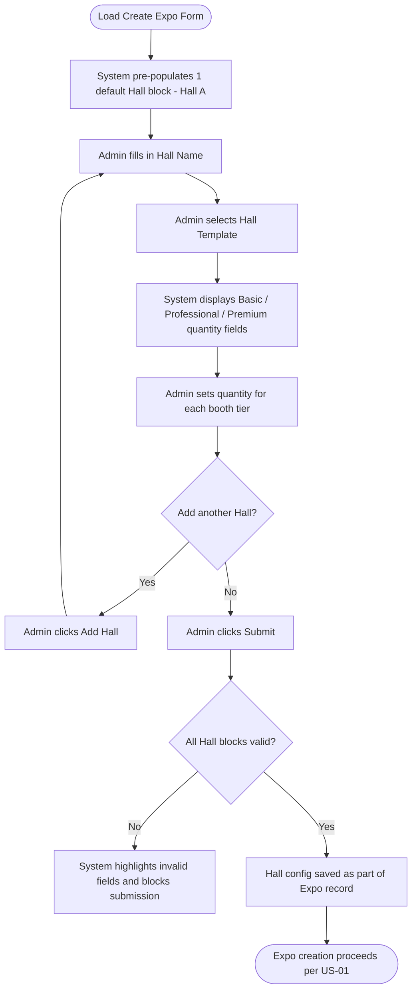

## 1. User Story Statement

As an **Admin** or **System Admin**,
**I want to** configure the Hall structure for a new Expo — including selecting a Hall Template and setting the quantity for each booth tier (Basic / Professional / Premium) —
**so that** the spatial layout is accurately defined before the Expo is initialized, and booth slots are allocated according to the intended tier distribution.

> **Context:** This ticket is an enhancement to [US-01][TX] Create Expo (Admin Portal). It replaces the original Hall/Zone/Booth Count fields with a structured Hall configuration flow driven by booth tiers.

---

## 2. Description & Business Value

The original US-01 captured Hall and Booth Count as simple text/integer fields. Based on stakeholder feedback, the Hall configuration requires a more structured flow:

1. Admin **names a Hall** and **selects a Hall Template** (which defines the spatial layout).
2. The system **automatically displays 3 booth tiers**: Basic, Professional, and Premium.
3. Admin **sets the quantity** for each tier.
4. Admin can **add additional Halls** following the same structure.

The system pre-populates **1 default Hall** so the Admin always has a starting point without manual action.

This change ensures:
- **Accurate capacity planning** — booth slots are defined by tier, not just a flat count.
- **Template-driven layout** — the visual/spatial layout is tied to a selected Hall Template.
- **Consistent data quality** — required fields and quantity validations prevent incomplete records from being submitted.

---

## 3. Scope & Technical Constraints

### 3.1. Pre-condition

- Admin is on the **Create Expo** form (part of US-01 flow).
- The Hall & Booth Template Library has at least one available Hall Template (managed in [US-01][TX] Manage Hall Template Library and [US-02][TX] Configure Hall Template Slots).

### 3.2. Input

The **Hall Configuration** section is a repeatable block. The system pre-populates **1 default Hall** upon page load. Admin may add more Halls via an "Add Hall" action.

Each Hall block contains:

| Label | Type | Required | Validation |
| :--- | :--- | :--- | :--- |
| Hall Name | Text | YES | Non-empty; max 100 characters; must be unique within the Expo. |
| Hall Template | Select | YES | Must select one from the available Hall Template list. All templates are shown regardless of the Expo Template. |
| Basic Booth — Quantity | Integer | YES | Must be ≥ 0. |
| Professional Booth — Quantity | Integer | YES | Must be ≥ 0. |
| Premium Booth — Quantity | Integer | YES | Must be ≥ 0. |

**Cross-field validation:** At least one booth tier (Basic, Professional, or Premium) must have a quantity > 0 per Hall.

### 3.3. Process / Logic

- **Default Hall**: Upon loading the Create Expo form, the system pre-populates one Hall block with the default name "Hall A". Admin may rename this field freely. The Hall Template field remains unselected and tier quantities default to 0.
- **Tier Display**: After a Hall Template is selected, the system displays the 3 booth tier fields (Basic / Professional / Premium) with quantity inputs defaulting to 0.
- **Multiple Halls**: Admin may add additional Hall blocks. Each follows the same structure and validation rules. Hall Names must be unique within the Expo.
- **Validation on Submit**: The system validates all Hall blocks before allowing form submission. Any Hall block with an empty Hall Name, no selected Template, or all-zero quantities blocks the submission.

### 3.4. Output

- Each configured Hall is saved as part of the Expo record, linked to its selected Hall Template.
- Each Hall stores the booth tier quantities: Basic, Professional, and Premium.
- The Expo creation process (US-01) proceeds to initialize booth placeholders based on the tier quantities defined.

---

## 4. Diagram

---

## 5. Design (UX/UI Interaction)

**User Flow 1: Configure Hall on Expo Creation**

Given: Admin is on the **Create Expo** form (redirected from clicking "Create new" per US-01).

1. The **Hall Configuration** section is displayed with **1 pre-populated Hall block** (Hall Name = "Hall A"; Template = unselected; all quantities = 0).
2. Admin fills in the **Hall Name** (editable, pre-filled with "Hall A").
3. Admin selects a **Hall Template** from the dropdown.
4. System reveals the three booth tier quantity inputs: **Basic**, **Professional**, **Premium** (all default to 0).
5. Admin sets the desired quantity for one or more tiers.
6. *(Optional)* Admin clicks **"Add Hall"** to add another Hall block and repeats steps 2–5.
7. Admin clicks **"Submit"** (as part of the full Expo creation form per US-01).
8. System validates all Hall blocks:
   - If any block is invalid, system highlights the offending fields and **blocks submission**.
   - If all blocks are valid, Expo is created with Hall configuration saved.

---

## 6. Acceptance Criteria (AC)

| **AC** | **Given** | **When** | **Then** |
| :--- | :--- | :--- | :--- |
| **01** | Admin opens the Create Expo form. | Form loads. | The Hall Configuration section is visible with **1 pre-populated Hall block** (Hall Name = "Hall A"; quantities = 0; template unselected). |
| **02** | A Hall block is displayed. | Admin selects a Hall Template. | System displays the three booth tier quantity inputs: Basic, Professional, Premium — all defaulting to 0. |
| **03** | Admin has not selected a Hall Template. | Admin clicks Submit. | System highlights the Hall Template field as required and blocks submission. |
| **04** | Hall Template is selected; all tier quantities are 0. | Admin clicks Submit. | System shows a validation error: "At least one booth tier must have a quantity greater than 0." Submission is blocked. |
| **05** | Hall Template is selected; at least one tier has quantity > 0. | Admin clicks Submit. | Validation passes for this Hall block; submission proceeds if all other form fields are also valid. |
| **06** | Admin has 1 or more Hall blocks. | Admin clicks "Add Hall". | A new empty Hall block is appended with a default sequential name (e.g., "Hall B"). Admin may rename it freely. |
| **07** | Admin has multiple Hall blocks. | Two or more Halls share the same Hall Name. | System shows a validation error on the duplicate Hall Name field and blocks submission. |
| **08** | All Hall blocks are valid and the full form is submitted. | Expo creation succeeds. | Each Hall is saved with its Template reference and tier quantities (Basic, Professional, Premium). |

---

## 7. Open Items

~~Confirm whether the Hall Template dropdown shows all available templates or is filtered by the Expo Template selected in US-01.~~ → **Resolved:** Dropdown shows all available Hall Templates regardless of the Expo Template.

~~Confirm the default Hall Name labeling convention for additional Halls (sequential A, B, C vs. user-defined only).~~ → **Resolved:** Default label is sequential (Hall A, Hall B, …). Admin can rename any Hall freely.
