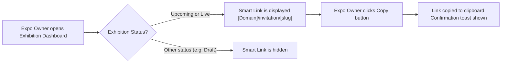

# 1. User Story Statement
**As an** Expo Owner,
**I want** the system to automatically generate a unique Smart Link for each exhibition,
**so that** I have a stable URL to share with potential exhibitors when the exhibition is in Upcoming or Live status.
# 2. Description & Business Value
Each exhibition that reaches **Upcoming** or **Live** status must have an official, shareable registration URL. The Smart Link is auto-generated from the exhibition slug, giving the Expo Owner a copy-ready link to distribute without manual URL construction. This reduces operational errors and ensures all registrations funnel through the correct entry point.
# 3. Scope & Technical Constraints
## **3.1. Pre-conditions**
- Exhibition has been created and has a valid slug
- Exhibition status is **Upcoming** or **Live**
- The authenticated user is the **Expo Owner** of the exhibition

## **3.2. Inputs**

- **Exhibition Slug**: Unique identifier automatically assigned at exhibition creation (e.g., `exhibition-2026`)

## **3.3. Process Logic**

- The system auto-generates a Smart Link by concatenating: `[Domain]/invitation/[Exhibition-Slug]`
- The Smart Link is **only displayed** when exhibition status is `Upcoming` or `Live`
- If exhibition status is `Draft` or any other non-qualifying status, the Smart Link is hidden and not rendered
- Only the **Expo Owner** of the exhibition can view and copy the Smart Link

## **3.4. Outputs**

- Smart Link is displayed in the Exhibition Dashboard with a **Copy** button
- Clicking Copy saves the link to clipboard and shows a brief confirmation toast

---

# 4. Flow / Process Diagram

---

# 5. UX/UI Interaction Flow

1. Expo Owner navigates to the **Exhibition Dashboard** of a target exhibition
2. If the exhibition is in **Upcoming** or **Live** status, a **Smart Link** field is visible displaying the auto-generated URL
3. Expo Owner clicks the **Copy** icon button next to the Smart Link field
4. System copies the link to the clipboard and displays a brief confirmation toast: *"Link copied to clipboard"*
5. If the exhibition is in any other status (e.g. Draft), the Smart Link section is not rendered in the UI

---

# 6. Acceptance Criteria (AC)

| **AC** | **Given** | **When** | **Then** |
| --- | --- | --- | --- |
| **01** | Exhibition has slug `exhibition-2026` and status is **Upcoming** | Expo Owner views Exhibition Dashboard | System displays Smart Link as `.../invitation/exhibition-2026` |
| **02** | Exhibition status is **Live** | Expo Owner views Exhibition Dashboard | Smart Link is still displayed with the same URL format |
| **03** | Exhibition status is **Draft** (or other non-qualifying status) | Expo Owner views Exhibition Dashboard | Smart Link field is not rendered |
| **04** | Smart Link is visible on the dashboard | Expo Owner clicks **Copy** icon button | Link is copied to clipboard and a confirmation toast is displayed |

---

# 7. Open Items

**Story Points:** [TBD]

**Related:** [[[US-12][TX] Smart Invitation Link Dynamic Routing]] (handles routing logic when this generated link is accessed)

**Open Items:**

- None at this time