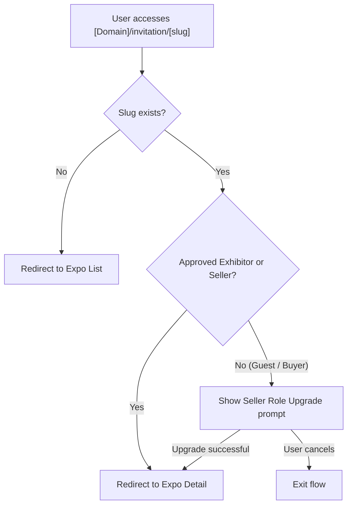

## 1. User Story Statement

**As a** Guest, Buyer, or Seller,

**I want** to be automatically routed to the appropriate destination when I access a Smart Invitation Link,

**so that** I land on the Expo Detail page — with a role gate applied for users who have not yet registered as a Seller.

---

# **2. Description & Business Value**

This is the core routing component of the Smart Link feature. When any user accesses a Smart Invitation Link, the system evaluates their identity and role, then routes them to the **Expo Detail** page — the single destination for all valid access. Users who are already a Seller or approved Exhibitor land directly on Expo Detail. Guests and Buyers must first upgrade to the Seller role before being granted access. This gate ensures only qualified, identified users can view and interact with the Expo Detail page.

---

# **3. Scope & Technical Constraints**

## **3.1. Pre-conditions**

- User accesses a URL in the format: `[Domain]/invitation/[Exhibition-Slug]`
- The exhibition may be in any active status (Upcoming, Live, or Archive)

## **3.2. Inputs**

- **URL path**: `[Domain]/invitation/[Exhibition-Slug]`
- **User identity state**: Guest (unauthenticated) / Buyer / Seller / approved Exhibitor

## **3.3. Process Logic**

The system evaluates the request in the following priority order:

1. **Slug Validation**: If the exhibition slug does not exist → Redirect to the **Expo List** page
2. **Exhibitor Check**: If the user is logged in and is an **approved Exhibitor** of this exhibition → Redirect to the **Expo Detail** page
3. **Seller Check**: If the user is logged in as a **Seller** → Redirect to the **Expo Detail** page
4. **Role Gate**: If the user is a **Guest** (unauthenticated) or a **Buyer** → Prompt to upgrade/register as **Seller** first → Upon successful role upgrade, redirect to the **Expo Detail** page

> Note: Exhibitions in **Archive** status are still accessible — routing proceeds normally without blocking.
> 

## **3.4. Outputs**

- Redirect to one of: **Expo List** (invalid slug) or **Expo Detail** (all valid access)
- For Guest/Buyer: intermediate **Seller Role Upgrade prompt** before reaching Expo Detail

---

# **4. Flow / Process Diagram**

---

# **5. UX/UI Interaction Flow**

1. User accesses a Smart Link in the format `[Domain]/invitation/[Exhibition-Slug]`
2. **If slug is invalid**: User is immediately redirected to the Expo List page — no error message displayed
3. **If slug is valid and user is an approved Exhibitor**: User is redirected to the **Expo Detail** page of that exhibition
4. **If slug is valid and user is a Seller**: User is redirected directly to the **Exhibitor Registration** page
5. **If user is a Guest (unauthenticated)**:
    - System shows the Seller Role Upgrade prompt (e.g., registration/login gate)
    - If user completes the upgrade to Seller → redirect to Exhibitor Registration
    - If user cancels or dismisses → flow exits
6. **If user is a Buyer**:
    - System shows the same Seller Role Upgrade prompt
    - If user upgrades to Seller → redirect to Exhibitor Registration
    - If user cancels → flow exits
7. Routing is seamless — no intermediate loading screen is shown

---

# **6. Acceptance Criteria (AC)**

| **AC** | **Given** | **When** | **Then** |
| --- | --- | --- | --- |
| **01** | The exhibition slug does not exist in the system | Any user accesses the Smart Link | System redirects to the Expo List page |
| **02** | User is logged in as an approved Exhibitor of the target exhibition | User accesses the Smart Link | System redirects to the Expo Detail page of that exhibition |
| **03** | User is logged in as a Seller | User accesses the Smart Link with a valid slug | System redirects to the Exhibitor Registration page |
| **04** | User is a Guest (unauthenticated) | User accesses the Smart Link with a valid slug | System shows the Seller Role Upgrade prompt before proceeding |
| **05** | User is a Buyer | User accesses the Smart Link with a valid slug | System shows the Seller Role Upgrade prompt before proceeding |
| **06** | Guest or Buyer completes the Seller role upgrade | After upgrade is successful | System redirects to the Exhibitor Registration page |
| **07** | Guest or Buyer dismisses/cancels the Seller role upgrade prompt | User closes the prompt | Flow exits; user is not redirected to Exhibitor Registration |
| **08** | Exhibition status is **Archived** and slug is valid | Seller accesses the Smart Link | System still redirects to the Exhibitor Registration page (no blocking) |

---

# **7. Story Points & Open Items**

**Story Points:** [TBD]

**Related:** [[[US-11][TX] Smart Link Generation]] (generates the Smart Link format consumed here) · [[[US-01][TX] Select Booth Type and Position]] (Exhibitor Registration destination after successful Seller routing)

**Open Items:**

- The exact UI treatment for the Seller Role Upgrade prompt is [TBD] — confirm whether it is a modal, a dedicated page, or a login/register wall
- Confirm behavior when Guest/Buyer cancels the upgrade prompt: stay on current screen, redirect to Expo List, or redirect to homepage?