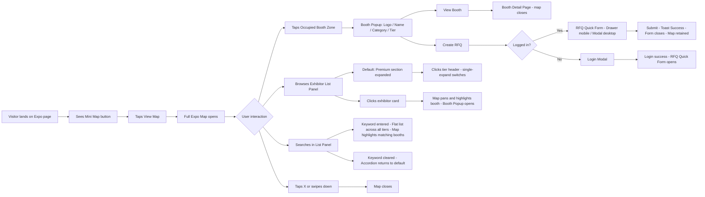

## 1. User Story Statement

**As a** Visitor, **I want to** view and interact with an interactive map of the expo floor **so that** I can quickly locate exhibitor booths, explore the exhibition space, and take key actions on exhibitors directly from the map without losing context.
## 2. Description & Business Value

The Expo Map provides Visitors with a game-map-style overview of the entire exhibition space — accessible via a persistent mini map or floating button, and expandable into a full-screen interactive view. Visitors can interact directly with booth zones on the map, browse an accordion-style Exhibitor List Panel organized by Booth Tier, and perform quick actions (View Booth, Create RFQ) without navigating away from the map context.

**Business Value:** Reduces cognitive load when exploring large expos, increases the number of exhibitors a Visitor discovers and engages with, and directly triggers commercial actions (RFQ) from the map — improving conversion rates and strengthening Arobid's value proposition for both Expo Owners and Exhibitors.

---

## 3. Scope & Technical Constraints

### Pre-conditions

- The Expo is in `Live` status (published by Admin).
- The Expo Owner has configured the floor layout (booth zones assigned positions on the map).
- At least 1 Exhibitor has been `Approved` and has an active booth instance in the Expo.
- Visitors do not need to be logged in to view the map and Exhibitor List Panel.
- Visitors must be logged in to perform the **Create RFQ** action.

### Inputs

- Floor map layout data: booth zones, coordinates, labels, booth tier — configured by Expo Owner / Admin.
- Exhibitor list data: company name, logo, category, booth number, booth tier (`Premium` / `Pro` / `Standard`).
- Search input from Visitor: keyword to find exhibitors by name or category.
- RFQ quick form data: fields entered by the Visitor in the condensed RFQ form (specific fields TBD per RFQ module).

### Process Logic

- The system renders the map as a 2D interactive canvas. Booth zones are displayed with distinct visual states:
    - `Occupied` — has an Exhibitor assigned; interactive.
    - `Empty` — no Exhibitor assigned; non-interactive.
    - `Featured` — Premium-tier Exhibitor; visually distinguished on the map `[TBD: visual treatment]`.
- When a Visitor taps/clicks an `Occupied` booth zone on the map, a **Booth Popup** appears showing: company logo, company name, category tag, tier badge, and 2 quick action buttons: **"View Booth"** and **"Create RFQ"**.
- The **Exhibitor List Panel** is displayed as a **single-expand accordion** organized by Booth Tier:
    - Default state: **Premium Booth** section expanded (exhibitor list visible); other tiers collapsed.
    - When a Visitor clicks a tier header (e.g., "Pro Booth"): that section expands and the currently open section collapses.
    - Only one tier section can be expanded at a time.
- **Search behavior in the List Panel:**
    - When a Visitor types a keyword: the accordion is temporarily bypassed — results are shown as a flat list across all tiers, ungrouped.
    - When the Visitor clears the keyword: the panel reverts to the accordion default state (Premium expanded).
- When a Visitor clicks an exhibitor card in the List Panel: the map automatically pans and highlights the corresponding booth, and the Booth Popup opens.
- **Create RFQ flow:**
    - If Visitor is logged in: the RFQ Quick Form opens as a **Drawer** (mobile, slides up from bottom) or **Modal** (desktop, centered overlay). The Booth Popup remains visible in the background.
    - If Visitor is not logged in: a Login modal appears; after successful login, the RFQ Quick Form opens automatically.
    - After the Visitor submits the RFQ form: a success toast is shown; the form closes; the map and panel retain their current state.
- The map supports pinch-to-zoom, scroll-to-zoom (desktop), and drag to pan.
- The mini map / floating button remains persistently visible while the Visitor is on the Expo page.

### Outputs

- Visitor sees the full expo space as an interactive map with booth zones differentiated by status and tier.
- Booth Popup with exhibitor details and 2 quick actions: View Booth, Create RFQ.
- Exhibitor List Panel as a single-expand accordion by Booth Tier, with cross-tier search.
- RFQ successfully created and linked to the corresponding Exhibitor (handled by the RFQ module).
- When "View Booth" is selected: navigation to the Exhibitor's Booth Detail Page.

---

## 4. Flow / Process Diagram

---

## 5. UX/UI Interaction Flow

1. Visitor is on the Expo page and sees a **floating mini map button** pinned to the bottom-right corner of the screen.
2. Visitor taps the button → the Expo Map opens as a **full-screen overlay** with a slide-up / fade-in animation.
3. The map renders the full floor layout: booth zones are color-coded by status (occupied / featured / empty) with booth number labels.
4. The **Exhibitor List Panel** appears side-by-side with the map on desktop, or as a pull-up bottom sheet on mobile. Default state: **"Premium Booth"** section is expanded showing the Premium exhibitor list; "Pro Booth" and "Standard Booth" are collapsed.
5. Visitor taps the **"Pro Booth"** section header → Pro section expands; Premium section collapses.
6. Visitor taps an **exhibitor card** in the List Panel → the map automatically pans and zooms to the corresponding booth; the Booth Popup opens.
7. Visitor taps directly on an **occupied booth zone** on the map → Booth Popup appears showing: logo, company name, category tag, tier badge, and buttons **"View Booth"** and **"Create RFQ"**.
8. Visitor taps **"View Booth"** → navigates to the Booth Detail Page; the Expo Map closes.
9. Visitor taps **"Create RFQ"** (logged in) → the RFQ Quick Form opens as a **Drawer** (mobile, slides up from bottom) or **Modal** (desktop, centered overlay). The Booth Popup remains visible in the background.
10. Visitor fills in the RFQ Quick Form and taps **"Submit"** → success toast: *"Your RFQ has been sent successfully."*; form closes; map and panel retain their current state.
11. Visitor taps **"Create RFQ"** (not logged in) → Login modal appears; after successful login, the RFQ Quick Form opens automatically.
12. Visitor types a keyword into the **Search bar** in the List Panel → the panel switches to a flat list (accordion bypassed), showing results across all tiers; matching booth zones on the map are highlighted; non-matching booths are dimmed.
13. Visitor clears the keyword in the Search bar → the panel reverts to the accordion with the default state (Premium Booth expanded); map highlights are cleared.
14. Visitor taps **"✕"** or swipes down (mobile) → the map closes and the Visitor returns to the Expo page state prior to opening the map.

---

## 6. Acceptance Criteria

| # | Given | When | Then |
| --- | --- | --- | --- |
| AC-01 | The Expo is in `Live` status with at least 1 approved Exhibitor | Visitor taps the Mini Map button on the Expo page | The Expo Map opens displaying the full floor layout; booth zones are rendered in correct positions and differentiated by status |
| AC-02 | The Expo Map is open | Visitor taps a booth zone with status `Occupied` | A Booth Popup appears showing: company logo, company name, category tag, tier badge, "View Booth" button, and "Create RFQ" button |
| AC-03 | The Expo Map is open | Visitor taps a booth zone with status `Empty` | No popup appears; the booth zone does not respond to interaction |
| AC-04 | A Booth Popup is open | Visitor taps "View Booth" | Navigation proceeds to the Exhibitor's Booth Detail Page; the Expo Map closes |
| AC-05 | Visitor is logged in and a Booth Popup is open | Visitor taps "Create RFQ" | The RFQ Quick Form opens as a Drawer (mobile) or Modal (desktop); the Booth Popup remains visible in the background |
| AC-06 | Visitor is not logged in and a Booth Popup is open | Visitor taps "Create RFQ" | A Login modal appears; after successful login, the RFQ Quick Form opens automatically |
| AC-07 | The RFQ Quick Form is open | Visitor fills in the form and taps "Submit" | A success toast is shown: "Your RFQ has been sent successfully."; the form closes; the map and list panel retain their current state |
| AC-08 | The Expo Map has just opened and the Exhibitor List Panel is visible | Default state of the List Panel | The "Premium Booth" section is expanded with the Premium exhibitor list visible; "Pro Booth" and "Standard Booth" sections are collapsed |
| AC-09 | The List Panel is in default state (Premium expanded) | Visitor taps the "Pro Booth" section header | The "Pro Booth" section expands and its exhibitor list becomes visible; the "Premium Booth" section collapses |
| AC-10 | The List Panel accordion is open | Visitor taps any exhibitor card | The map automatically pans and zooms to the corresponding booth; the Booth Popup for that exhibitor opens |
| AC-11 | The List Panel accordion is displayed | Visitor types a keyword into the Search bar | The panel switches to a flat list across all tiers; matching booth zones on the map are highlighted; non-matching booths are dimmed |
| AC-12 | The List Panel is in search mode (flat list) | Visitor clears all text in the Search bar | The panel reverts to the accordion default state (Premium Booth expanded); all map highlights are cleared |
| AC-13 | The Expo Map is open | Visitor taps "✕" or swipes down (mobile) | The map closes; the Visitor returns to the Expo page state prior to opening the map |
| AC-14 | The Expo is not in `Live` status | Visitor accesses the Expo page | The Mini Map button is not displayed; the Expo Map cannot be accessed |

---

## 7. Story Points & Open Items

**Estimated Story Points:** `[TBD]`

**Related TradeXpo stories:** [[[US-01][TX] Exhibitor Detail Page]] ("View Booth" navigates to this page) · [[[US-02][TX] Send Inquiry (RFQ)]] ("Create RFQ" triggers this module from the map)

| # | Item | Owner |
| --- | --- | --- |
| OI-01 | How does the Expo Owner configure the floor layout? Drag-and-drop tool or file upload (SVG/CAD)? → Likely requires a separate US: **"Expo Floor Layout Builder"** | Product |
| OI-02 | What fields are included in the RFQ Quick Form? Needs alignment with the RFQ module (separate US) to define the minimum required fields for the condensed form | Product / Engineering |
| OI-03 | Featured / Premium booth visual treatment on the map: color, icon, border highlight? | Design |
| OI-04 | Mini map: static thumbnail or live preview? What zoom threshold triggers the transition to mini map state? | Design |
| OI-05 | If an Expo has no Premium-tier exhibitors, which tier does the List Panel default-expand? (Highest tier with at least one exhibitor?) | Product |
| OI-06 | Real-time updates: if the Expo Owner reassigns booth while the Expo is Live, does the map refresh automatically? Push or polling mechanism? `[TBD]` | Engineering |