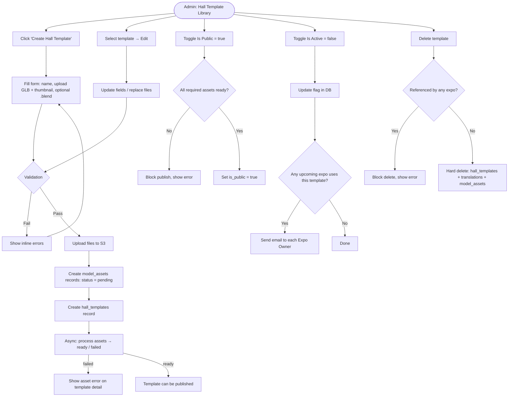

# 1. User Story Statement
**As an** Admin,
**I want** to create and manage Hall Templates in a shared library,
**so that** Expo Organizers can select a pre-built virtual hall design when setting up their expo.

# 2. Description & Business Value
Hall Templates are the 3D virtual spaces that host exhibitor booths. Admin maintains a library of hall designs by uploading the source Blender file, the GLB render file used by the 3D viewer, and a thumbnail image for preview. Each uploaded file is tracked as a `model_assets` record with an async processing status (`pending` → `processing` → `ready` / `failed`). A template can only be published when all required assets are `ready`. The template name supports multiple languages via `hall_template_translations`, with the base `name` on `hall_templates` serving as the fallback. This library is the foundational asset pool for all virtual expos on TradeXpo.

# 3. Scope & Technical Constraints

### 3.1. Pre-condition
- User is authenticated as **Admin**.
- Navigates to **Admin > TradeXpo > Hall Template Library**.

### 3.2. Input

#### Create / Edit form fields:

| Field | Type | Required | Notes |
|---|---|---|---|
| Name (default) | Text | Yes | Unique within the library — stored in `hall_templates.name` as the fallback name |
| Name Translations | Key-value (language_code → name) | No | Stored in `hall_template_translations`; Admin can add translations per language after creation |
| Source Blender File | File upload | No | `.blend` format — creates a `model_assets` record, stored as `source_blend_asset_id`; no file size limit |
| GLB Render File | File upload | Yes | `.glb` format — creates a `model_assets` record, stored as `render_glb_asset_id`; no file size limit |
| Thumbnail | Image upload | Yes | Preview image — creates a `model_assets` record, stored as `thumbnail_asset_id`; accepted formats: JPG, PNG, WebP |
| Is Public | Toggle | Yes | Default: `false` (draft); `true` = visible to organizers. **Blocked** if any required asset is not `ready` |
| Is Active | Toggle | Yes | Default: `true`; `false` = soft-disabled, hidden everywhere |

### 3.3. Process / Logic

#### Asset upload flow
Each uploaded file goes through the following lifecycle via `model_assets`:
1. File is uploaded to **AWS S3** → `file_url` is stored.
2. A `model_assets` record is created with `status = pending`.
3. System processes the file async (format validation, etc.) → `status` transitions to `processing` → `ready` or `failed`.
4. The resulting `model_assets.id` is linked to the template as `source_blend_asset_id`, `render_glb_asset_id`, or `thumbnail_asset_id`.

| `model_assets.status` | Meaning |
|---|---|
| `pending` | Upload received, processing not yet started |
| `processing` | Asset is being validated/processed |
| `ready` | Asset is available for use |
| `failed` | Processing failed; file is unusable |

#### On Create
- System validates: `name` is unique, GLB and thumbnail files are provided.
- Asset records are created per the upload flow above.
- `hall_templates` record is created with `updated_by` = current admin user ID.
- `is_public` defaults to `false`; Admin cannot set `is_public = true` until GLB and thumbnail assets both have `status = ready`.

#### On Edit
- All fields are editable.
- Replacing a file: the old `model_assets` record is **retained** (not deleted) to avoid breaking existing expo references. A new `model_assets` record is created and the FK on the template is updated.
- `updated_at` and `updated_by` are refreshed on save.

#### On Publish (`is_public = true`)
- System checks that `render_glb_asset_id` and `thumbnail_asset_id` both reference a `model_assets` record with `status = ready`.
- If any required asset is not `ready` → publish is blocked with an error.

#### On Deactivate (`is_active = false`)
- Template is hidden from the organizer selection picker.
- System queries all **upcoming** expos currently using this template.
- For each affected expo, system sends an **email notification** to the **Expo Owner (Organizer)** informing them that the hall template has been deactivated and they should review their expo configuration. If the send fails, the system **retries automatically** (retry policy managed by the email service).
- Existing expos are **not automatically changed** — they continue to reference the template; only Admin can reassign.

#### On Delete
- Hard delete is **blocked** if any expo references this template.
- Otherwise, the `hall_templates` record, all `hall_template_translations` records, and linked `model_assets` records are deleted.

#### Translations
- Admin adds/edits translations via a separate translation panel (not in the main create form).
- Each translation record: `hall_template_id`, `language_code` (e.g., `en`, `vi`, `ja`), `name`.
- The frontend displays the translated name based on the viewer's locale; falls back to `hall_templates.name` if no translation exists for that locale.

### 3.4. Output
- `hall_templates` record saved with FKs to `model_assets` for each asset.
- `hall_template_translations` records saved per language added.
- Template appears in the organizer's hall selection picker when `is_public = true` and `is_active = true` and all required assets are `ready`.

### 3.5. Library List Page
The Hall Template Library page displays templates in a **paginated table/grid** with the following:

| Column | Source |
|---|---|
| Thumbnail | `thumbnail_asset_id` → `model_assets.file_url` |
| Name | `hall_templates.name` |
| Updated By | `hall_templates.updated_by` (admin user name) |
| Updated At | `hall_templates.updated_at` |
| Status | Derived: `is_active = false` → **Inactive**; `is_public = false` → **Draft**; all assets `ready` + `is_public = true` → **Published**; any asset not `ready` → **Processing / Failed** |

- **Search:** by template name (full-text, case-insensitive).
- **Pagination:** server-side; page size TBD by frontend team.

# 4. Diagram

# 5. Design (UX/UI Interaction)

### User Flow 0: Browse the Library

**Given:** Admin navigates to Hall Template Library.
* **Step 1:** System displays the paginated list of templates with columns: Thumbnail, Name, Updated By, Updated At, Status.
* **Step 2:** Admin types in the **Search** box to filter by name — list updates in real time (or on submit).
* **Step 3:** Admin uses pagination controls to navigate between pages.

### User Flow 1: Create Hall Template

**Given:** Admin is on the Hall Template Library page.
* **Step 1:** Admin clicks **"+ Create Hall Template"**.
* **Step 2:** System displays a drawer/modal with the creation form.
* **Step 3:** Admin enters **Name** (default language), uploads **GLB Render File** (required) and **Thumbnail** (required), optionally uploads **Source Blender File**, sets **Is Public** toggle.
* **Step 4:** Admin clicks **"Save"**.
* **Step 5:** System validates inputs. Files are uploaded to S3 and `model_assets` records created with `status = pending`. Template appears in list with an **"Assets Processing"** indicator.
* **Step 6:** Once assets finish processing, indicator updates to **"Ready"** (or **"Asset Failed"** if any asset fails).

### User Flow 2: Publish Template

**Given:** Admin is on the Hall Template Library; template assets are `ready`.
* **Step 1:** Admin toggles **Is Public** to `true`.
* **Step 2:** System verifies required assets are `ready`. On success, saves inline.
* **Step 3:** Template becomes visible in the organizer hall selection picker.

**Error path:** If any required asset is not `ready` → toggle reverts, error toast: *"Cannot publish: required assets are not ready yet."*

### User Flow 3: Manage Translations

**Given:** Admin is on the Hall Template detail page.
* **Step 1:** Admin opens the **"Translations"** tab/panel.
* **Step 2:** Admin selects a language code (e.g., `vi`, `ja`) and enters the translated name.
* **Step 3:** Admin clicks **"Add Translation"**. Record is saved to `hall_template_translations`.
* **Step 4:** Admin may edit or delete existing translation rows inline.

### User Flow 4: Edit Hall Template

**Given:** Admin is on the Hall Template Library page.
* **Step 1:** Admin clicks **"Edit"** on a template card/row.
* **Step 2:** Drawer opens pre-filled with current values.
* **Step 3:** Admin modifies fields or replaces files (new upload triggers new `model_assets` record; old record retained).
* **Step 4:** Admin clicks **"Save"**. System updates the record.

### User Flow 5: Deactivate Template

**Given:** Admin is on the Hall Template Library page.
* **Step 1:** Admin toggles **Is Active** to `false` on a template row.
* **Step 2:** System saves inline. If upcoming expos are affected, emails are sent to each Expo Owner in the background.
* **Step 3:** List reflects the deactivated state (greyed badge).

### User Flow 6: Delete Hall Template

**Given:** Admin is on the Hall Template Library page.
* **Step 1:** Admin clicks **"Delete"** on a template.
* **Step 2:** System checks for expo references. If referenced → error toast: *"This template is in use by one or more expos and cannot be deleted."* Flow ends.
* **Step 3:** If not referenced → confirmation dialog appears.
* **Step 4:** Admin confirms. System deletes the template, all translations, and linked asset records.

# 6. Acceptance Criteria (AC)

| # | Given | When | Then |
|:--|:------|:-----|:-----|
| **01** | Admin is on the Hall Template Library page | Admin creates a template with a valid name, GLB file, and thumbnail | Template is saved; assets begin processing with `status = pending` |
| **02** | Admin is creating a template | Admin submits without uploading a GLB file | System shows validation error on GLB field; record is not saved |
| **03** | Admin is creating a template | Admin submits with a duplicate name | System shows "Name already exists" error |
| **04** | A file is uploaded successfully | Asset processing completes | `model_assets.status` transitions to `ready`; template shows "Ready" indicator |
| **05** | Asset processing fails | `model_assets.status = failed` | Template shows "Asset Failed" indicator; Admin is informed to re-upload |
| **06** | Required asset has `status = pending` or `failed` | Admin attempts to set `is_public = true` | System blocks publish with error: "Cannot publish: required assets are not ready yet" |
| **07** | All required assets have `status = ready` | Admin sets `is_public = true` | Template becomes visible in the organizer hall selection picker |
| **08** | Admin sets `Is Public = false` on a template | Organizer opens the hall selection picker | The template does not appear |
| **09** | Admin sets `Is Active = false` on a template | Any user tries to access it | Template is hidden from all selection interfaces |
| **10** | Admin deactivates a template used by 2 upcoming expos | `is_active` is set to `false` | System sends email notification to each of the 2 Expo Owners |
| **11** | Admin deactivates a template with no upcoming expos | `is_active` is set to `false` | No email is sent |
| **12** | Admin deactivates a template used only by archived/live expos | `is_active` is set to `false` | No email is sent (only upcoming expos trigger notification) |
| **13** | Admin replaces the GLB file on an existing template | Save is confirmed | Old `model_assets` record is retained; new asset ID is linked to the template |
| **14** | A template is referenced by an existing expo | Admin attempts to delete it | System blocks deletion with an explanatory error message |
| **15** | A template has no expo references | Admin confirms deletion | `hall_templates`, all `hall_template_translations`, and linked `model_assets` records are permanently removed |
| **16** | Admin adds a Vietnamese translation (`vi`) for a template | Organizer views the picker with locale `vi` | Template name displays in Vietnamese |
| **17** | No translation exists for the organizer's locale | Organizer views the picker | Template name falls back to `hall_templates.name` (default) |
| **18** | Admin is on the Hall Template Library page | Admin types a name in the search box | List filters to show only templates whose name matches the search term |
| **19** | Library has more templates than one page | Admin navigates to page 2 | System loads the next set of templates |
| **20** | A template has all assets `ready` and `is_public = true` | Admin views the library list | Template shows **"Published"** status |
| **21** | A template has `is_public = false` | Admin views the library list | Template shows **"Draft"** status |
| **22** | A template has `is_active = false` | Admin views the library list | Template shows **"Inactive"** status |

# 7. Open Items
- **Email content** for deactivation notification — subject line and body copy to be defined by the content/product team.
- **Asset failed UX** — should Admin receive a proactive notification (in-app or email) when an asset fails processing, or only see it passively on the template detail page?
