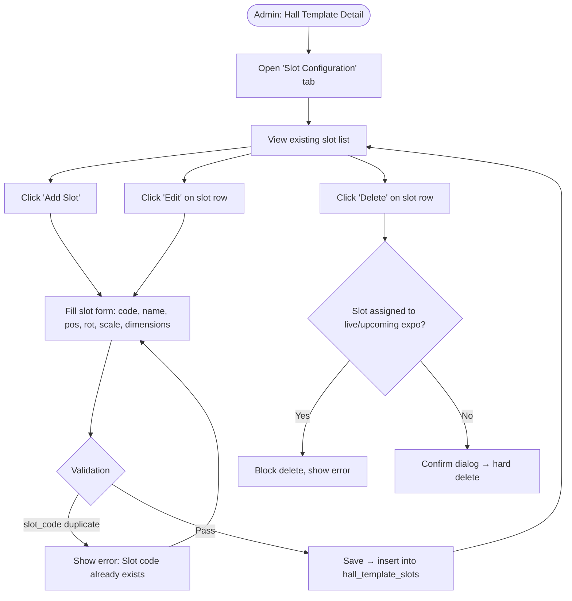

# 1. User Story Statement
**As an** Admin,
**I want** to define and manage booth slot positions within a Hall Template,
**so that** the 3D viewer knows exactly where each exhibitor booth is placed inside the virtual hall.

# 2. Description & Business Value
A Hall Template is a 3D space; Slots define the precise coordinates for each booth within that space. Each slot stores a 3D position (`pos_x/y/z`), rotation (`rot_x/y/z`), scale (`scale_x/y/z`), and physical dimensions (`width`, `height`, `depth`). When an expo is configured, these slots become the assignable booth positions. Correctly configured slots are required before a hall template can be used in a live expo.

> **Related:** [[[US-01][TX] Manage Hall Template Library]]

# 3. Scope & Technical Constraints

### 3.1. Pre-condition
- Admin has already created a Hall Template (see US-01).
- Admin navigates to **Admin > TradeXpo > Hall Template Library > [Template] > Slot Configuration**.

### 3.2. Input

#### Slot form fields:

| Field | Type | Required | Notes |
|---|---|---|---|
| Slot Code | Text | Yes | Unique within the hall template (e.g., `A01`, `B-02`) — used as a stable identifier |
| Name | Text | Yes | Display name (e.g., "Booth A01") |
| Position X / Y / Z | Number (decimal) | Yes | 3D world-space position of the slot origin — in **Blender units** |
| Rotation X / Y / Z | Number (decimal) | Yes | Euler rotation in degrees |
| Scale X / Y / Z | Number (decimal) | Yes | Default: `1.0` for each axis |
| Width / Height / Depth | Number (decimal) | Yes | Physical dimensions of the booth space — in **Blender units** (1 BU = 1 meter) |
| Metadata | Key-value builder | No | Entered as key-value pairs in the UI; serialized to JSON on save. Used for additional 3D properties (lighting, labels, etc.) |

### 3.3. Process / Logic
- On **Create Slot**:
  - `slot_code` must be unique within the same `hall_template_id`.
  - All numeric fields default to `0` except scale (defaults to `1.0`).
  - Record is inserted into `hall_template_slots` with the parent `hall_template_id`.
- On **Edit Slot**:
  - All fields are editable.
  - If the slot is already assigned to a booth in a **live** expo, the system shows a warning but does not block the update (positional changes take effect on next 3D load).
- On **Delete Slot**:
  - Blocked if the slot is currently assigned to a booth in any **upcoming** or **live** expo.
  - Otherwise, hard-deleted.
- **Bulk import** (optional future scope): slots may be imported via CSV or auto-generated from the GLB file metadata — out of scope for this story.

### 3.4. Output
- Slot records are saved in `hall_template_slots`.
- The slot list is displayed in a table on the template detail page, grouped or sortable by `slot_code`.

# 4. Diagram

# 5. Design (UX/UI Interaction)

### User Flow 1: Add a Slot

**Given:** Admin is on the Slot Configuration tab of a Hall Template.
* **Step 1:** Admin clicks **"+ Add Slot"**.
* **Step 2:** System displays an inline row or side drawer with the slot form.
* **Step 3:** Admin enters Slot Code (e.g., `A01`), Name (e.g., `Booth A01`), and the 3D coordinates (pos, rot, scale, dimensions).
* **Step 4:** Admin clicks **"Save"**.
* **Step 5:** System validates uniqueness of `slot_code`. On success, the slot appears in the list.

### User Flow 2: Edit a Slot

**Given:** Admin is on the Slot Configuration tab.
* **Step 1:** Admin clicks **"Edit"** on a slot row.
* **Step 2:** Form opens pre-filled with current values.
* **Step 3:** Admin modifies any field.
* **Step 4:** Admin clicks **"Save"**. If the slot is in use by a live expo, a warning banner is shown: *"This slot is in use by a live expo. Changes will take effect on next load."*
* **Step 5:** System saves and updates the row.

### User Flow 3: Delete a Slot

**Given:** Admin is on the Slot Configuration tab.
* **Step 1:** Admin clicks **"Delete"** on a slot row.
* **Step 2:** System checks if the slot is assigned in an upcoming or live expo.
  - If yes → error toast: *"This slot is assigned to an active expo and cannot be deleted."* Flow ends.
  - If no → confirmation dialog shown.
* **Step 3:** Admin confirms. Slot is removed from the list.

# 6. Acceptance Criteria (AC)

| # | Given | When | Then |
|:--|:------|:-----|:-----|
| **01** | Admin is on the Slot Configuration tab | Admin adds a slot with a unique `slot_code` and valid coordinates | Slot is saved and appears in the list |
| **02** | Admin adds a slot | Slot Code is the same as an existing slot in the same hall template | System shows validation error "Slot code already exists in this hall"; record is not saved |
| **03** | Admin adds a slot | Scale fields are left blank | System defaults Scale X/Y/Z to `1.0` |
| **04** | A slot is assigned to a booth in an upcoming expo | Admin attempts to delete the slot | System blocks deletion with an explanatory error |
| **05** | A slot is not assigned to any expo | Admin confirms deletion | Slot record is permanently removed |
| **06** | Admin edits position coordinates of a slot already used in a live expo | Admin saves | System shows a warning banner: *"This slot is in use by a live expo. Changes will take effect on next load."* and proceeds with saving |
| **07** | Admin opens the Slot Configuration tab | Hall template has 10+ slots | Slots are displayed in a sortable table, sorted by `slot_code` by default |

# 7. Open Items
- **3D preview integration**: Should the Admin UI show a live 3D preview of the hall with slot positions overlaid? (Nice-to-have, deferred to design review)
- **Metadata schema**: Should `metadata` be free-form JSON or enforced against a schema? Recommend free-form for now with a JSON syntax validator.
