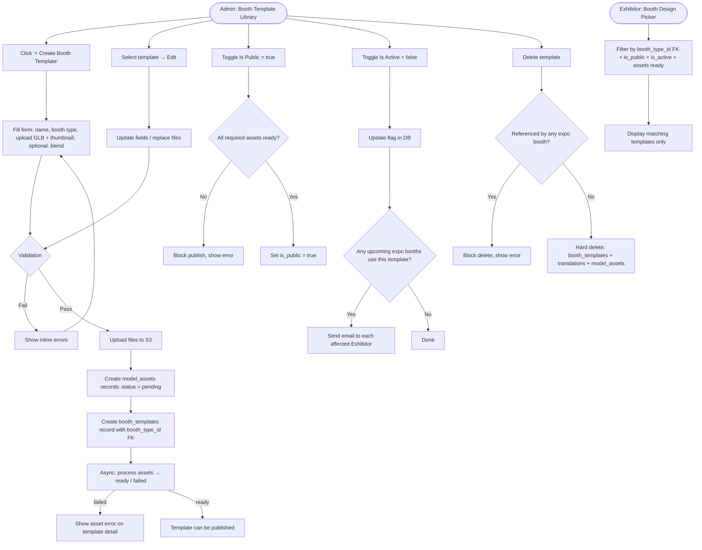

# 1. User Story Statement
**As an** Admin,
**I want** to create and manage Booth Templates in a shared library,
**so that** Exhibitors can choose a pre-built booth design when registering for an expo.

# 2. Description & Business Value
Booth Templates define the visual design of an individual exhibitor booth inside the virtual hall. Each template is linked to a **Booth Type** via `booth_type_id` FK to the `booth_types` table — a dedicated table that holds each type's config (name, pricing tier, dimensions, permissions, etc.) managed separately. When an Exhibitor selects and pays for a specific booth type, the system only presents templates belonging to that type during booth configuration — ensuring the exhibitor's design choice is consistent with what they paid for.

Similar to Hall Templates, each uploaded file is tracked as a `model_assets` record with an async processing status (`pending` → `processing` → `ready` / `failed`). A template can only be published when all required assets are `ready`. The template name supports multiple languages via `booth_template_translations`, with `booth_templates.name` as the fallback.

> **Related:** [[[US-01][TX] Manage Hall Template Library]] · [[[US-02][TX] Configure Hall Template Slots]]

# 3. Scope & Technical Constraints

### 3.1. Pre-condition
- User is authenticated as **Admin**.
- Navigates to **Admin > TradeXpo > Booth Template Library**.

### 3.2. Input

#### Create / Edit form fields:

| Field | Type | Required | Notes |
|---|---|---|---|
| Name (default) | Text | Yes | Unique within the library — stored in `booth_templates.name` as the fallback name |
| Booth Type | Select | Yes | FK `booth_type_id` → `booth_types.id`; dropdown lists all active booth types. **Note:** `booth_type_id` column is pending addition to the `booth_templates` schema |
| Name Translations | Key-value (language_code → name) | No | Stored in `booth_template_translations`; Admin can add translations per language after creation |
| Source Blender File | File upload | No | `.blend` format — creates a `model_assets` record, stored as `source_blend_asset_id`; no file size limit |
| GLB Render File | File upload | Yes | `.glb` format — creates a `model_assets` record, stored as `render_glb_asset_id`; no file size limit |
| Thumbnail | Image upload | Yes | Preview image — creates a `model_assets` record, stored as `thumbnail_asset_id`; accepted formats: JPG, PNG, WebP |
| Description | Text area | No | Short description shown during booth selection (e.g., size, style notes) |
| Is Public | Toggle | Yes | Default: `false` (draft); `true` = visible in the booth selection picker. **Blocked** if any required asset is not `ready` |
| Is Active | Toggle | Yes | Default: `true`; `false` = soft-disabled, hidden from all pickers |

### 3.3. Process / Logic

#### Asset upload flow
Identical to Hall Template asset handling — each uploaded file goes through `model_assets`:
1. File is uploaded to **AWS S3** → `file_url` is stored.
2. A `model_assets` record is created with `status = pending`.
3. System processes the file async → `status` transitions to `processing` → `ready` or `failed`.
4. The resulting `model_assets.id` is linked to the template as `source_blend_asset_id`, `render_glb_asset_id`, or `thumbnail_asset_id`.

| `model_assets.status` | Meaning |
|---|---|
| `pending` | Upload received, processing not yet started |
| `processing` | Asset is being validated/processed |
| `ready` | Asset is available for use |
| `failed` | Processing failed; file is unusable |

#### On Create
- System validates: `name` is unique, `booth_type_id` references a valid `booth_types` record, GLB and thumbnail files are present.
- Asset records are created per the upload flow above.
- `booth_templates` record is created with `updated_by` = current admin user ID.
- `is_public` defaults to `false`; Admin cannot set `is_public = true` until GLB and thumbnail assets both have `status = ready`.

#### On Edit
- All fields are editable.
- Replacing a file: the old `model_assets` record is **retained** (not deleted) to avoid breaking existing expo booth references. A new `model_assets` record is created and the FK on the template is updated.
- `updated_at` and `updated_by` are refreshed on save.

#### On Publish (`is_public = true`)
- System checks that `render_glb_asset_id` and `thumbnail_asset_id` both reference a `model_assets` record with `status = ready`.
- If any required asset is not `ready` → publish is blocked with an error.

#### On Deactivate (`is_active = false`)
- Template is hidden from the booth selection picker for all future selections.
- System queries all **upcoming** expos that have exhibitor booths using this template.
- For each affected exhibitor, system sends an **email notification** informing them that their selected booth template has been deactivated and they should review their booth configuration. If the send fails, the system **retries automatically** (retry policy managed by the email service).
- Existing booths are **not automatically changed** — they continue to reference the template.

#### On Delete
- Hard delete is **blocked** if any expo booth references this template.
- Otherwise, the `booth_templates` record, all `booth_template_translations` records, and linked `model_assets` records are deleted.

#### Translations
- Admin adds/edits translations via a separate translation panel on the template detail page.
- Each translation record: `booth_template_id`, `language_code` (e.g., `en`, `vi`, `ja`), `name`.
- The frontend displays the translated name based on the viewer's locale; falls back to `booth_templates.name` if no translation exists for that locale.

#### Booth picker filtering (Exhibitor-facing)
When an Exhibitor opens the booth design picker after completing payment for a booth type, the system queries:
- `booth_type_id` = the `booth_types.id` of the paid booth type
- `is_public = true`
- `is_active = true`
- All required assets `status = ready`

### 3.4. Output
- `booth_templates` record saved with `booth_type_id` FK to `booth_types` and FKs to `model_assets` for each asset.
- `booth_template_translations` records saved per language added.
- Template appears in the exhibitor booth selection picker only for the matching booth type, when `is_public = true`, `is_active = true`, and required assets are `ready`.

# 4. Diagram

# 5. Design (UX/UI Interaction)

### User Flow 1: Create Booth Template

**Given:** Admin is on the Booth Template Library page.
* **Step 1:** Admin clicks **"+ Create Booth Template"**.
* **Step 2:** System displays a drawer/modal with the creation form.
* **Step 3:** Admin enters **Name** (default), selects **Booth Type** (required), optional **Description**, uploads **GLB Render File** (required) and **Thumbnail** (required), optionally uploads **Source Blender File**, sets **Is Public** toggle.
* **Step 4:** Admin clicks **"Save"**.
* **Step 5:** System validates inputs. Files are uploaded to S3 and `model_assets` records created with `status = pending`. Template appears in the list with an **"Assets Processing"** indicator.
* **Step 6:** Once assets finish processing, indicator updates to **"Ready"** (or **"Asset Failed"** if any fail).

### User Flow 2: Publish Booth Template

**Given:** Admin is on the Booth Template Library; template assets are `ready`.
* **Step 1:** Admin toggles **Is Public** to `true`.
* **Step 2:** System verifies required assets are `ready`. On success, saves inline.
* **Step 3:** Template becomes visible in the booth picker for exhibitors who paid for the matching booth type.

**Error path:** If any required asset is not `ready` → toggle reverts, error toast: *"Cannot publish: required assets are not ready yet."*

### User Flow 3: Manage Translations

**Given:** Admin is on the Booth Template detail page.
* **Step 1:** Admin opens the **"Translations"** tab/panel.
* **Step 2:** Admin selects a language code (e.g., `vi`, `ja`) and enters the translated name.
* **Step 3:** Admin clicks **"Add Translation"**. Record is saved to `booth_template_translations`.
* **Step 4:** Admin may edit or delete existing translation rows inline.

### User Flow 4: Edit Booth Template

**Given:** Admin is on the Booth Template Library page.
* **Step 1:** Admin clicks **"Edit"** on a template card/row.
* **Step 2:** Drawer opens pre-filled with current values.
* **Step 3:** Admin modifies fields or replaces files (new upload triggers new `model_assets` record; old record retained).
* **Step 4:** Admin clicks **"Save"**. System updates the record.

### User Flow 5: Delete Booth Template

**Given:** Admin is on the Booth Template Library page.
* **Step 1:** Admin clicks **"Delete"** on a template.
* **Step 2:** System checks for expo booth references.
  - If referenced → error toast: *"This template is used by one or more expo booths and cannot be deleted."* Flow ends.
  - If not referenced → confirmation dialog.
* **Step 3:** Admin confirms. System deletes the template, all translations, and linked asset records.

# 6. Acceptance Criteria (AC)

| # | Given | When | Then |
|:--|:------|:-----|:-----|
| **01** | Admin is on the Booth Template Library page | Admin creates a template with valid name, booth type, GLB file, and thumbnail | Template is saved; assets begin processing with `status = pending` |
| **02** | Admin is creating a template | Admin submits without selecting a Booth Type | System shows validation error on Booth Type field; record is not saved |
| **03** | Admin is creating a template | Admin submits without uploading a GLB file | System shows validation error on GLB field; record is not saved |
| **04** | Admin is creating a template | Name is the same as an existing booth template | System shows "Name already exists" error |
| **05** | A file is uploaded successfully | Asset processing completes | `model_assets.status` transitions to `ready`; template shows "Ready" indicator |
| **06** | Asset processing fails | `model_assets.status = failed` | Template shows "Asset Failed" indicator; Admin is informed to re-upload |
| **07** | Required asset has `status = pending` or `failed` | Admin attempts to set `is_public = true` | System blocks publish with error: "Cannot publish: required assets are not ready yet" |
| **08** | All required assets have `status = ready` | Admin sets `is_public = true` | Template becomes visible in the booth picker for the matching booth type |
| **09** | `is_public = false` on a template | Exhibitor opens the booth design picker | The template does not appear |
| **10** | `is_active = false` on a template | Any user tries to select it | Template is hidden from all selection interfaces |
| **11** | Exhibitor has paid for booth type "Standard" | Exhibitor opens the booth design picker | Only templates where `booth_type_id` matches the Standard `booth_types` record, `is_public = true`, `is_active = true`, and assets `ready` are shown |
| **12** | Exhibitor has paid for booth type "Premium Corner" | Exhibitor opens the booth design picker | Standard templates are not shown; only Premium Corner templates appear |
| **13** | Admin replaces the GLB file on an existing template | Save is confirmed | Old `model_assets` record is retained; new asset ID is linked to the template |
| **14** | A template is referenced by an expo booth | Admin attempts to delete it | System blocks deletion with an explanatory error message |
| **15** | A template has no expo booth references | Admin confirms deletion | `booth_templates`, all `booth_template_translations`, and linked `model_assets` records are permanently removed |
| **16** | Admin adds a Vietnamese translation (`vi`) for a template | Exhibitor views the picker with locale `vi` | Template name displays in Vietnamese |
| **17** | No translation exists for the exhibitor's locale | Exhibitor views the picker | Template name falls back to `booth_templates.name` (default) |
| **18** | Admin fills in the Description field when creating a template | Exhibitor opens the booth picker | Description is shown alongside the template thumbnail and name |
| **19** | Admin deactivates a booth template used by exhibitors in 2 upcoming expos | `is_active` is set to `false` | System sends email notification to each affected Exhibitor |
| **20** | Admin deactivates a booth template with no upcoming expo booths | `is_active` is set to `false` | No email is sent |

# 7. Open Items
- **`booth_type_id` + `booth_types` table** — `booth_templates` does not yet have `booth_type_id` and `booth_types` table does not yet exist. Dev team will create these proactively. Management of `booth_types` records (CRUD) is a separate user story to be defined.
- **Asset failed UX** — should Admin receive a proactive notification (in-app or email) when an asset fails processing, or only see it passively on the template detail page? (Shared concern with US-01.)
