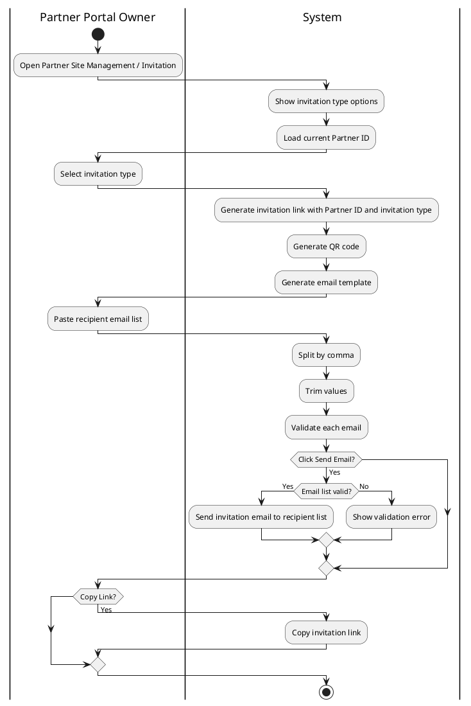

# USER STORY: Partner Portal - Partner Site Management - Invitation - Create Invitation Link and Send Email

## 1. User Story Statement

This section states the business actor, action, and value of the story in the required format.

As a Partner Portal Owner,

I want to create Partner Site invitation links and send them to recipient email lists,

So that I can invite enterprises to visit or join my Partner Site with Partner-level tracking.

## 2. Description & Business Value

This section explains what the story does and why it matters to the business.

- This story covers invitation link creation and email sending under `Partner Site Management / Invitation`.
- The Partner Portal Owner can create an invitation link for the current Partner Site.
- The Partner Portal Owner can select which kind of invitation they want to send before the link is generated.
- Supported invitation types in this story are `Site Visit Link` and `Join Partner Site`.
- The Partner Portal Owner can send the invitation to a list of recipient emails.
- The email list must support batch copy-paste from outside the system and split recipients by comma.
- The invitation link must include a specific `Partner ID` using the standard URL parameter `partnerId` so the system can track attribution and reuse that tracking later in other features.
- The system must generate an email template for the selected invitation type, including content and one CTA button that uses the generated invitation link.
- The business value is easier Partner-led acquisition, faster email invitation distribution, and consistent Partner attribution for downstream tracking.

## 3. Scope & Technical Constraints

This section defines the scope boundary, entry conditions, inputs, business flow, and outputs.

### 3.1. Pre-condition

- A Partner Site already exists for the current Partner.
- The current user has permission to access `Partner Site Management / Invitation`.
- The current Partner has one valid `Partner ID`.
- The system supports generating one invitation link and QR code for the current Partner Site invitation context.
- The email sending service is available.

### 3.2. Input

#### 3.2.1 Invitation Creation Input

| Field | Field Type | Required | Validation Rule | Source / Mapping | Example | Notes |
| --- | --- | --- | --- | --- | --- | --- |
| Partner ID | Slug | Yes | Must map to the current Partner and be embedded in the generated invitation link; display-only in this story | Partner master data | `partner-vxa-01` | System-generated tracking input |
| Invitation Type | Enum | Yes | Allowed values: `Site Visit Link`, `Join Partner Site` | Invitation type selection | `Join Partner Site` | User selects before send |
| Invitation Link | URL | Yes | Must be system-generated, valid HTTPS URL, and include the standard Partner attribution parameter `partnerId` | Invitation link generator | `https://arobid.site/invite?partnerId=partner-vxa-01&type=join` | Display-only after generation |
| QR Code | Image Upload | Yes | Must be system-generated from the invitation link | QR generator | QR image for current invitation link | Display-only invitation asset |
| Recipient Email List | Long Text | No | Trim spaces, sanitize text, split by comma, and each parsed value must be a valid email | User-entered invite recipient list | `a@company.com, b@company.com` | Batch paste supported |
| Sender Email | Email | Yes | Must use the current Arobid no-reply email configured by the system | System email configuration | Current Arobid no-reply email | Sender is system-controlled and not editable by Partner Portal Owner |
| Send Email Action | Boolean | No | When triggered, system validates parsed email list before sending | Invitation send action | `true` | UI action only |
| Copy Link Action | Boolean | No | When triggered, system copies generated invitation link | Copy action | `true` | UI action only |

#### 3.2.2 Email Parsing Rule

| Rule | Description | Display Rule | Example |
| --- | --- | --- | --- |
| Input Separator | Recipient list is split by comma | System parses one pasted string into multiple email items | `a@x.com, b@y.com, c@z.com` |
| Space Handling | Leading and trailing spaces around each email are trimmed | Trimmed values are validated as email | `a@x.com, b@y.com ` |
| Empty Token Handling | Empty email values after split are ignored | Do not create blank recipient items | `a@x.com,,b@y.com` |
| Invalid Email Handling | Invalid email values block send and show validation feedback | User must correct invalid values before send | `a@x.com, wrong@` |

#### 3.2.3 Invitation Type Definition

| Invitation Type | Description | Link Behavior | Example |
| --- | --- | --- | --- |
| Site Visit Link | Invitation directs recipient to visit the Partner Site directly | Generated link opens the Partner Site landing/visit destination | `Visit Vietnam Export Alliance site` |
| Join Partner Site | Invitation directs recipient to the onboarding flow on the Partner Site | Generated link opens the Partner Site onboarding/join flow | `Join Vietnam Export Alliance partner site` |

#### 3.2.4 Generated Email Template Definition

| Template Element | Field Type | Required | Validation Rule | Source / Mapping | Example | Notes |
| --- | --- | --- | --- | --- | --- | --- |
| From Email | Email | Yes | Must display and send from the current Arobid no-reply email configured by the system | System email configuration | Current Arobid no-reply email | Not editable in this story |
| Email Subject | Short Text | Yes | Max 255 characters; must reflect the selected invitation type | System-generated email template | `You are invited to join Vietnam Export Alliance` | Generated from invitation type |
| Email Greeting | Short Text | Yes | Max 255 characters; sanitize unsafe content | System-generated email template | `Hello,` | Static or configurable system copy |
| Email Body Content | Long Text | Yes | Allow line breaks, sanitize HTML/script content | System-generated email template | `Vietnam Export Alliance invited you to explore its Partner Site.` | Main message block |
| CTA Button Label | Short Text | Yes | Max 255 characters; must match selected invitation type intent | System-generated email template | `Visit Partner Site` | Uses invitation type |
| CTA Button Link | URL | Yes | Must use the generated invitation link for the selected invitation type | Invitation link generator | `https://arobid.site/invite?partnerId=partner-vxa-01&type=visit` | Button destination |
| Email Footer | Long Text | No | Allow line breaks, sanitize HTML/script content | System-generated email template | `If you did not expect this invitation, you can ignore this email.` | Optional standard footer |

#### 3.2.5 Email Template by Invitation Type

| Invitation Type | Email Subject | Body Summary | CTA Button Label | Example |
| --- | --- | --- | --- | --- |
| Site Visit Link | `You are invited to visit [Partner Name]` | Invite recipient to visit and explore the Partner Site | `Visit Partner Site` | Visit Vietnam Export Alliance page |
| Join Partner Site | `You are invited to join [Partner Name]` | Invite recipient to start onboarding and join through the Partner Site | `Join Partner Site` | Start onboarding from Vietnam Export Alliance |

#### 3.2.6 Full Email Template Copy

| Invitation Type | Email Subject | Email Body | CTA Button Label | CTA Link |
| --- | --- | --- | --- | --- |
| Site Visit Link | `Visit {PartnerName}` | `Hi {RecipientName},\n\n{PartnerName} would like to invite you to visit its Partner Site.\n\nYou can explore company information, featured content, and trade opportunities from {PartnerName} through the link below.\n\nBest regards,\n{PartnerName}` | `Visit Partner Site` | `{InvitationLink}` |
| Join Partner Site | `You are invited to join {PartnerName}` | `Hi {RecipientName},\n\n{PartnerName} would like to invite you to join its Partner Site.\n\nPlease use the link below to start the onboarding flow. After joining, your enterprise information can be connected to {PartnerName}'s Partner Site experience.\n\nBest regards,\n{PartnerName}` | `Join Partner Site` | `{InvitationLink}` |

#### 3.2.7 Email Template Placeholder Definition

| Placeholder | Description | Required | Source / Mapping | Example |
| --- | --- | --- | --- | --- |
| `{PartnerName}` | Current Partner display name | Yes | Partner profile / Partner Site configuration | `Vietnam Export Alliance` |
| `{RecipientName}` | Recipient display name if available; otherwise fallback to generic greeting | No | Recipient contact data or email recipient record | `Nguyen Van A` |
| `{InvitationLink}` | Generated Partner-attributed invitation link for selected invitation type | Yes | Invitation link generator | `https://arobid.site/invite?partnerId=partner-vxa-01&type=join` |

#### 3.2.8 Out-of-Scope Rule

| Attribute | Description | Source / Mapping | Example |
| --- | --- | --- | --- |
| Social Share Flow | Social sharing to Facebook, LinkedIn, or Instagram is not part of this story | Covered in separate social share scope | No social share button logic here |
| Invitation Acceptance Flow | This story does not define what happens after the recipient opens the link and registers | Covered in downstream registration / invitation tracking scope | No registration flow detail here |
| Multi-Partner Invitation | This story is only for the current Partner Site context | Current Partner Site invitation scope | One Partner ID per invitation context |

### 3.3. Process / Logic

1. The system opens `Partner Site Management / Invitation` for the current Partner Site.
2. The system requires the user to select one invitation type before sending email.
3. The system supports two invitation types in this story: `Site Visit Link` and `Join Partner Site`.
4. The system generates or loads the invitation link for the current Partner Site context based on the selected invitation type.
5. The system must embed the current `Partner ID` in the invitation link using the standard URL parameter `partnerId` for attribution tracking.
6. The system generates the QR code from the invitation link.
7. The system generates the email template for the selected invitation type.
8. The system must use the current Arobid no-reply email as the sender email for invitation emails.
9. The Partner Portal Owner must not be able to edit the sender email in this story.
10. The generated email template must include content and one CTA button that uses the generated invitation link.
11. The user may paste a list of recipient emails into one input area.
12. The system parses the pasted email list by comma, trims surrounding spaces, ignores empty values, and validates each parsed email.
13. When the user selects `Send Email`, the system must block sending if no valid email remains after parsing.
14. If one or more parsed emails are invalid, the system must show validation feedback and require correction before sending.
15. If the parsed email list is valid, the system sends the invitation to the valid recipient list using the generated Partner-attributed invitation link and the generated email template.
16. The user may copy the invitation link directly.
17. This story stops at invitation creation, link/QR generation, email template generation, email send, and copy-link behavior.

### 3.4. Output

- The system generates a Partner-attributed invitation link.
- The system generates a QR code for the invitation link.
- The system generates an email template for the selected invitation type.
- Invitation email is sent from the current Arobid no-reply email.
- The user can paste and send invitations to a comma-separated email list.
- The user can copy the invitation link.
- The invitation link includes `partnerId` for downstream tracking use.

## 4. Diagram

This section shows the workflow-level actor/action swimlane for the story.

## 5. Design (UX/UI Interaction)

This section defines the expected UI interaction flow only.

Given: The Partner Portal Owner is on `Partner Site Management / Invitation`

Step 1: The system shows the invitation creation area for the current Partner Site.

Step 2: The system shows invitation type options `Site Visit Link` and `Join Partner Site`.

Step 3: The user selects which invitation type to send.

Step 4: The system displays the generated invitation link and QR code for the selected invitation type and current Partner context.

Step 5: The system displays the generated email template for the selected invitation type, including content and one CTA button using the generated link.

Step 6: The system displays the sender email as the current Arobid no-reply email.

Step 7: The user may paste one or more recipient emails into a common input area.

Step 8: The system treats comma as the separator for batch recipient input.

Step 9: When the user selects `Send Email`, the system validates the parsed recipient list before sending.

Step 10: If the email list is invalid, the system shows validation feedback and does not send the invitation.

Step 11: If the email list is valid, the system sends invitations from the current Arobid no-reply email using the generated email template and the Partner-attributed invitation link.

Step 12: The user may copy the invitation link directly.

Step 13: The current scope stops at create/copy/send behavior for the invitation email asset.

## 6. Acceptance Criteria

This section defines the testable business outcomes in Given-When-Then format.

| AC | Given | When | Then |
| --- | --- | --- | --- |
| AC-01 | Given the current Partner Site invitation screen is opened | When the screen loads | Then the system shows invitation type options `Site Visit Link` and `Join Partner Site` |
| AC-02 | Given the user selects an invitation type | When the invitation asset is generated | Then the system generates an invitation link for the selected invitation type and current Partner context |
| AC-03 | Given the invitation link is generated | When the screen is rendered | Then the invitation link includes the specific Partner ID using the `partnerId` URL parameter for tracking |
| AC-04 | Given the invitation link exists | When the screen is rendered | Then the system shows a QR code generated from that invitation link |
| AC-05 | Given an invitation type is selected | When the email asset is generated | Then the system shows an email template with content and one CTA button that uses the generated invitation link |
| AC-05.1 | Given the email template is displayed or the invitation email is sent | When the sender email is required | Then the system uses the current Arobid no-reply email as the sender email |
| AC-06 | Given `Site Visit Link` is selected | When the email template is generated | Then the CTA button label and content reflect direct visit to the Partner Site |
| AC-07 | Given `Join Partner Site` is selected | When the email template is generated | Then the CTA button label and content reflect onboarding through the Partner Site |
| AC-08 | Given the user pastes recipient emails into the input area | When the system parses the value | Then the system splits recipients by comma and trims surrounding spaces |
| AC-09 | Given the parsed recipient list contains invalid email values | When the user selects `Send Email` | Then the system blocks sending and shows validation feedback |
| AC-10 | Given the parsed recipient list contains at least one valid email and no invalid email values | When the user selects `Send Email` | Then the system sends the invitation to the parsed recipients using the generated email template |
| AC-11 | Given the invitation link exists | When the user selects `Copy Invitation Link` | Then the system copies the generated invitation link |
| AC-12 | Given the invitation is used later in downstream features | When attribution is needed | Then the system can identify the originating Partner from the `partnerId` embedded in the invitation link |
